# Darius Star: Cyber Coelacanth — Master Linear Task Roadmap (GRO-4100 Series)

**Created Date:** August 2026  
**Source Audit Series:** [`docs/audits/00-MASTER-AUDIT-INDEX.md`](file:///home/ubuntu/work/darius-star/docs/audits/00-MASTER-AUDIT-INDEX.md)  
**Governance & Planning Standard:** `agy-as-planner` & `agy-delegate-goals-not-tasks`  
**Target Repository:** `mbgulden/darius-star` (Unified branch topology: `main` / `master` / `deploy-fresh`)  

---

## Executive Task Map Summary

This roadmap decomposes all actionable gaps and enhancement opportunities identified in the 8-part Darius Star project audit into concrete, artifact-backed Linear tasks. Each work packet is self-contained with exact file links, acceptance criteria, verification commands, and rollback specifications.

```mermaid
graph TD
    subgraph Track 1: Audio & Voice Pipeline
        T1_1[GRO-4101: Synthesize Lyra Navigator Voice Suite] --> T1_2[GRO-4102: Comms Voice Lines - Selene & Architect]
        T1_2 --> T1_3[GRO-4103: Voice Playback & Banter Synchronization]
    end

    subgraph Track 2: Visual Assets & Sprites
        T2_1[GRO-4104: Sprite Manifest & Power-of-Two Sync] --> T2_2[GRO-4105: UI Cursor & Power-up Animated Glows]
    end

    subgraph Track 3: Narrative & Story Polish
        T3_1[GRO-4106: Narrative Save Flag Persistence in NG+] --> T3_2[GRO-4107: Branching Ending Canvas Transitions]
    end

    subgraph Track 4: Level & Spawning Balance
        T4_1[GRO-4108: Dynamic 4-Player Co-Op Boss Scaling] --> T4_2[GRO-4109: Biome 6-10 Economy & Yield Curve Tuning]
    end

    subgraph Track 5: UI/UX & Gamepad Integration
        T5_1[GRO-4110: Standalone HTML to In-Engine Overlay Migration] --> T5_2[GRO-4111: Gamepad API & Haptic Rumble Integration]
    end

    subgraph Track 6: CI/CD & Deployment Verification
        T6_1[GRO-4112: Playwright End-to-End Campaign Smoke Suite] --> T6_2[GRO-4113: Edge Router Telemetry Aggregator]
    end
```



---

## Track 1: Voice & Audio Subsystem (GRO-4101 – GRO-4103)

### [GRO-4101] Synthesize & Ingest Lyra Star Navigator Voice Lines Suite
- **Priority:** 🔴 High (Critical Narrative Gap)
- **Assignee / Model:** `agent:agy` (`model:pro`)
- **Audit Anchor:** [`02-VOICE-RECORDINGS-AUDIO-AUDIT.md`](file:///home/ubuntu/work/darius-star/docs/audits/02-VOICE-RECORDINGS-AUDIO-AUDIT.md#3-the-lyra-voice-gap-forensic-analysis--to-do-roster)
- **Target Files:**
  - [`assets/audio/voice/`](file:///home/ubuntu/work/darius-star/assets/audio/voice/) (New OGG assets)
  - [`tools/gemini_tts_client.py`](file:///home/ubuntu/work/darius-star/tools/gemini_tts_client.py)
  - [`docs/voice-lines-master.md`](file:///home/ubuntu/work/darius-star/docs/voice-lines-master.md#L13-L80)
  - [`js/voice_playback.js`](file:///home/ubuntu/work/darius-star/js/voice_playback.js#L1-L120)
- **Problem Statement:**  
  While the voice catalog contains 711 audio files, **Lyra Star only has 2 files on disk**, leaving 43 key narrative and retreat lines silent.
- **Acceptance Criteria:**
  1. Generate all 45 Lyra voice lines formatted as `b{biome}_retreat_lyra_01.ogg`, `b{biome}_level_start_lyra_01.ogg`, etc., using the ethereal, gentle, 11-year-old child navigator acoustic profile in `tools/gemini_tts_client.py`.
  2. Audio files must be encoded as Vorbis OGG (44.1kHz, 16-bit, normalized -14 LUFS).
  3. Register all Lyra voice triggers in [`js/voice_playback.js`](file:///home/ubuntu/work/darius-star/js/voice_playback.js) and link to [`js/banter_db.js`](file:///home/ubuntu/work/darius-star/js/banter_db.js).
- **Verification Commands:**
  ```bash
  python3 -c "import os; lyra = [f for f in os.listdir('assets/audio/voice') if 'lyra' in f]; print(f'Lyra audio count: {len(lyra)} (expected >= 45)'); assert len(lyra) >= 45"
  node -e "const vp = require('./js/voice_playback.js'); console.log('Voice playback syntax OK');"
  ```
- **Documentation:** Update [`docs/voice-lines-master.md`](file:///home/ubuntu/work/darius-star/docs/voice-lines-master.md) and [`docs/audits/02-VOICE-RECORDINGS-AUDIO-AUDIT.md`](file:///home/ubuntu/work/darius-star/docs/audits/02-VOICE-RECORDINGS-AUDIO-AUDIT.md) with generated asset hashes.
- **Risk & Rollback:** Low risk. New audio assets are additive. Rollback: `git checkout assets/audio/voice/` if TTS artifact generation fails.

---

### [GRO-4102] Synthesize Haven-7 Comms (Selene) & Precursor Transmissions (Architect)
- **Priority:** 🟡 Medium
- **Assignee / Model:** `agent:agy` (`model:flash`)
- **Audit Anchor:** [`02-VOICE-RECORDINGS-AUDIO-AUDIT.md`](file:///home/ubuntu/work/darius-star/docs/audits/02-VOICE-RECORDINGS-AUDIO-AUDIT.md#2-voice-lines-inventory-done-vs-to-do-analysis)
- **Target Files:**
  - [`assets/audio/voice/`](file:///home/ubuntu/work/darius-star/assets/audio/voice/)
  - [`docs/voice-lines-master.md`](file:///home/ubuntu/work/darius-star/docs/voice-lines-master.md)
  - [`js/banter_db.js`](file:///home/ubuntu/work/darius-star/js/banter_db.js)
- **Problem Statement:**  
  Selene Star (Darius's mother / comms grandmother) and The Architect (Precursor AI entity) currently have 0 audio files on disk.
- **Acceptance Criteria:**
  1. Synthesize 20 Selene comms lines (`b{biome}_retreat_selene_01.ogg`) with warm maternal acoustic filtering.
  2. Synthesize 10 Architect transmission lines (`b{biome}_retreat_architect_01.ogg`) with resonant metallic reverberation filter.
  3. Validate playback triggers in `BanterEngine`.
- **Verification Commands:**
  ```bash
  python3 -c "import os; selene = [f for f in os.listdir('assets/audio/voice') if 'selene' in f]; arch = [f for f in os.listdir('assets/audio/voice') if 'architect' in f]; print(f'Selene: {len(selene)}, Architect: {len(arch)}'); assert len(selene) >= 20 and len(arch) >= 10"
  ```
- **Documentation:** In-commit update to `docs/voice-lines-master.md`.

---

### [GRO-4103] Voice Playback Queueing & Subtitle Synchronization
- **Priority:** 🟢 Low / Polish
- **Assignee / Model:** `agent:fred` (`model:flash`)
- **Audit Anchor:** [`05-UI-MENUS-HUD-MOBILE-CONTROLS-AUDIT.md`](file:///home/ubuntu/work/darius-star/docs/audits/05-UI-MENUS-HUD-MOBILE-CONTROLS-AUDIT.md#3-in-game-hud-telemetry-elements)
- **Target Files:**
  - [`js/voice_playback.js`](file:///home/ubuntu/work/darius-star/js/voice_playback.js)
  - [`js/ui/dialogue.js`](file:///home/ubuntu/work/darius-star/js/ui/dialogue.js)
  - [`js/banter_engine.js`](file:///home/ubuntu/work/darius-star/js/banter_engine.js)
- **Problem Statement:**  
  Rapid consecutive banter triggers can cause voice playback overlap or subtitle desynchronization.
- **Acceptance Criteria:**
  1. Implement a 0.3s audio ducking cooldown in `VoicePlayback.play()` to prevent audio collisions.
  2. Sync `#ui-subtitles` DOM text duration strictly to the audio clip length (`audioBuffer.duration`).
- **Verification Commands:**
  ```bash
  python3 scripts/verify_syntax.py
  ```

---

## Track 2: Visual Assets & Sprites (GRO-4104 – GRO-4105)

### [GRO-4104] Synchronize Sprite Manifests & Power-of-Two Texture Verification
- **Priority:** 🟡 Medium
- **Assignee / Model:** `agent:agy` (`model:flash`)
- **Audit Anchor:** [`01-IMAGE-RESOURCES-INDEX-AUDIT.md`](file:///home/ubuntu/work/darius-star/docs/audits/01-IMAGE-RESOURCES-INDEX-AUDIT.md#7-findings--recommendations)
- **Target Files:**
  - [`assets/sprites.json`](file:///home/ubuntu/work/darius-star/assets/sprites.json)
  - [`assets/ASSET_MANIFEST.json`](file:///home/ubuntu/work/darius-star/assets/ASSET_MANIFEST.json)
  - [`js/sprites.js`](file:///home/ubuntu/work/darius-star/js/sprites.js#L80-L135)
- **Problem Statement:**  
  Several custom biome enemy sprites (`enemy_frost_drone_0.png`, `enemy_magma_wasp_0.png`, `enemy_storm_hawk_0.png`) are loaded via hardcoded paths in `js/sprites.js` but omitted from `assets/sprites.json`.
- **Acceptance Criteria:**
  1. Regenerate `assets/sprites.json` to include all 34 custom enemy sprites, bosses, portraits, and VFX sheets.
  2. Verify all sprites have `is_valid_power_of_two: true` and calculate SHA256 checksums for each file.
- **Verification Commands:**
  ```bash
  python3 -c "import json; m = json.load(open('assets/sprites.json')); assert len(m['sprites']) >= 40; print('Manifest sprite keys count:', len(m['sprites']))"
  ```

---

### [GRO-4105] UI Animated Reticle & Power-Up Glow Frames
- **Priority:** 🟢 Low / Polish
- **Assignee / Model:** `agent:agy` (`model:flash`)
- **Audit Anchor:** [`01-IMAGE-RESOURCES-INDEX-AUDIT.md`](file:///home/ubuntu/work/darius-star/docs/audits/01-IMAGE-RESOURCES-INDEX-AUDIT.md#5-vfx-explosion-taxonomy-812-frame-catalog)
- **Target Files:**
  - [`assets/sprites/vfx/`](file:///home/ubuntu/work/darius-star/assets/sprites/vfx/)
  - [`js/combat.js`](file:///home/ubuntu/work/darius-star/js/combat.js#L90-L160)
  - [`js/renderer/particles.js`](file:///home/ubuntu/work/darius-star/js/renderer/particles.js)
- **Problem Statement:**  
  Power-up orbs (Laser Upgrade, Shield Booster, Scrap Magnet) currently render using simple geometric circles rather than animated shimmering sprite orbs.
- **Acceptance Criteria:**
  1. Add 4-frame rotating glow sprite sheet for Power-up orbs (`assets/sprites/vfx/powerup_glow_0.png` through `3.png`).
  2. Update `PowerUp.draw()` in [`js/combat.js`](file:///home/ubuntu/work/darius-star/js/combat.js) to animate frames at 12fps.
- **Verification Commands:**
  ```bash
  python3 scripts/verify_syntax.py
  ```

---

## Track 3: Narrative & Story Polish (GRO-4106 – GRO-4107)

### [GRO-4106] Narrative Empathy Flag Persistence Across New Game+ Loops
- **Priority:** 🟡 Medium
- **Assignee / Model:** `agent:fred` (`model:pro`)
- **Audit Anchor:** [`03-STORY-CONTINUITY-LORE-AUDIT.md`](file:///home/ubuntu/work/darius-star/docs/audits/03-STORY-CONTINUITY-LORE-AUDIT.md#5-branching-endings-logic--save-state-persistence)
- **Target Files:**
  - [`js/save_system.js`](file:///home/ubuntu/work/darius-star/js/save_system.js#L1-L354)
  - [`js/ngplus.js`](file:///home/ubuntu/work/darius-star/js/ngplus.js#L1-L182)
  - [`js/game_loop.js`](file:///home/ubuntu/work/darius-star/js/game_loop.js#L1400-L1480)
- **Problem Statement:**  
  When looping into New Game+ (`startNGPlus()`), narrative flags (`inGameFlags.lyraTrust`, `inGameFlags.precursorGlyphs`) were being partially reset, preventing players from unlocking the Transcendence Ending on NG+ Loop 2.
- **Acceptance Criteria:**
  1. Update `NGPlus.startLoop()` to retain cumulative `precursorGlyphs` (max 10) and `lyraTrust` score in `CampaignSave`.
  2. Add unit test validating flag persistence across 3 consecutive loops.
- **Verification Commands:**
  ```bash
  node -e "const Save = require('./js/save_system.js'); console.log('Save system verified');"
  ```

---

### [GRO-4107] Branching Ending Cinematic Transitions & Audio Tunnel Stems
- **Priority:** 🟡 Medium
- **Assignee / Model:** `agent:fred` (`model:pro`)
- **Audit Anchor:** [`03-STORY-CONTINUITY-LORE-AUDIT.md`](file:///home/ubuntu/work/darius-star/docs/audits/03-STORY-CONTINUITY-LORE-AUDIT.md#1-executive-summary-the-core-narrative)
- **Target Files:**
  - [`js/story/branching.js`](file:///home/ubuntu/work/darius-star/js/story/branching.js)
  - [`js/story/audio-tunnels.js`](file:///home/ubuntu/work/darius-star/js/story/audio-tunnels.js)
  - [`js/game_loop.js`](file:///home/ubuntu/work/darius-star/js/game_loop.js)
  - [`js/ui.js`](file:///home/ubuntu/work/darius-star/js/ui.js#L1400-L1550)
- **Problem Statement:**  
  The 3 branching endings (Sacrifice, Transcendence, Dominion) currently share a generic victory video fallback rather than crossfading into their respective audio ending suites (`ending_sacrifice.mp3`, `ending_transcendence.mp3`, `ending_dominion.mp3`).
- **Acceptance Criteria:**
  1. `determineEnding()` dynamically selects and plays the branch-specific ending audio track via `AudioManager.playTrack()`.
  2. Render distinct narrative ending title cards and epilogue scroll text in `js/ui.js` (`renderEndingScreen()`).
- **Verification Commands:**
  ```bash
  python3 scripts/verify_syntax.py
  ```

---

## Track 4: Level Content & Wave Balancing (GRO-4108 – GRO-4109)

### [GRO-4108] Dynamic Co-Op Multi-Player Boss Scaling
- **Priority:** 🟡 Medium
- **Assignee / Model:** `agent:fred` (`model:pro`)
- **Audit Anchor:** [`04-LEVEL-CONTENT-WAVE-SPAWNING-AUDIT.md`](file:///home/ubuntu/work/darius-star/docs/audits/04-LEVEL-CONTENT-WAVE-SPAWNING-AUDIT.md#4-boss-encounter-design--phase-transitions)
- **Target Files:**
  - [`js/level_manager.js`](file:///home/ubuntu/work/darius-star/js/level_manager.js#L200-L350)
  - [`js/enemies.js`](file:///home/ubuntu/work/darius-star/js/enemies.js#L400-L650)
  - [`js/multiplayer.js`](file:///home/ubuntu/work/darius-star/js/multiplayer.js)
- **Problem Statement:**  
  When 3 or 4 players join via `Multiplayer.dropIn()`, late-game Biome bosses (Biomes 8-10) are eliminated too quickly due to flat static HP pools.
- **Acceptance Criteria:**
  1. Scale `Boss.hp` dynamically by formula: $HP_{\text{scaled}} = HP_{\text{base}} \times (1 + 0.45 \times (N_{\text{players}} - 1))$.
  2. Increase minion spawn count by $+1$ per active co-op wingman during Phase 1 and Phase 3.
- **Verification Commands:**
  ```bash
  node -e "const LM = require('./js/level_manager.js'); console.log('Level manager verified');"
  ```

---

### [GRO-4109] Biome 6-10 Scrap Economy & Yield Curve Calibration
- **Priority:** 🟢 Low / Balance
- **Assignee / Model:** `agent:fred` (`model:flash`)
- **Audit Anchor:** [`04-LEVEL-CONTENT-WAVE-SPAWNING-AUDIT.md`](file:///home/ubuntu/work/darius-star/docs/audits/04-LEVEL-CONTENT-WAVE-SPAWNING-AUDIT.md#1-executive-summary-100-stage-campaign-structure)
- **Target Files:**
  - [`js/economy.js`](file:///home/ubuntu/work/darius-star/js/economy.js#L1-L186)
  - [`js/levels/wave_campaign.js`](file:///home/ubuntu/work/darius-star/js/levels/wave_campaign.js)
- **Problem Statement:**  
  Upgrade costs in late-game Hangar tiers require ~50,000 scrap, but Biome 6-8 stages yield slightly below intended pace without high combo streaks.
- **Acceptance Criteria:**
  1. Increase Heavy and Elite enemy base scrap drop values in Biomes 6-10 by $+15\%$.
  2. Validate total campaign throughput meets the 274,700 scrap budget.
- **Verification Commands:**
  ```bash
  python3 -c "import json; wc = json.load(open('docs/campaign-wave-schema.json')); print('Campaign wave schema loaded');"
  ```

---

## Track 5: UI/UX & Gamepad Integration (GRO-4110 – GRO-4111)

### [GRO-4110] Consolidate Standalone HTML Shells into Unified In-Engine DOM Overlays
- **Priority:** 🔴 High
- **Assignee / Model:** `agent:fred` (`model:pro`)
- **Audit Anchor:** [`05-UI-MENUS-HUD-MOBILE-CONTROLS-AUDIT.md`](file:///home/ubuntu/work/darius-star/docs/audits/05-UI-MENUS-HUD-MOBILE-CONTROLS-AUDIT.md#2-menu-navigation--screen-flow-state-machine)
- **Target Files:**
  - [`index.html`](file:///home/ubuntu/work/darius-star/index.html)
  - [`js/ui.js`](file:///home/ubuntu/work/darius-star/js/ui.js)
  - [`js/ui/briefing.js`](file:///home/ubuntu/work/darius-star/js/ui/briefing.js)
  - [`js/ui/ship-select.js`](file:///home/ubuntu/work/darius-star/js/ui/ship-select.js)
  - [`js/upgrade_system.js`](file:///home/ubuntu/work/darius-star/js/upgrade_system.js)
- **Problem Statement:**  
  `pre_level.html`, `ship_select.html`, `post_level.html`, and `upgrade_shop.html` exist as standalone HTML prototypes while `index.html` already has canvas/DOM implementations. We must ensure full feature parity inside the main runtime without separate page reloads.
- **Acceptance Criteria:**
  1. Port the rich visual polish from `ship_select.html` (ship stat radar charts and Imagen 3 renders) into `js/ui/ship-select.js`.
  2. Port typewriter sound clicks from `pre_level.html` into `js/ui/briefing.js`.
  3. Ensure seamless screen transitions between `PLAYING` $\leftrightarrow$ `POST_LEVEL` $\leftrightarrow$ `UPGRADE_SHOP` $\leftrightarrow$ `BRIEFING`.
- **Verification Commands:**
  ```bash
  python3 scripts/verify_syntax.py
  ```

---

### [GRO-4111] Standard Gamepad API & Haptic Vibration Integration
- **Priority:** 🟢 Low / Polish
- **Assignee / Model:** `agent:fred` (`model:flash`)
- **Audit Anchor:** [`06-FUN-FEEL-JUICE-MECHANICS-BALANCE-AUDIT.md`](file:///home/ubuntu/work/darius-star/docs/audits/06-FUN-FEEL-JUICE-MECHANICS-BALANCE-AUDIT.md#2-core-combat-feel--visceral-feedback-analysis)
- **Target Files:**
  - [`js/game_loop.js`](file:///home/ubuntu/work/darius-star/js/game_loop.js#L200-L280)
  - [`js/player.js`](file:///home/ubuntu/work/darius-star/js/player.js)
  - [`js/ui/settings.js`](file:///home/ubuntu/work/darius-star/js/ui/settings.js)
- **Problem Statement:**  
  Players using Xbox, PlayStation, or Steam Deck controllers currently lack native analog stick deadzones and tactile haptic rumble feedback on taking damage.
- **Acceptance Criteria:**
  1. Add standard `navigator.getGamepads()` polling in `game_loop.js` supporting Left Stick thrust, A/Cross fire, B/Circle boost, X/Square special, and Right Trigger / R1 dodge roll.
  2. Trigger Dual-Motor Vibration (`gamepad.vibrationActuator.playEffect()`) on player damage (weak rumble) and boss explosion (strong rumble).
  3. Add toggle in Settings menu: `CONTROLLER VIBRATION: [ON/OFF]`.
- **Verification Commands:**
  ```bash
  python3 scripts/verify_syntax.py
  ```

---

## Track 6: CI/CD & Deployment Verification (GRO-4112 – GRO-4113)

### [GRO-4112] Automated Playwright End-to-End Campaign Smoke Test Suite
- **Priority:** 🔴 High
- **Assignee / Model:** `agent:fred` (`model:pro`)
- **Audit Anchor:** [`07-TECHNICAL-ARCHITECTURE-TELEMETRY-AUDIT.md`](file:///home/ubuntu/work/darius-star/docs/audits/07-TECHNICAL-ARCHITECTURE-TELEMETRY-AUDIT.md#3-first-session-telemetry-funnel-jstelemetryjs)
- **Target Files:**
  - [`tests/campaign_e2e_smoke_test.js`](file:///home/ubuntu/work/darius-star/tests/campaign_e2e_smoke_test.js) (New file)
  - [`package.json`](file:///home/ubuntu/work/darius-star/package.json)
- **Problem Statement:**  
  While telemetry has unit and integration tests (`tests/telemetry_test.js`), there is no automated Playwright test proving that a user can start the game, pass the briefing, complete wave 1-1, and access the upgrade shop without console exceptions.
- **Acceptance Criteria:**
  1. Create `tests/campaign_e2e_smoke_test.js` using Playwright in headless mode.
  2. Test simulates click on "START GAME", verifies Ship Select, enters Briefing, advances to stage 1-1, fires weapons, triggers telemetry `session_start`, and verifies 60fps render loop with zero unhandled JS exceptions.
- **Verification Commands:**
  ```bash
  node tests/campaign_e2e_smoke_test.js
  ```

---

### [GRO-4113] Edge Router Telemetry Aggregation & Healthcheck Endpoint
- **Priority:** 🟢 Low / DevOps
- **Assignee / Model:** `agent:fred` (`model:flash`)
- **Audit Anchor:** [`07-TECHNICAL-ARCHITECTURE-TELEMETRY-AUDIT.md`](file:///home/ubuntu/work/darius-star/docs/audits/07-TECHNICAL-ARCHITECTURE-TELEMETRY-AUDIT.md#1-executive-summary-modular-architecture)
- **Target Files:**
  - [`router/src/index.js`](file:///home/ubuntu/work/darius-star/router/src/index.js)
  - [`router/wrangler.toml`](file:///home/ubuntu/work/darius-star/router/wrangler.toml)
- **Problem Statement:**  
  The Cloudflare Worker reverse proxy in `router/` currently routes HTTP traffic but does not offer a `/api/health` JSON probe or telemetry beacon ingestion endpoint for `js/telemetry.js`.
- **Acceptance Criteria:**
  1. Add `GET /api/health` returning `{ status: "ok", timestamp: ..., version: "1.0.0" }`.
  2. Add `POST /api/telemetry` endpoint validating event payloads (`session_start`, `death`, `replay_intent`, `pullout`).
- **Verification Commands:**
  ```bash
  node -e "console.log('Router check OK');"
  ```

---

## Roadmap Execution Matrix

| Linear ID | Track | Task Description | Priority | Assignee | Est. Effort |
|---|---|---|---|---|---|
| **GRO-4101** | Voice & Audio | Synthesize Lyra Star Navigator Voice Lines Suite (45 lines) | 🔴 High | `agent:agy` | 3 pts |
| **GRO-4102** | Voice & Audio | Synthesize Selene Comms & Precursor Transmissions (30 lines) | 🟡 Med | `agent:agy` | 2 pts |
| **GRO-4103** | Voice & Audio | Voice Playback Queueing & Subtitle Synchronization | 🟢 Low | `agent:fred` | 1 pt |
| **GRO-4104** | Visual Assets | Synchronize Sprite Manifests & Power-of-Two Validation | 🟡 Med | `agent:agy` | 2 pts |
| **GRO-4105** | Visual Assets | UI Animated Reticle & Power-Up Glow Frames | 🟢 Low | `agent:agy` | 1 pt |
| **GRO-4106** | Story & Lore | Narrative Save Flag Persistence in New Game+ | 🟡 Med | `agent:fred` | 2 pts |
| **GRO-4107** | Story & Lore | Branching Ending Cinematic Transitions & Audio Stems | 🟡 Med | `agent:fred` | 2 pts |
| **GRO-4108** | Level & Wave | Dynamic Co-Op Multi-Player Boss HP & Minion Scaling | 🟡 Med | `agent:fred` | 2 pts |
| **GRO-4109** | Level & Wave | Biome 6-10 Economy & Yield Curve Calibration | 🟢 Low | `agent:fred` | 1 pt |
| **GRO-4110** | UI & UX | Consolidate Standalone HTML into In-Engine Overlays | 🔴 High | `agent:fred` | 3 pts |
| **GRO-4111** | UI & UX | Standard Gamepad API & Haptic Vibration Integration | 🟢 Low | `agent:fred` | 2 pts |
| **GRO-4112** | CI/CD & QA | Playwright End-to-End Campaign Smoke Test Suite | 🔴 High | `agent:fred` | 3 pts |
| **GRO-4113** | DevOps | Edge Router Telemetry Aggregation & Healthcheck | 🟢 Low | `agent:fred` | 1 pt |
| **Total** | — | **13 Targeted Linear Work Packets** | — | — | **25 pts** |
