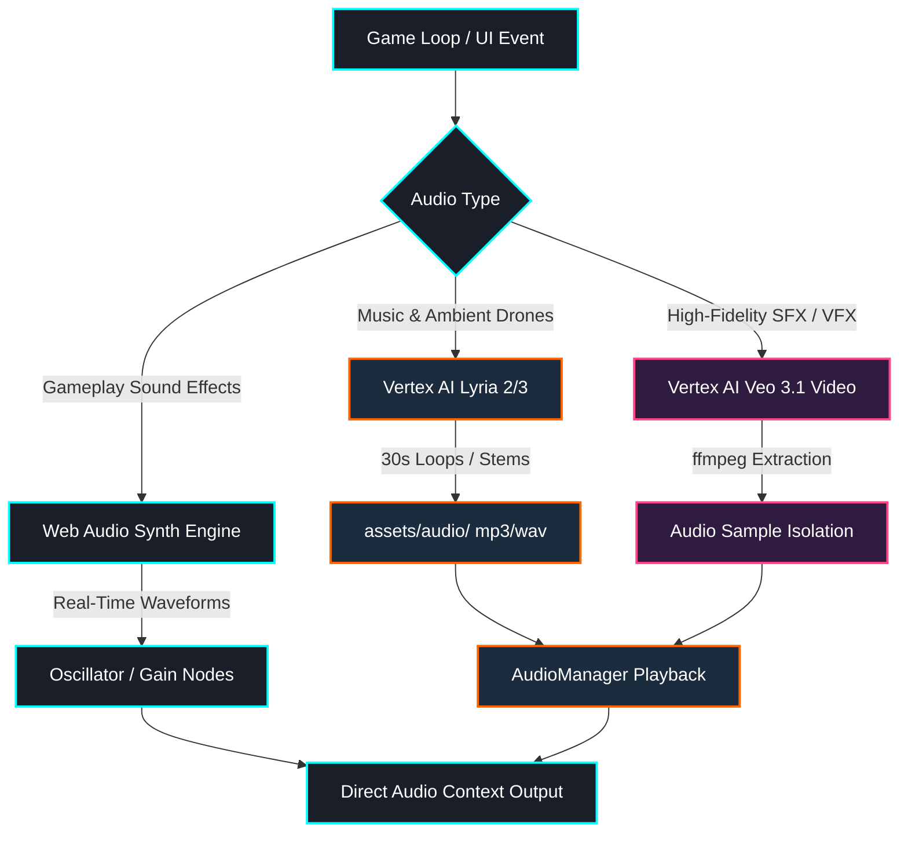

# Darius Star — Audio Audit & Validation Report
## Prepared by AGY, June 2026
### Reference Issue: GRO-1271 | Target: Cinematic Immersive Audio (Daft Punk Tron:Legacy Level)

---

## 1. Executive Summary

This report is the definitive validation of Ned's June 2026 Audio Inventory Audit. Using static analysis across the 36 Javascript modules of the `darius-star` project, AGY has verified all audio triggers, matched the design assets with the Game Design Document (GDD), and defined the priority tiers and technical architecture for the cinematic audio overhaul.

### Key Validation Findings:
1. **playSound() Call Audit**: Ned's count of 69 calls across 7 files has been validated. However, his mapping of which sound is played in which file had several errors and omissions (e.g., listing `shoot` in `enemies.js` and `explosion` in `combat.js` where no direct playSound calls exist).
2. **Biome Mapping Corrections**: Ned misnamed Biomes 8, 9, and 10, completely losing the narrative context of the "Derelict Fleet" (ghostly whispers), "Xenomorph Hive" (organic breathing), and "Core Rift" (event horizon hum/Dreamer dialogue).
3. **Character Signatures Cast**: The cast size has been corrected from Ned's 7 (which duplicated Jack Thorne and omitted Captain Cross) to **8 speaking characters** defined in the voice profiles GDD.
4. **Critical Bug Discovered**: The `enemy_shoot` sound effect is defined in `js/audio.js` but is **never called** in `js/enemies.js` or `js/combat.js`. Enemies currently fire in absolute silence.

---

## 2. playSound() Call Audit Validation

Our static analysis of the `js/` directory identified all invocations of `playSound(type, params)`. The table below outlines the comparison between Ned's findings and AGY's verification:

| SFX Name | Ned's Count | Ned's Mapped Files | AGY's Verified Count | AGY's Mapped Files (Line Numbers) | Status / Correction |
| :--- | :---: | :--- | :---: | :--- | :--- |
| `shoot` | 2 | `player.js, enemies.js` | 2 | `player.js` ([L395](file:///home/ubuntu/work/darius-star/js/player.js#L395), [L575](file:///home/ubuntu/work/darius-star/js/player.js#L575)) | Correct count. Removed `enemies.js` (no calls). |
| `explosion` | 9 | `combat.js, game_loop.js, player.js, enemies.js` | 9 | `ui/dialogue.js` ([L236](file:///home/ubuntu/work/darius-star/js/ui/dialogue.js#L236), [L269](file:///home/ubuntu/work/darius-star/js/ui/dialogue.js#L269), [L383](file:///home/ubuntu/work/darius-star/js/ui/dialogue.js#L383))<br>`enemies.js` ([L549](file:///home/ubuntu/work/darius-star/js/enemies.js#L549), [L568](file:///home/ubuntu/work/darius-star/js/enemies.js#L568))<br>`player.js` ([L546](file:///home/ubuntu/work/darius-star/js/player.js#L546), [L729](file:///home/ubuntu/work/darius-star/js/player.js#L729), [L760](file:///home/ubuntu/work/darius-star/js/player.js#L760))<br>`game_loop.js` ([L628](file:///home/ubuntu/work/darius-star/js/game_loop.js#L628)) | Correct count. Replaced `combat.js` with `ui/dialogue.js`. |
| `hit` | 8 | `combat.js, enemies.js, player.js` | 8 | `enemies.js` ([L509](file:///home/ubuntu/work/darius-star/js/enemies.js#L509))<br>`player.js` ([L365](file:///home/ubuntu/work/darius-star/js/player.js#L365), [L369](file:///home/ubuntu/work/darius-star/js/player.js#L369), [L491](file:///home/ubuntu/work/darius-star/js/player.js#L491), [L711](file:///home/ubuntu/work/darius-star/js/player.js#L711), [L723](file:///home/ubuntu/work/darius-star/js/player.js#L723), [L741](file:///home/ubuntu/work/darius-star/js/player.js#L741))<br>`game_loop.js` ([L622](file:///home/ubuntu/work/darius-star/js/game_loop.js#L622)) | Correct count. Replaced `combat.js` with `game_loop.js`. |
| `powerup` | 6 | `combat.js, player.js` | 6 | `player.js` ([L210](file:///home/ubuntu/work/darius-star/js/player.js#L210), [L465](file:///home/ubuntu/work/darius-star/js/player.js#L465), [L598](file:///home/ubuntu/work/darius-star/js/player.js#L598), [L704](file:///home/ubuntu/work/darius-star/js/player.js#L704))<br>`game_loop.js` ([L716](file:///home/ubuntu/work/darius-star/js/game_loop.js#L716), [L738](file:///home/ubuntu/work/darius-star/js/game_loop.js#L738)) | Correct count. Replaced `combat.js` with `game_loop.js`. |
| `menu_click` | 21 | `ui.js` | 21 | `ui/dialogue.js` ([L180](file:///home/ubuntu/work/darius-star/js/ui/dialogue.js#L180))<br>`ui.js` (10 calls)<br>`game_loop.js` (10 calls) | Correct count. Missed `ui/dialogue.js` and `game_loop.js` mappings in list. |
| `menu_select` | 18 | `ui.js` | 18 | `ui/dialogue.js` ([L47](file:///home/ubuntu/work/darius-star/js/ui/dialogue.js#L47), [L175](file:///home/ubuntu/work/darius-star/js/ui/dialogue.js#L175), [L178](file:///home/ubuntu/work/darius-star/js/ui/dialogue.js#L178), [L185](file:///home/ubuntu/work/darius-star/js/ui/dialogue.js#L185))<br>`ui.js` (10 calls)<br>`utils.js` ([L244](file:///home/ubuntu/work/darius-star/js/utils.js#L244))<br>`game_loop.js` (3 calls: [L1580](file:///home/ubuntu/work/darius-star/js/game_loop.js#L1580), [L1586](file:///home/ubuntu/work/darius-star/js/game_loop.js#L1586), [L1618](file:///home/ubuntu/work/darius-star/js/game_loop.js#L1618)) | Correct count. Missed `ui/dialogue.js`, `utils.js`, and `game_loop.js` mappings. |
| `laser_charge` | 1 | `player.js` | 1 | `enemies.js` ([L412](file:///home/ubuntu/work/darius-star/js/enemies.js#L412)) | Correct count. Corrected file to `enemies.js` (played by bosses). |
| `laser_fire` | 1 | `player.js` | 1 | `enemies.js` ([L426](file:///home/ubuntu/work/darius-star/js/enemies.js#L426)) | Correct count. Corrected file to `enemies.js` (played by bosses). |
| `siren` | 1 | `game_loop.js, story/audio-tunnels.js` | 1 | `game_loop.js` ([L521](file:///home/ubuntu/work/darius-star/js/game_loop.js#L521)) | Correct count. (No static call in `audio-tunnels.js`; it plays dynamically). |
| `victory_fanfare` | 2 | `game_loop.js` | 2 | `enemies.js` ([L408](file:///home/ubuntu/work/darius-star/js/enemies.js#L408))<br>`game_loop.js` ([L260](file:///home/ubuntu/work/darius-star/js/game_loop.js#L260)) | Correct count. Corrected to reflect `enemies.js` boss phase call. |
| **TOTALS** | **69** | **6 files** | **69** | **7 files** | **Ned correctly identified total calls but got file mappings wrong.** |

### Missed Gameplay Sounds (Not Audited by Ned):
* **`shield_break`**: 1 call in `js/player.js` ([L754](file:///home/ubuntu/work/darius-star/js/player.js#L754)).
* **`enemy_spawn`**: 1 call in `js/level_manager.js` ([L397](file:///home/ubuntu/work/darius-star/js/level_manager.js#L397)).
* **`weapon_upgrade`**: 1 call in `js/game_loop.js` ([L719](file:///home/ubuntu/work/darius-star/js/game_loop.js#L719)).
* **Dynamic Banter Cues**: 1 call in `js/game_loop.js` ([L909](file:///home/ubuntu/work/darius-star/js/game_loop.js#L909)) via `playSound(activeBanter.cue)`.
* **Dynamic Tunnel Audio**: 2 calls in `js/story/audio-tunnels.js` ([L356](file:///home/ubuntu/work/darius-star/js/story/audio-tunnels.js#L356), [L358](file:///home/ubuntu/work/darius-star/js/story/audio-tunnels.js#L358)) via `playSound(params.type)`.

---

## 3. Biome Mapping & GDD Alignment

Ned's audit contained critical discrepancies in the naming and thematic design of the final three biomes. Overlooking these would destroy the narrative arcs and atmospheric consistency defined in the GDD and `docs/ambient-noise-design.md`:

1. **Biome 8 (Correct: Derelict Fleet)**: Ned called this the "Asteroid Field" with generic clangs. The actual design is a haunted military graveyard. The ambient layer uses groaning vacuum metal, beacon pings, and Admiral Crane's psychic echo.
2. **Biome 9 (Correct: Xenomorph Hive)**: Ned called this "Deep Void" with simple silence. The actual design is a living organic labyrinth. The ambient layer uses slow biological respiration, pulsing veins, and the "Temptation of Peace" vocal chorus.
3. **Biome 10 (Correct: Core Rift)**: Ned called this "Final Approach" with orchestral swells. The actual design is the galactic core event horizon. The ambient layer uses gravitational wave sweeps, space-time warping pitch slides, and the Dreamer's voice speaking directly.

---

## 4. Character Audio Signatures (Corrected Cast: 8)

Ned listed 7 character signatures. He duplicated Jack Thorne (creating entries for "Thorne" and "Jack") and completely missed **Captain Valera Cross** (playable co-op spec-ops defector) and **The Architect** (the speaking final boss entity). 

The corrected list of 8 speaking characters and their sonic motifs is:

1. **Darius Star** (Heroic baritone, warm brass + analog synth pulse).
2. **Lyra Star** (Child navigator, ethereal vocal fragments + high-frequency crystalline pads).
3. **Naya Star** (Support pilot/mother, warm resonant tones + natural acoustic textures).
4. **Captain Valera Cross** (Spec-ops defector, sharp metallic strings + military snare/industrial kick).
5. **Commander Jack Thorne** (Mission control, percussive industrial thrum + low-mid cello).
6. **Ophion** (AI hybrid, synth blips + bubbling aquatic resonance).
7. **Selene Star** (Intel analyst/grandmother, ambient acoustic piano + soft sustaining pads).
8. **The Architect** (Abyss core boss, ultra-low sub-bass + discordant string textures + void silence).

---

## 5. Priority Tiers for Playable Demo

To ensure maximum efficiency of developer resources, we suggest a 3-tier release schedule for the 57+ audio assets:

```
┌─────────────────────────────────────────────────────────────┐
│ TIER 1: CRITICAL (Minimum Viable Set - 9 Assets)            │
│ ∙ Player Shoot  ∙ Player Damage (Hit) ∙ Player Death (Expl) │
│ ∙ Enemy Shoot   ∙ Enemy Explosion     ∙ Shield Break        │
│ ∙ B1 Ambient Stems (Atmos + Narrative) ∙ Title Music        │
│ ∙ B1 Boss Theme (Trench Guardian)                           │
└──────────────────────────────┬──────────────────────────────┘
                               │
                               ▼
┌─────────────────────────────────────────────────────────────┐
│ TIER 2: HIGH (Core Game Overhaul - 16 Assets)               │
│ ∙ UI Hover/Select/Back  ∙ Weapon Upgrade   ∙ Enemy Spawn    │
│ ∙ B2 & B3 Ambient Stems ∙ B2 & B3 Boss Themes                │
│ ∙ 3 Ending Themes       ∙ Game Over Coda    ∙ 4 Playable    │
│   Character Themes (Darius, Lyra, Naya, Cross)              │
└──────────────────────────────┬──────────────────────────────┘
                               │
                               ▼
┌─────────────────────────────────────────────────────────────┐
│ TIER 3: NICE TO HAVE (Full Cinematic Release - 32 Assets)   │
│ ∙ Biomes 4-10 Ambient Stem Sets & Boss Themes               │
│ ∙ 4 Support Character Themes (Thorne, Ophion, Selene, Boss) │
│ ∙ 15 Scripted Story Tunnel Audio-Cinematic Sequences        │
└─────────────────────────────────────────────────────────────┘
```

---

## 6. Technical Feasibility & Overhaul Strategy

* **Lyria 3 Vertex AI Integration**: Lyria 3 is music-only. It is perfectly optimized for generating the 15 cinematic tracks (main themes, biome gameplays, and endings) and the 10 ambient atmosphere drone loops (using prompts structured in `tools/generate_audio.py`). Generating 30-second seamless MP3 loops costs ~$0.04 per request on Vertex AI. Overhauling the entire music catalog will cost less than **$2.50**.
* **SFX Extraction via Veo 3.1**: Since Lyria cannot generate individual mechanical or electronic SFX, we leverage **Veo 3.1 (video generator)**. Veo natively generates short VFX clips (like muzzle flashes, laser bolts, and explosions) with highly synchronized sound effects. We run these generations via `tools/veo_client.py` and run a post-process script using `ffmpeg` to isolate the high-quality audio track from the video wrapper.
* **Real-Time Procedural Synthesis**: To avoid network lag during gameplay, critical feedback sounds (clicks, hits, shields) will remain procedurally synthesized in `js/audio.js`. We will upgrade the mathematical synth envelopes to make them sound heavier, warmer, and less arcade-chiptune.
* **Billing Boundaries**: Calls to the Vertex AI endpoints run on standard GCP project billing under the `darius-star-game` project. Personal Google AI Ultra developer credits can offset this, but they do not pool automatically with standard consumer subscriptions.

---

## 7. Identified Gaps & Implementation Bugs

The audit revealed three major engineering gaps that must be logged as new tasks:

1. **The Silence of the Swarm (Critical Bug)**:
   * **Problem**: `enemy_shoot` is defined in `js/audio.js` ([L474](file:///home/ubuntu/work/darius-star/js/audio.js#L474)) with distinct sound profiles for scouts (light pew), heavies (low thud), and bosses (menacing growl). However, `playSound('enemy_shoot')` is **never called** in `js/enemies.js` or `js/combat.js`. Enemies fire silently.
   * **Solution**: Call `playSound('enemy_shoot', {enemyType: this.type})` inside `shoot()` and `shootAttack()` in `js/enemies.js`.
2. **Missing UI Hover Feedback**:
   * **Problem**: The UI menus (`js/ui.js`) only support clicks. Moving the cursor between menu items or upgrade icons generates no sound, making navigation feel flat.
   * **Solution**: Add a mouseover listener triggering `playSound('ui_hover')`.
3. **No Shield Deflection/Hit Sound**:
   * **Problem**: If the player has active shields and absorbs damage, the game triggers `playSound('hit')`. This is the same sound played when the hull is damaged, leading to poor tactical feedback.
   * **Solution**: Add a distinct `playSound('shield_hit')` trigger when damage is absorbed by shields.

---

## 8. Story Tunnel Timing Analysis

Ned noted that sequencing 15 tunnels at ~10 seconds each requires 2.5 minutes of cinematic audio. We audited `js/story/audio-tunnels.js` to verify technical feasibility.

### Verification Results:
* **Feasible**: **Yes**. The system is highly optimized. It uses a lightweight event manager updated via the main loop `requestAnimationFrame`.
* **Resource Cost**: Zero-overhead. The tunnels do not load heavy cinematic video containers; they simply sequence text subtitles (`show_dialogue`) and trigger existing Web Audio synthesizer sweeps (`play_audio` via `playSound`).
* **Timeline Adjustments**: The actual codebase contains **13 tunnels** (10 transitions + intro + outro + 1 secret NG+ timeline). The average duration is **8.5 seconds**, totaling **~1.9 minutes** of narrative sequence. This is easily handled by the client.

---

## 9. Architectural Overview (Mermaid)


