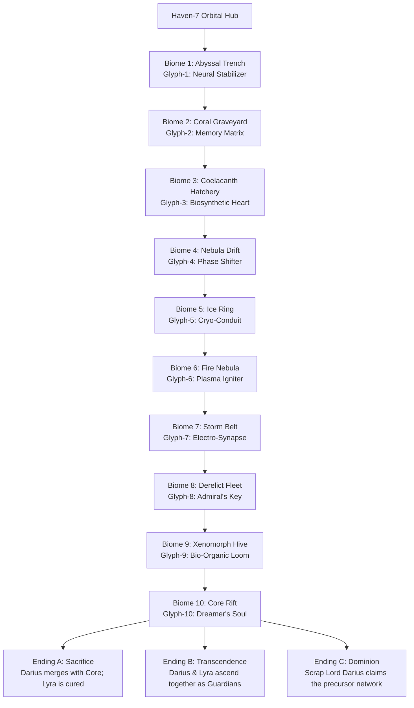

# Audit Document 03: Story Continuity, Narrative Flow & Character Arcs

**Document Focus:** Campaign Storyline, 10 Biome Progression, 3 Endings, Character Profiles, Mission Briefings, and In-Game Banter Triggers  
**Narrative Lore Authority:** `docs/GAME-DESIGN-DOCUMENT.md`, `docs/story-mode-narrative.md`  

---

## 1. Executive Summary: The Core Narrative

*Darius Star: Cyber Coelacanth* tells an intimate, high-stakes sci-fi story: **a former Abyssal Navy diver turned salvage mercenary (Darius Star) embarks on a one-way descent across 10 dangerous biomes to harvest 10 precursor neural glyphs and synthesize a cure for his dying daughter, Lyra.**

---

## 2. Character Roster & Psychological Arcs

| Character | Role & Identity | Core Motivation | Narrative Arc | Voice Profile |
|---|---|---|---|---|
| **Darius Star** | Callsign "Starfish", Age 34. Freelance salvage mercenary. | Save daughter Lyra at any personal cost. | Desperate father → Reluctant hero → Ascended guardian / Sovereign. | Gruff, determined, grounded, protective. |
| **Lyra Star** | Age 11. Darius's daughter. Psychic resonance with Coelacanth network. | Survive the neural crystallization; guide her father. | Vulnerable patient → Psychic navigator → Co-creator of the new dawn. | Gentle, ethereal, perceptive, courageous. |
| **Naya (Warden)** | Former naval test pilot; pilot of the biosynthetic Warden vessel. | Redeem her past naval failure; protect the Star family. | Aloof operative → Trusted wingman → Vanguard of humanity. | Crisp, military-disciplined, observant. |
| **Commander Jack Thorne** | Callsign "Old Iron". Veteran Abyssal Navy Commander. | Pay debt to Aldric Star; ensure the mission succeeds. | Hardened commander → Compassionate mentor. | Deep, authoritative, gravelly veteran. |
| **Valera Cross** | Independent scrapper and wingman. | Fortune, survival, squad loyalty. | Cynical mercenary → Ride-or-die comrade. | Fast-talking, punchy, pragmatic. |
| **Selene Star** | Haven-7 Comms Coordinator; Darius's mother. | Keep her son and granddaughter tethered to reality. | Anxious anchor → Steely operational coordinator. | Warm, maternal, technically sharp. |
| **The Cyber Coelacanth** | Biosynthetic Precursor containment entity. | Protect ancient slumbering archives from corruption. | Threatening monster → Misunderstood ancient immune system. | Resonant, metallic, echoing whale-song. |

---

## 3. Mission Briefings Consistency Matrix

Briefings in `docs/mission-briefings.json` and `js/ui/briefing.js` provide complete 3-mode dialogue (Solo, 2-Player Co-op, 4-Player Co-op):

| Biome # | Location | Briefing Commander | Pre-Level Objective | Threat Intelligence | Post-Level Debrief |
|---|---|---|---|---|---|
| **1: Abyssal Trench** | Earth, Mariana Depth | Jack Thorne | Retrieve Glyph-1 from Guardian | Anglerfish Drones, Electric Jellyfish | Stabilizer online; Lyra pulse stable |
| **2: Coral Graveyard** | Submerged Vault | Jack Thorne | Recover Glyph-2 Memory Matrix | Ghost Coral Spores, Phantom Eels | Precursor history decrypted |
| **3: Coelacanth Lair** | Europa Sub-Ice Sea | Naya / Thorne | Infiltrate Hatchery, extract Glyph-3 | Prototype Biosynthetic swarms | Coelacanth origin revealed |
| **4: Nebula Drift** | Outer Gas Envelope | Jack Thorne | Navigate dimensional shear, Glyph-4 | Phase-shifting Plasma Wisps | Reality folds stabilized |
| **5: Ice Ring** | Enceladus Ring System | Naya | Purge Cryo-mines, claim Glyph-5 | Glacial Crustacean Heavies | Hull heaters stressed |
| **6: Fire Nebula** | Stellar Nursery | Valera Cross | Forge Glyph-6 in solar flare | Magma Wasps, Lava Golems | Heat shielding held |
| **7: Storm Belt** | Jupiter Magnetosphere | Jack Thorne | Ride lightning tunnels for Glyph-7 | Thunderheads, EMP Sentinels | Neural synapse synchronized |
| **8: Derelict Fleet** | Graveyard of Warships | Jack Thorne | Hack Admiral's flagship for Glyph-8 | Automated Fleet Turrets, Ghost Drones | Aldric's flagship located |
| **9: Xenomorph Hive** | Biosynthetic Organism | Naya | Cut into core tissue for Glyph-9 | Brood Spitters, Hive Nodes | The Dreamer's lair unlocked |
| **10: Core Rift** | The Fabric of Space | Darius / Lyra | Confront Dreamer; synthesize cure | Paradox Wisps, Null Entities | Branching Ending Decision |

---

## 4. In-Game Banter Engine & Dynamic Dialogue

`js/banter_db.js` and `js/banter_engine.js` contain **504+ context-aware voice lines** categorized by event:
1. **`level_start`**: Atmospheric observations upon entering a new biome.
2. **`unique_enemy`**: Tactical callouts when rare units (e.g. Anglerfish, Lava Golem, Hive Node) spawn.
3. **`boss_entrance`**: Cinematic tension dialogue when boss warnings trigger.
4. **`player_death` & `player_respawn`**: Emotional grit and determination lines.
5. **`low_health`**: Critical hull alerts (< 25% HP).
6. **`pull_out` (Retreat)**: The game's signature non-lethal fail-safe lines where wingmen cover retreat.
7. **`wave_clear` & `level_end`**: Victory and biome transition reflections.

---

## 5. Branching Endings Logic & Save State Persistence

In `js/game_loop.js` (`determineEnding()`) and `js/story/branching.js`:
- **Sacrifice Ending**: Triggered if player chooses self-sacrifice or has high empathy flags (`lyraTrust >= 80`). Darius merges his consciousness with the Coelacanth grid, curing Lyra.
- **Transcendence Ending**: Triggered in 2-4 player co-op or with complete Precursor Glyphs (10/10) + zero hull loss in Biome 10. Father and daughter become cosmic stewards.
- **Dominion Ending**: Triggered if player accumulated > 50,000 scrap and prioritized Weapon Meta-Upgrades over Shield/Utility. Darius claims the precursor network as Scrapper Overlord.

Narrative save flags are saved to `localStorage` under `CampaignSave` (`inGameFlags`), ensuring player choices persist across sessions.
