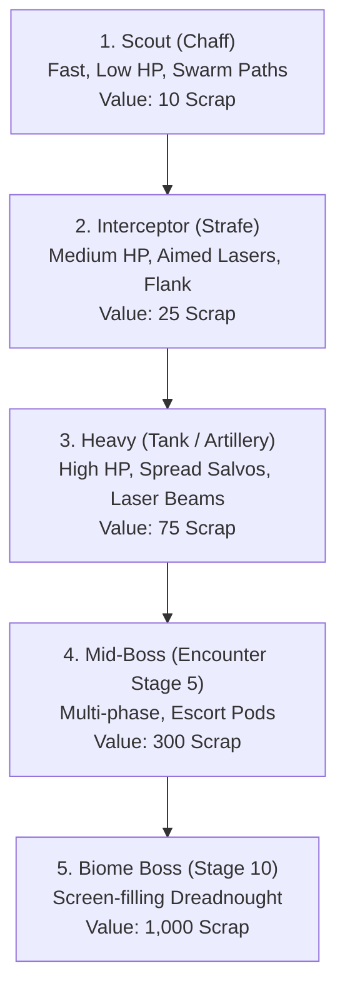

# Audit Document 04: Level Content, Enemy Taxonomy & Wave Balancing

**Document Focus:** 10-Biome × 10-Level Wave Matrix (100 Sublevels), 7,680 Enemy Formations, Enemy Archetypes, Boss HP Scaling, and Economy Yields  
**Wave Authority Reference:** `docs/enemy-wave-designer.md`, `js/levels/wave_campaign.js` (7,709 lines)  

---

## 1. Executive Summary: 100-Stage Campaign Structure

*Darius Star* features a full 100-stage campaign progression governed by `LevelManager` and `WAVE_CAMPAIGN`.

| Biome # | Biome Name | Stage Range | Theme & Environment | Enemy Count | Mid-Boss HP (L5) | Biome Boss HP (L10) | Est. Scrap Yield |
|---|---|---|---|---|---|---|---|
| **1** | Abyssal Trench | 1-1 to 1-10 | Crushing ocean floor, thermal vents | 720 enemies | 60 HP | 120 HP | 12,500 ⚙️ |
| **2** | Coral Graveyard | 2-1 to 2-10 | Calcified memory reef, ghost coral | 740 enemies | 80 HP | 150 HP | 15,200 ⚙️ |
| **3** | Coelacanth Hatchery | 3-1 to 3-10 | Europa sub-ice breeding ground | 760 enemies | 100 HP | 200 HP | 18,000 ⚙️ |
| **4** | Nebula Drift | 4-1 to 4-10 | Ionized gas clouds, reality distortions | 760 enemies | 120 HP | 180 HP | 21,500 ⚙️ |
| **5** | Ice Ring | 5-1 to 5-10 | Saturnian ice field, cryo-crystal hazards | 780 enemies | 140 HP | 200 HP | 24,000 ⚙️ |
| **6** | Fire Nebula | 6-1 to 6-10 | Molten star-forge, plasma eruptions | 780 enemies | 160 HP | 220 HP | 27,500 ⚙️ |
| **7** | Storm Belt | 7-1 to 7-10 | High-voltage gas giant storms | 800 enemies | 180 HP | 240 HP | 31,000 ⚙️ |
| **8** | Derelict Fleet | 8-1 to 8-10 | Graveyard of automated warships | 800 enemies | 200 HP | 260 HP | 35,000 ⚙️ |
| **9** | Xenomorph Hive | 9-1 to 9-10 | Organic biosynthetic interior | 820 enemies | 220 HP | 280 HP | 40,000 ⚙️ |
| **10** | Core Rift | 10-1 to 10-10 | Precursor singularity nexus | 840 enemies | 240 HP | 400 HP | 50,000 ⚙️ |
| **Total** | **10 Biomes** | **100 Stages** | — | **7,680 Enemies** | — | — | **~274,700 ⚙️** |

---

## 2. Enemy Taxonomy & Combat Roles

Every enemy unit fits into a defined combat archetype:

---

## 3. Wave Spawn Formations & Difficulty Mathematics

The `LevelManager` executes spawn formations using parametric bezier and trigonometric paths:
- **V-Formation**: Scouts enter in a wedge from the top/bottom right, diving toward the player's center.
- **Sine Wave Pincer**: Interceptors weave in opposing sinusoidal frequencies (2.5 Hz), creating overlapping crossfire.
- **Heavy Escort**: Heavies anchor the rear right quadrant while shielded by a front line of 4-6 Scouts.
- **Bullet Curtain Density**: Controlled by `difficultyMultiplier` (0.8 on Easy, 1.0 on Normal, 1.35 on Hard, 1.75 on Paradox NG+).

---

## 4. Boss Encounter Design & Phase Transitions

1. **Phase 1: Ranged Barrage (100% - 75% HP)**: Fires 3-way aimed plasma bolts and releases 2 Escort Minions every 8 seconds.
2. **Phase 2: Mega-Beam Charge (75% - 50% HP)**: Charges a screen-spanning horizontal laser beam (0.8s telegraph with cyan screen tint).
3. **Phase 3: Enraged Swarm (50% - 0% HP)**: Boss skin transitions to `boss_rage.png` (red thermal glow). Firing rate doubles, bullet speed increases by 35%, and undulating sinusoidal charge sweeps across the canvas.
