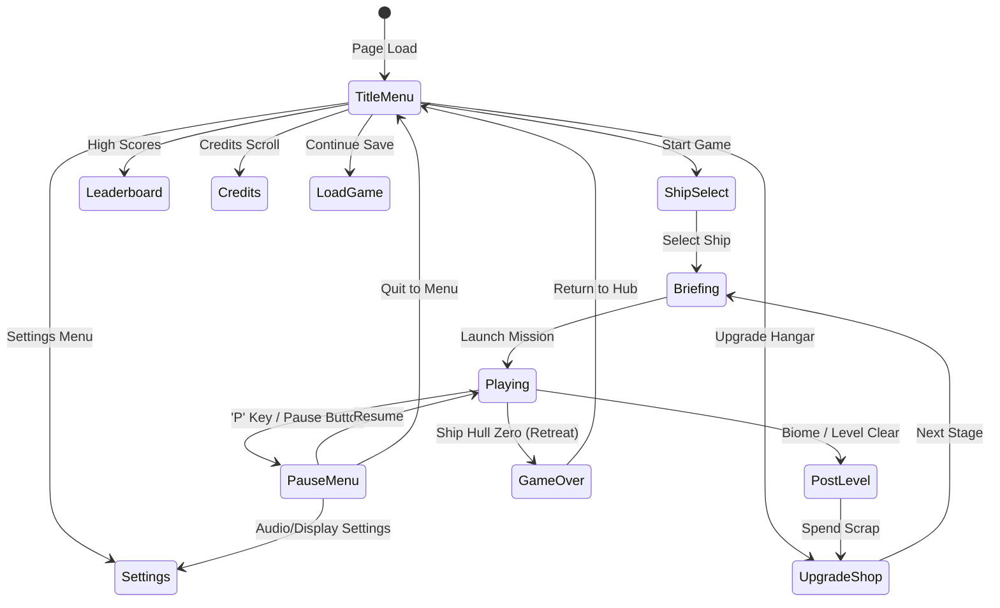

# Audit Document 05: UI Menus, HUD & Mobile Controls Audit

**Document Focus:** Menu Navigation, Ship Selection, Briefings, Upgrade Hangar, In-Game HUD Telemetry, Responsive Canvas, and Touch Controls  
**Implementation Modules:** `js/ui.js` (1,608 lines), `js/touch_controls.js` (343 lines), `js/ui/*.js`  

---

## 1. Executive Summary: UI System Architecture

The user interface utilizes a hybrid rendering paradigm:
- **In-Canvas Arcade HUD & Menus**: Rendered directly in `draw()` loop for 60fps retro arcade crispness.
- **Absolute DOM Overlays**: Used for high-contrast accessibility (subtitles, streamer alerts, banter boxes, mobile touch controls).

---

## 2. Menu Navigation & Screen Flow State Machine

---

## 3. In-Game HUD Telemetry Elements

| HUD Element | Visual Presentation | Dynamic Behavior | Source Variable / Function |
|---|---|---|---|
| **Hull Integrity Bar** | Green-to-Red gradient bar (top-left) | Pulses red under 25% HP; warning siren plays | `player.hp / player.maxHp` |
| **Shield Generator Gauge** | Cyan segmented bar with glow effect | Recharges after 4.0s without taking damage | `player.shield / player.maxShield` |
| **Boost Meter** | Orange gauge (READY / COOLING) | 1.5x speed boost when Spacebar/Boost tapped | `player.boostTimer` |
| **Secondary Special Meter** | Purple gauge (0% - 100%) | Fills on enemy kills; triggers Shock Lance / Iron Curtain | `player.specialMeter` |
| **Dodge Indicator** | Cyan text `DODGE: READY (E)` | 3.0s cooldown; provides 0.3s invulnerability frames | `player.dodgeCooldown` |
| **Scrap Counter** | Green text `⚙️ [Scrap Count]` | Counts up dynamically as magnetic scrap is absorbed | `totalScrap` |
| **Combo Streak Multiplier** | Golden text `COMBO x[1.0 - 4.0]` | Visual scale bounce on kills; decays over 3.5s | `ComboSystem.multiplier` |
| **Boss Health Bar** | Screen-wide top bar with skull icon | Displays boss name, remaining HP, and phase shifts | `Boss.hp / Boss.maxHp` |
| **Banter Overlay** | Italic subtitle box (top-right) | Displays pilot dialogue with portraits | `BanterEngine.activeBanter` |
| **Subtitles Box** | High-contrast black/gold DOM box | Center-bottom subtitles for voice accessibility | `#ui-subtitles` |

---

## 4. Mobile & Touch Controls UX Audit (`js/touch_controls.js`)

Touch controls automatically activate when `pointer: coarse` is detected or on mobile viewports:

| Control Element | Screen Location | Size & Layout | Action / Key Mapping | Viewport Responsiveness |
|---|---|---|---|---|
| **Virtual Floating Joystick** | Bottom-Left Quadrant | 120px base, 60px stick | Maps to W, A, S, D 8-directional thrust | Dynamic touch tracking |
| **Primary Fire Button** | Bottom-Right (Grid Row 1) | 56×56px Red Circle | Auto-fire / Manual Laser Discharges | Fixed layout |
| **Boost Button** | Bottom-Right (Grid Row 2) | 48×48px Orange Circle | Activates thruster surge | Fixed layout |
| **Special Weapon Button** | Bottom-Right (Grid Row 3) | 48×48px Purple Circle | Fires Ship Special Ability | Fixed layout |
| **Dodge Button** | Bottom-Right (Grid Row 4) | 48×48px Cyan Circle | Executes 0.3s invulnerability roll | Fixed layout |
| **Pause Button** | Top-Right Corner | 36×36px Translucent Box | Opens Pause Menu Overlay | Pinned to safe margin |

Canvas scaling in `resizeCanvas()` accounts for mobile navigation bars, offsetting height by 200px on coarse pointers to avoid virtual button clipping.
