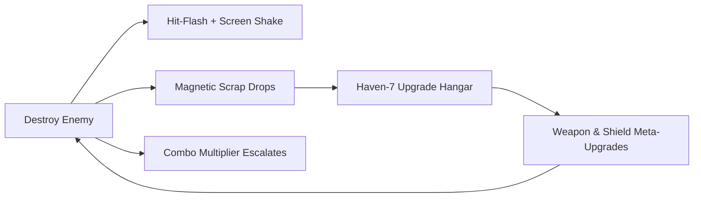

# Audit Document 06: Fun-ness, Game Feel, Juice & Mechanics Balance Audit

**Document Focus:** Combat Viscerality, Game Feel ("Juice"), Weapon Progression, Dodge i-Frames, Kill-Streak Multipliers, Scrap Metaprogression, and NG+ Paradox Loop  
**Design Authority:** `docs/GAME-DESIGN-DOCUMENT.md`, `docs/game-mechanics-design.md`  

---

## 1. Executive Summary: The Juice & Dopamine Loop

*Darius Star* balances fast-paced arcade responsiveness with rewarding tactile feedback ("juice") and deep metaprogression:

---

## 2. Core Combat Feel & Visceral Feedback Analysis

| Feedback System | Implementation in Engine | Psychological Impact |
|---|---|---|
| **Hit-Flash Effect** | White silhouette flash on hit (`spawnHitFlash()`) | Instant visual confirmation of damage dealt |
| **Screen Shake & Tint** | Directional canvas offset with chromatic tint | Heavy impact weight during explosions / boss hits |
| **Particle Cascades** | 15-30 particle bursts with velocity decay (`Particle`) | Gratifying debris simulation on kills |
| **Audio Pitch Ramping** | Web Audio frequency shifts + combo sound pitch | Dopamine spike as kill streaks climb |
| **Scrap Vacuum Magnet** | Smooth quadratic pull toward player (`player.scrapMagnet`) | Immediate tactile reward for aggressive positioning |

---

## 3. Weapon Systems & Overheat Dynamics

Primary fire progresses through 5 distinct tiers:
1. **Single Shot (Tier 1)**: Single forward laser bolt (15 dmg, 8 shots/sec).
2. **Double Shot (Tier 2)**: Parallel dual beams (28 dmg total).
3. **Triple Spread (Tier 3)**: 3-way angled spread (0°, +15°, -15°) for crowd control.
4. **Heavy Pulsar (Tier 4)**: Chunky energy orbs with 10px splash radius (65 dmg).
5. **Supreme Nova (Tier 5)**: 5-way wave clearing blast with slight overheat buildup.

---

## 4. Scrapper Economy & Metaprogression

Scrap is the lifeblood of the player's journey:
- **Common Scrap**: 85% of drops. Used for basic ship repairs and level upgrades.
- **Precursor Alloys**: 14% of drops. Required for advanced weapons and shield amplifiers.
- **One-in-a-Million Legendary Drops (0.0001%)**: Ultra-rare components (e.g. *Abyssal Heart Core*, *Cryo-Forged Alloy*, *Dreamer's Fragment*) that provide permanent run-altering passives.

---

## 5. New Game Plus (NG+) & Paradox Modifiers (`js/ngplus.js`)

Upon completing Biome 10, players can loop into New Game+ (`startNGPlus()`):
- **Paradox Enemies**: Gain glitch VFX overlays and erratic teleporting trajectories.
- **Enemy Bullet Velocity**: Scales by +15% per loop iteration.
- **Scrap Yield Multiplier**: Scales by +50% per loop iteration.
