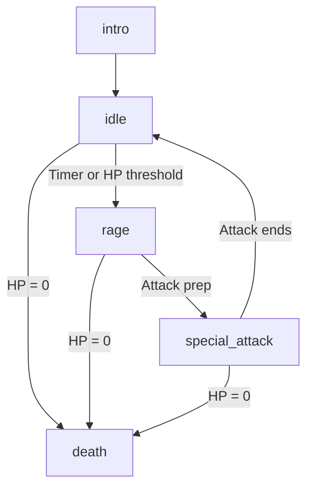

# Biome Boss Design Spec — Darius Star: Cyber Coelacanth

## Overview
This document specifies the 9 unique boss encounters designed to fill the critical gap in the biome progression structure of *Darius Star*. Each design is tightly aligned with the narrative themes in [story-mode-narrative.md](file:///home/ubuntu/work/darius-star/docs/story-mode-narrative.md) and the difficulty progression outlined in [level-system-design.md](file:///home/ubuntu/work/darius-star/docs/level-system-design.md).

The game uses a **5-state AI state machine** for all bosses:

---

## Biome 1: Abyssal Trench — DROWNED WARDEN (Trench Guardian)
*The corrupted precursor sentinel defending the Abyssal Trench. corrupted by millennia of isolation, it defends itself blindly, recognizing Aldric's genetic signature too late.*

### Technical Details
* **Biome Level**: Biome 1, Sub-level 10
* **Base HP**: 120 HP
* **Size footprint**: 180px × 110px
* **Base speed**: 60 px/s
* **Color palette**: Deep navy (#0A1128), vent orange (#FF6600), bioluminescent cyan (#00FFFF)

### AI State Machine
| State | Trigger / Conditions | Behavior / Attack Patterns | Duration |
|---|---|---|---|
| **intro** | Boss level starts | Descends from a hydrothermal vent. Emits deep mechanical roar. Shielded (invulnerable). | 4.0s |
| **idle** | After intro or special_attack | Sine-wave horizontal patrol. Fires **Hydro-Pulse** every 2.0s. Spawns 2 Angler Minions. | 8.0s |
| **rage** | HP < 50% | Speed +40%. Fires **Thermal Spray** every 1.5s. Performs charge dashes at player y-position. | 6.0s |
| **special_attack** | Transition from rage | **Vent Eruption**: Mouth glows bright orange, venting steam. Shields open, exposing core (vulnerable). Fires a massive sweeping sweep laser. | 3.0s |
| **death** | HP = 0 | Shell segment joints explode sequentially. Emits final data fragment transmittal wave. | 3.0s |

### Unique Attack Patterns
1. **Hydro-Pulse**: Fires pairs of cyan energy orbs that move in interlocking sine-wave trajectories, making direct horizontal dodging difficult.
2. **Thermal Spray**: Fires 5-way spreading fans of hot orange magma orbs that move outward and decelerate, creating a bullet screen.
3. **Precursor Slam**: A sudden, telegraphed horizontal dash towards the player's side of the screen, leaving a trail of static spark needles.

### Minion Spawn Behavior
* **Minion**: **Angler Drone** (1 HP, 80 px/s).
* **Behavior**: Skitters in sine-waves across the screen and occasionally flashes its light sensor, briefly disrupting player targeting.

### Weak Point Mechanics
* **Vent Joints**: The left and right arm joints are protected by heavy plating.
* **Mechanic**: Each joint has 30 HP. Destroying a joint drops 100 bonus scrap and disables the **Precursor Slam** attack.

### Lyria Music Prompt
> "Dark ambient industrial techno, 110 BPM, sub-bass pressure waves, metallic clangs, hydrophone filter sweeps, building to a heavy, distorted synth-choir climax during rage phase."

### Visual Sprite Prompt
> "16-bit pixel art, retro arcade shmup style, cyberpunk biomechanical aesthetic, neon color palette. Drowned Warden biome 1 boss: a colossal armored precursor isopod serpent, metallic blue-gray shell, glowing bioluminescent orange hydrothermal vents, orange (#FF5500) optic sensors, floating in dark abyss, side-view boss sprite, 1024x1024 transparent background"

### Concept Art Mockup

---

## Biome 2: Coral Graveyard — MEMORY WRAITH (Graveyard Leviathan)
*A spectral construct formed from the collective memory-echoes of an extinct cybernetic reef, defending the precursor memory-vault.*

### Technical Details
* **Biome Level**: Biome 2, Sub-level 10
* **Base HP**: 150 HP
* **Size footprint**: 200px × 120px
* **Base speed**: 50 px/s
* **Color palette**: Rust orange (#CC5500), dead coral pink (#FF4488), murk green (#1A3A2A)

### AI State Machine
| State | Trigger / Conditions | Behavior / Attack Patterns | Duration |
|---|---|---|---|
| **intro** | Boss level starts | Materializes from coral dust clouds, spectral wail screen-distortion effect. Invulnerable. | 4.0s |
| **idle** | After intro or special_attack | Figures-of-eight patrol. Fires **Coral Spike** every 2.5s. Spawns 3 Rust Drones. | 9.0s |
| **rage** | HP < 50% | Speed +30%. Tail sweeps. Fires **Spectral Wave** every 1.8s. | 6.0s |
| **special_attack** | Transition from rage | **Death Spiral Beam**: Central coral eye glows magenta. Releases a sweeping laser beam rotating 180 degrees. | 2.5s |
| **death** | HP = 0 | Dissolves into shimmering glowing coral dust, leaving the memory module floating. | 4.0s |

### Unique Attack Patterns
1. **Coral Spike**: Launches 3 homing needle projectiles that track the player's coordinates for 2.0s before accelerating in a straight line.
2. **Rust Spray**: Fires 8-way bursts of rusted metal scrap that break apart into smaller static shrapnel pellets after traveling half-screen.
3. **Echo Projection**: Spawns 3 semi-transparent ghost copies of extinct reef predators that swim horizontally across the screen.

### Minion Spawn Behavior
* **Minion**: **Coral Wasp** (2 HP, 100 px/s).
* **Behavior**: Flies in quick circular lunges, firing small pink stinger shots that briefly slow down the player's weapon fire rate.

### Weak Point Mechanics
* **Tail segments**: The tail armor segments can be targeted.
* **Mechanic**: Destroying the tail segment (35 HP) disables the **Echo Projection** attack and drops 150 scrap.

### Lyria Music Prompt
> "Haunting glass-harmonica pads, detuned metallic bells, 120 BPM gothic breakbeat, glitchy reverb-drenched synth leads, transitioning to intense operatic choir layers in rage."

### Visual Sprite Prompt
> "16-bit pixel art, retro arcade shmup style, cyberpunk biomechanical aesthetic, neon color palette. Memory Wraith biome 2 boss: spectral decaying cyber-whale skeleton made of glowing dead coral pink (#FF4488) and green (#33CC55) fiber-optic structures, rusted orange metal armor plates, floating in dark murky green water, side-view boss sprite, 1024x1024 transparent background"

### Concept Art Mockup

---

## Biome 4: Nebula Drift — STORM CONDUCTOR
*An electrical precursor entity riding nebula lightning storm cells, drawing energy from low-orbit atmospheric friction.*

### Technical Details
* **Biome Level**: Biome 4, Sub-level 10
* **Base HP**: 240 HP
* **Size footprint**: 190px × 140px
* **Base speed**: 80 px/s
* **Color palette**: Nebula cyan (#00BFFF), plasma magenta (#FF00FF), void black (#050510)

### AI State Machine
| State | Trigger / Conditions | Behavior / Attack Patterns | Duration |
|---|---|---|---|
| **intro** | Boss level starts | Rides down on a massive magenta lightning strike. Invulnerable. | 4.0s |
| **idle** | After intro or special_attack | Rapid horizontal strafes. Fires **Chain Lightning** every 2.0s. Spawns 2 Plasma Wisps. | 8.0s |
| **rage** | HP < 50% | Speed +50%. Sled chassis discharges constant passive sparks. Fires **Nebula Spray** every 1.2s. | 6.0s |
| **special_attack** | Transition from rage | **EMP Supernova**: Mouth/core charges up. Discharges screen-wide EMP wave; player must hide behind floating scrap wreckage. | 3.0s |
| **death** | HP = 0 | Sled breaks apart in electrical explosions. Entity dissolves into space dust. | 3.0s |

### Unique Attack Patterns
1. **Chain Lightning**: Fires cyan electricity arcs that jump to player decoys or minions, locking down movement vectors.
2. **Ionized Ring**: Emits an expanding ring of 16 purple plasma bullets that spin outwards from the boss core.
3. **Nebula Spray**: Rapid alternating fans of magenta and cyan orb bullets that cover the top half of the screen.

### Minion Spawn Behavior
* **Minion**: **Plasma Wisp** (1 HP, 110 px/s).
* **Behavior**: Teleports every 3s to random screen locations, firing a single quick horizontal plasma bolt.

### Weak Point Mechanics
* **Lightning Sled Thrusters**: Dual glowing engine exhausts on the bottom rear.
* **Mechanic**: Each engine has 40 HP. Destroying both thrusters reduces the boss's base movement speed by 40% and disables the **Ionized Ring** attack.

### Lyria Music Prompt
> "High-energy cyber-industrial synthwave, 130 BPM, heavy modular synth arpeggios, crackling electricity SFX, driving synth basslines, screaming square-wave leads during rage."

### Visual Sprite Prompt
> "16-bit pixel art, retro arcade shmup style, cyberpunk biomechanical aesthetic, neon color palette. Storm Conductor biome 4 boss: electrical entity made of cyan (#00FFFF) and magenta (#FF00FF) plasma energy riding a mechanical lightning sled, surrounded by dark cloud swirls, side-view boss sprite, 1024x1024 transparent background"

### Concept Art Mockup

---

## Biome 5: Ice Ring — FROST COLOSSUS
*A massive crystalline defender embedded in the frozen rings of Saturn, manipulating sub-zero debris to freeze trespassers.*

### Technical Details
* **Biome Level**: Biome 5, Sub-level 10
* **Base HP**: 280 HP
* **Size footprint**: 210px × 150px
* **Base speed**: 40 px/s
* **Color palette**: Ice blue (#88CCFF), crystal white (#EEEEFF), deep freeze (#002244)

### AI State Machine
| State | Trigger / Conditions | Behavior / Attack Patterns | Duration |
|---|---|---|---|
| **intro** | Boss level starts | Shakes off outer asteroid ice shell with heavy debris rain. Invulnerable. | 4.0s |
| **idle** | After intro or special_attack | Slow vertical hovering. Fires **Freeze Beam** every 3.0s. Spawns 4 Ice Shards. | 10.0s |
| **rage** | HP < 50% | Core glows hyper-blue. Fires **Glacial Shatter** every 2.0s. Spikes rain from top. | 6.0s |
| **special_attack** | Transition from rage | **Glacial Shatter AoE**: Absorbs rings. Explodes body ice armor outward in a dense needle ring, exposing core. | 3.0s |
| **death** | HP = 0 | Crystalline shell shatters into shards. Core collapses and implodes silently. | 4.0s |

### Unique Attack Patterns
1. **Freeze Beam**: A thick cold-blue laser. Getting grazed or hit reduces player ship speed by 50% for 1.5s.
2. **Glacial Shatter**: Launches a large ice asteroid at the player. On impact or on reaching player y-plane, it shatters into 8 radial sharp ice needles.
3. **Ice Spike Rain**: Shoots spikes upward which rain down on random x-columns, marked by faint white paths.

### Minion Spawn Behavior
* **Minion**: **Ice Shard** (1 HP, 90 px/s).
* **Behavior**: Spins erratically and ricochets off the edges of the screen up to 3 times before self-destructing.

### Weak Point Mechanics
* **Crystalline Ice Plates**: 4 distinct glowing blue armor plates covering the chest.
* **Mechanic**: Each plate has 35 HP. Destroying a plate exposes a core segment that takes 2x damage from player weapons.

### Lyria Music Prompt
> "Ethereal glockenspiel arpeggios, sub-zero wind atmosphere, cold digital pads, 115 BPM cinematic orchestral drums, transitioning to a thundering brass and strings climax."

### Visual Sprite Prompt
> "16-bit pixel art, retro arcade shmup style, cyberpunk biomechanical aesthetic, neon color palette. Frost Colossus biome 5 boss: massive crystalline ice colossus with sharp refracting lightblue (#88CCFF) edges, armored white metal joints, glowing cold blue core, floating in space with asteroid particles, side-view boss sprite, 1024x1024 transparent background"

### Concept Art Mockup

---

## Biome 6: Fire Nebula — INFERNO CORE
*A molten mechanical planetoid core operating in the volcanic expanse, broadcasting the corruption signal of the Abyss.*

### Technical Details
* **Biome Level**: Biome 6, Sub-level 10
* **Base HP**: 320 HP
* **Size footprint**: 180px × 180px (Circular)
* **Base speed**: 45 px/s
* **Color palette**: Lava orange (#FF4400), ember yellow (#FFAA00), ash gray (#443333)

### AI State Machine
| State | Trigger / Conditions | Behavior / Attack Patterns | Duration |
|---|---|---|---|
| **intro** | Boss level starts | Rises from a background lava storm, locking 4 satellites into orbit. Invulnerable. | 4.0s |
| **idle** | After intro or special_attack | Circular weaving motion. Fires **Lava Waves** every 2.0s. Spawns 2 Magma Wasps. | 8.0s |
| **rage** | HP < 50% | Core fissures flare. Satellites orbit 60% faster. Fires **Magma Burst** every 1.5s. | 7.0s |
| **special_attack** | Transition from rage | **Solar Flare**: Satellites form a focusing array in front. Fires a sweeping beam of molten liquid fire. | 2.5s |
| **death** | HP = 0 | Shell fractures, erupting lava geysers. Core melts into slag, satellites self-destruct. | 4.0s |

### Unique Attack Patterns
1. **Lava Waves**: Fires undulating horizontal wave patterns of orange plasma glob bullets that move like liquid sheets.
2. **Satellite Barrage**: The orbiting satellites fire quick synchronized red lasers directed at the player's position.
3. **Magma Burst**: Fires heavy fire blobs that land on the screen floor, creating residual burning fire hazard pools for 3.0s.

### Minion Spawn Behavior
* **Minion**: **Magma Wasp** (2 HP, 120 px/s).
* **Behavior**: Charges in direct diagonal lines at the player, exploding in a small splash area on impact or death.

### Weak Point Mechanics
* **Orbiting Satellites**: 4 independent satellite shields.
* **Mechanic**: Each satellite has 30 HP. Destroying a satellite reduces the **Solar Flare** beam width and damage by 25%.

### Lyria Music Prompt
> "Heavy tribal taiko drums, distorted low-end synth growls, 125 BPM aggressive industrial metal rhythm, rising choir chants, heat-haze soundscapes."

### Visual Sprite Prompt
> "16-bit pixel art, retro arcade shmup style, cyberpunk biomechanical aesthetic, neon color palette. Inferno Core biome 6 boss: molten metal planetoid core, glowing lava orange (#FF4400) fissures and cracks, orbiting mechanical fire satellites and ash clouds, side-view boss sprite, 1024x1024 transparent background"

### Concept Art Mockup

---

## Biome 7: Storm Belt — TEMPEST OVERLORD
*A massive storm giant entity formed from the eternal hurricane currents of HD 189733b, driven mad by centuries of atmospheric stress.*

### Technical Details
* **Biome Level**: Biome 7, Sub-level 10
* **Base HP**: 360 HP
* **Size footprint**: 220px × 160px
* **Base speed**: 70 px/s
* **Color palette**: Lightning white (#FFFFFF), static blue (#4466FF), storm gray (#333344)

### AI State Machine
| State | Trigger / Conditions | Behavior / Attack Patterns | Duration |
|---|---|---|---|
| **intro** | Boss level starts | Condenses from a dark background storm vortex. Static discharges shake screen. | 4.0s |
| **idle** | After intro or special_attack | Left-to-right drift. Projects **Wind Push** currents. Fires **Lightning Cage** every 2.0s. | 9.0s |
| **rage** | HP < 50% | Cloud mass turns pitch black. Optic glows red. Static discharge rates double. | 6.0s |
| **special_attack** | Transition from rage | **Total Blackout Strike**: Screen goes dark. Boss teleports and calls down sequential targeted lightning. | 3.0s |
| **death** | HP = 0 | Cloud body dissipates into mist. Core sparks out and drops the atmospheric stabilizer. | 4.0s |

### Unique Attack Patterns
1. **Lightning Cage**: Fires vertical lightning pillars that act as walls, restricting the player's horizontal movement window.
2. **Wind Push**: Emits atmospheric shockwaves that push the player ship sideways or downward, forcing counter-drift adjustments.
3. **Thunderhead Bolt**: Launches a massive, slow-moving ball lightning sphere that splits into 24 radial sparks upon taking damage.

### Minion Spawn Behavior
* **Minion**: **Storm Hawk** (3 HP, 100 px/s).
* **Behavior**: Swoops in from screen corners, discharging EMP bursts that briefly disable player special weapon usage for 1.5s.

### Weak Point Mechanics
* **Lightning Generator Hands**: Left and right hand segments made of exposed coils.
* **Mechanic**: Each hand has 40 HP. Destroying a hand disables the **Wind Push** effect and limits **Lightning Cage** to one side.

### Lyria Music Prompt
> "Distorted glitchy breakbeats, white-noise wind gusts, thunderous synth hits, 135 BPM, chaotic electro-industrial rhythm, transitioning to a desperate melodic string theme."

### Visual Sprite Prompt
> "16-bit pixel art, retro arcade shmup style, cyberpunk biomechanical aesthetic, neon color palette. Tempest Overlord biome 7 boss: perpetual storm giant entity made of storm gray (#333344) clouds, glowing white-blue static energy arcs, massive lightning arms and a central eye optic sensor, side-view boss sprite, 1024x1024 transparent background"

### Concept Art Mockup

---

## Biome 8: Derelict Fleet — WARSHIP HULK
*The reanimated hull of the Navy flagship NSS Event Horizon, controlled by the corrupted neural echo of Admiral Crane.*

### Technical Details
* **Biome Level**: Biome 8, Sub-level 10
* **Base HP**: 400 HP
* **Size footprint**: 240px × 130px
* **Base speed**: 35 px/s
* **Color palette**: Hull gray (#555566), emergency red (#FF2222), rust brown (#886644)

### AI State Machine
| State | Trigger / Conditions | Behavior / Attack Patterns | Duration |
|---|---|---|---|
| **intro** | Boss level starts | Sails in from the ship graveyard. Emergency sirens flare. Invulnerable. | 4.0s |
| **idle** | After intro or special_attack | Patrols the back screen wall. Fires **Missile Volley** every 3.0s. Spawns 4 drones. | 10.0s |
| **rage** | HP < 50% | Hull plating splits open, exposing the AI core. Fires **Railgun Blast** every 2.0s. | 7.0s |
| **special_attack** | Transition from rage | **Reactor Overcharge**: Core glows white. Fires a triple horizontal railgun laser grid with warning lines. | 3.0s |
| **death** | HP = 0 | Core undergoes reactor meltdown, tearing the hull in half with heavy explosions. | 5.0s |

### Unique Attack Patterns
1. **Missile Volley**: Launches 6 homing missiles from vertical silos that track player position but can be shot down.
2. **Flak Canopy**: Fires burst shells that detonate near the player's coordinates, showering the area in circular patterns of small shrapnel bullets.
3. **Railgun Blast**: Ultra-fast horizontal lasers telegraphed by red warning lines 1.0s before firing.

### Minion Spawn Behavior
* **Minion**: **Salvage Drone** (2 HP, 110 px/s).
* **Behavior**: Drifts toward the player, attempting to latch on and self-destruct, dealing massive shield damage.

### Weak Point Mechanics
* **Armored Hull Plates**: Three thick hull plates covering the central reactor core.
* **Mechanic**: Each plate has 50 HP. Destroying all three plates exposes the AI Core (taking 3x damage) and awards a "Full Dismantle" scrap bonus (+300 scrap).

### Lyria Music Prompt
> "Slow, heavy military march snare, ominous brass horns, 100 BPM orchestral industrial metal, alarm pings, transitioning to a chaotic metal guitar riff climax."

### Visual Sprite Prompt
> "16-bit pixel art, retro arcade shmup style, cyberpunk biomechanical aesthetic, neon color palette. Warship Hulk biome 8 boss: colossal reanimated precursor dreadnought ship carcass, dark grey hull plating (#555566), exposed active red glowing AI core cores, missile launcher bays, turrets firing red energy projectiles, floating debris, side-view boss sprite, 1024x1024 transparent background"

### Concept Art Mockup

---

## Biome 9: Xenomorph Hive — HIVE QUEEN
*The massive organic broodmother infesting the derelict precursor ruins, defending the hive network from containment.*

### Technical Details
* **Biome Level**: Biome 9, Sub-level 10
* **Base HP**: 440 HP
* **Size footprint**: 210px × 170px
* **Base speed**: 55 px/s
* **Color palette**: Flesh pink (#CC6677), acid green (#33FF33), organic purple (#6633AA)

### AI State Machine
| State | Trigger / Conditions | Behavior / Attack Patterns | Duration |
|---|---|---|---|
| **intro** | Boss level starts | Tears through organic walls. Screeches, causing green acid rain. Invulnerable. | 4.0s |
| **idle** | After intro or special_attack | Vertical swaying. Fires **Acid Spray** every 2.0s. Spawns 3 Crawlers from egg sac. | 9.0s |
| **rage** | HP < 50% | Outer chitin carapace cracks. Glowing veins expand. Fires **Bio-Lasers** at +40% speed. | 6.0s |
| **special_attack** | Transition from rage | **Psychic Scream**: Screech waves distort the screen. Reverses player input controls for 3.0s. | 3.0s |
| **death** | HP = 0 | Large egg sac ruptures. Queen collapses into dissolving organic biomass. | 4.0s |

### Unique Attack Patterns
1. **Acid Spray**: Launches 4 globs of green acid that cover the screen in high arcs, leaving burning pools on the screen floor.
2. **Bio-Lasers**: Fires biological purple beams that undulate and bend slightly toward the player ship's coordinates.
3. **Tentacle Whip**: Massive fleshy claws strike from the top or bottom screen borders, cutting off vertical maneuvering.

### Minion Spawn Behavior
* **Minion**: **Crawler** (2 HP, 130 px/s).
* **Behavior**: Skitters along screen boundaries, then launches itself in high-speed leap attacks directly at the player.

### Weak Point Mechanics
* **Neon-Green Egg Sac**: Suspended beneath the main organic chassis.
* **Mechanic**: The egg sac has 60 HP. Destroying the egg sac prevents Crawler spawns for the rest of the fight and stuns the Queen for 3.0s.

### Lyria Music Prompt
> "Organic squelch loops, 120 BPM heavy industrial techno, tribal woodblock percussion, insectoid chittering SFX, heartbeat sub-bass, screeching synth leads."

### Visual Sprite Prompt
> "16-bit pixel art, retro arcade shmup style, cyberpunk biomechanical aesthetic, neon color palette. Hive Queen biome 9 boss: giant biomechanical insectoid alien queen, glowing neon acid green (#33FF33) egg sac and glands, metallic dark purple carapace, organic tissue fused with mechanical cables, side-view boss sprite, 1024x1024 transparent background"

### Concept Art Mockup

---

## Biome 10: Core Rift — REALITY WARP (Final Boss - The Architect)
*The reality-bending final precursor consciousness orbiting the supermassive black hole event horizon at the galactic center.*

### Technical Details
* **Biome Level**: Biome 10, Sub-level 10 (Final Battle)
* **Base HP**: 480 HP
* **Size footprint**: 200px × 200px (Abstract)
* **Base speed**: 80 px/s (Instant glitch teleports)
* **Color palette**: Void black (#000000), rift white (#FFFFFF), reality-bleed magenta (#FF0088), code green (#00FF41)

### AI State Machine
| State | Trigger / Conditions | Behavior / Attack Patterns | Duration |
|---|---|---|---|
| **intro** | Boss level starts | Screen glitches into code. Black hole horizon forms. Entity materializes. | 5.0s |
| **idle** | After intro or special_attack | Teleports between positions. Fires **Rift Fissures** every 2.0s. Spawns 2 Rift Aberrations. | 8.0s |
| **rage** | HP < 50% | Environment turns into inverted void color. Splits into mirror twins. Speed +50%. | 8.0s |
| **special_attack** | Transition from rage | **Reality Collapse**: Screens colors invert. UI glitches. Sweeps a wide void rift that erases player bullets. | 3.5s |
| **death** | HP = 0 | Disintegrates into code lines, flashing the screen white to trigger final narrative resolution. | 6.0s |

### Unique Attack Patterns
1. **Rift Fissures**: Rips open dimensional cracks in space that fire lasers in crossing vertical and horizontal grid patterns.
2. **Paradox Orbs**: Fires black and white orbs that orbit the player ship, creating localized gravity wells that pull the player ship.
3. **Glitch Barrage**: A fast stream of glitching bullet sprites that flicker, change speeds, and alter vector trajectories mid-flight.

### Minion Spawn Behavior
* **Minion**: **Rift Aberration** (3 HP, 100 px/s).
* **Behavior**: Rapidly morphs shapes, copying random enemy configurations from biomes 1–9.

### Weak Point Mechanics
* **Glitch Core**: Exposed only when charging the **Reality Collapse** special attack.
* **Mechanic**: The core takes 3x damage from player weapons but triggers minor visual screen glitches when hit.

### Lyria Music Prompt
> "Granular synthesis drones, reversed melodic fragments from all previous biome tracks, Shepard-tone riser, 140 BPM glitchcore breakbeat, detuned piano chords, climaxing in a heartbeat that fades into static."

### Visual Sprite Prompt
> "16-bit pixel art, retro arcade shmup style, cyberpunk biomechanical aesthetic, neon color palette. Reality Warp biome 10 final boss: shifting abstract geometric entity representing a corrupted digital consciousness, reality-bending cracks in space displaying raw code, black hole event horizon in the background, glowing code green (#00FF41) and neon magenta (#FF0088), side-view boss sprite, 1024x1024 transparent background"

### Concept Art Mockup

