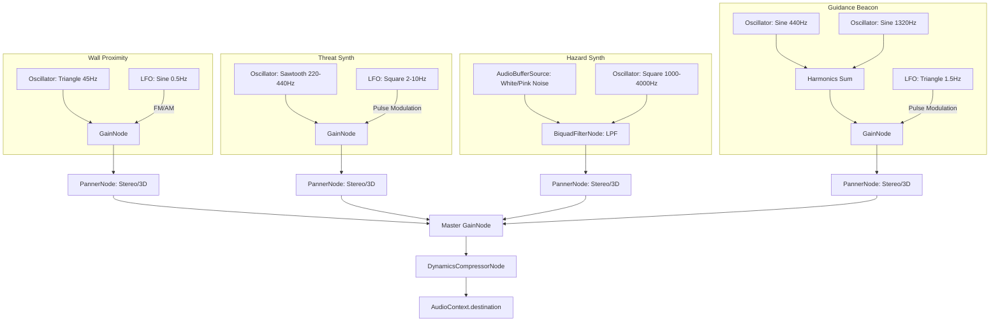

# BIOME 7: STORM BELT — AUDIO NAVIGATION TUNNEL SPECIFICATION

## Document ID: `DOC-GRO-1191-B7-AUDIO`
## Version: 1.0
## Date: June 11, 2026
## Status: Approved / Ready for Implementation
## Reference: `docs/GAME-DESIGN-DOCUMENT.md`, `docs/lyra-navigator-system.md`

---

## 1. NARRATIVE & GAMEPLAY CONTEXT

Biome 7 (Storm Belt / HD 189733b) is a critical mechanical and narrative turning point in *Darius Star: Cyber Coelacanth*. Following the Navy's devastating attack on Haven-7 at the end of Biome 6, **Lyra Navigator** has been exposed to an experimental attunement accelerator, plunging her into a deep comatose state. 

Without Lyra's active neural-link guidance, the *Nyxa*'s cockpit instruments fail to read through the extreme electromagnetic storm of the Storm Belt. The player is thrust into a **zero-visibility level** (the eye-wall corridor of an eternal hurricane). Standard visual navigation is impossible, and the player must guide the ship purely using **spatial chiptune audio cues** synthesized by the ship’s emergency backup system, aided by Ophion's raw, uncalibrated precursor data broadcast.

---

## 2. SPATIAL AUDIO SYSTEM ARCHITECTURE (WEB AUDIO API)

The audio navigation system is powered by the Web Audio API, utilizing procedural oscillators, spatial panners, and modulation nodes to translate physical obstacles, threat vectors, and safe paths into real-time sound.

### 2.1 Web Audio API Graph

The system routes synthesis nodes to a central stereo `PannerNode` or `StereoPannerNode` for each entity, then feeds into a master gain stage and dynamic compressor.



---

## 3. SYNTHESIS SPECIFICATIONS BY THREAT TYPE

The emergency synthesizer uses four distinct chiptune sound signatures to communicate the tactical environment:

### 3.1 Tunnel Boundary Proximity (Wall Collision Warning)
* **Waveform**: Triangle wave (warm, low-frequency rumble, mimicking structural hull resonance).
* **Base Frequency**: $45\text{ Hz}$ (Sub-bass, felt as much as heard).
* **Modulation**: Slowly modulated by a $0.5\text{ Hz}$ sine wave LFO (modulates gain to simulate atmospheric swelling).
* **Gain Mapping**: Proportional to the player's proximity to the top and bottom screen boundaries:
  * Top wall intensity: $G_{top} = \max\left(0, 1 - \frac{y_{player}}{d_{boundary}}\right)$
  * Bottom wall intensity: $G_{bottom} = \max\left(0, 1 - \frac{H_{screen} - y_{player}}{d_{boundary}}\right)$
  * Where $d_{boundary} = 80\text{ pixels}$ and $H_{screen} = 450\text{ pixels}$.
* **Panning**:
  * Top boundary sound is panned to the far left ($Pan = -1.0$) to indicate upper ceiling risk.
  * Bottom boundary sound is panned to the far right ($Pan = 1.0$) to indicate floor collision risk.

### 3.2 Moving Threats (Minion Drones / Obstacles)
* **Waveform**: Sawtooth wave (aggressive, buzzy, easily cutting through low-frequency storm hum).
* **Base Frequency**: Sweeps dynamically between $220\text{ Hz}$ (Low A) and $440\text{ Hz}$ (Concert A) based on distance.
* **Pulse Modulation**: A square wave LFO controls the gate gain, creating a "beeping" radar alert:
  * Distant ($dx > 400\text{ px}$): Beep rate is $2\text{ Hz}$ (2 pulses per second).
  * Dangerous ($dx < 150\text{ px}$): Beep rate accelerates to $6\text{ Hz}$.
  * Immediate Collision ($dx < 50\text{ px}$): Beep rate turns into a solid, un-pulsed alarm ($15\text{ Hz}$).
* **Spatial Mapping**:
  * $Pan = \text{clamp}\left(\frac{x_{enemy} - x_{player}}{400}, -1.0, 1.0\right)$
  * $Gain = \max\left(0, 1 - \frac{\text{distance}}{500}\right)$ (attenuates to $0$ past $500\text{ px}$).

### 3.3 High-Hazard Warnings (Lightning Bolts & Wind Shears)
* **Lightning Bolts (Horizontal/Vertical Strikes)**:
  * **Synthesis**: Combine a high-pitch Square wave ($1200\text{ Hz}$) with high-pass filtered white noise.
  * **Pre-Strike Build-up (1.5s warning)**: An ascending pitch sweep ($1000\text{ Hz} \to 4000\text{ Hz}$) pulsing rapidly at $10\text{ Hz}$.
  * **Strike Trigger**: A massive $0.5\text{s}$ white-noise explosion burst with a fast exponential decay.
  * **Panning**: Panned dynamically to the strike lane's horizontal/vertical center.
* **Wind Shears (Drift Currents)**:
  * **Synthesis**: Pink noise (simulating organic wind friction) routed through a resonant Bandpass Filter.
  * **Modulation**: The filter cutoff sweeps slowly between $200\text{ Hz}$ and $800\text{ Hz}$ at a $0.15\text{ Hz}$ rate.
  * **Behavior**: Pans left-to-right (representing tailwinds pushing the ship) or right-to-left (headwinds). The player must counter-steer in the opposite direction of the pan.

### 3.4 Guidance / Safe Path (Ophion's Data Beacon)
* **Waveform**: Composite additive synthesis: Fundamental Sine wave ($440\text{ Hz}$) + Harmonic Sine wave ($1320\text{ Hz}$).
* **Pulse Modulation**: Modulated by a triangle LFO at a stable, comforting $2.0\text{ Hz}$ (double-chime beat).
* **Trajectory Mapping**:
  * **On-Course** (Player $y$ within $\pm 25\text{ px}$ of the safe path center $y_{safe}$): Sound is perfectly centered ($Pan = 0$) and plays the steady $2.0\text{ Hz}$ harmonic chime.
  * **Drifting Above Safe Path** ($y_{player} < y_{safe} - 25\text{ px}$): The pitch drops to $330\text{ Hz}$ (Low warning), the pulse rate slows down to $0.8\text{ Hz}$, and the audio pans slightly to the **Right** (directing player to steer down).
  * **Drifting Below Safe Path** ($y_{player} > y_{safe} + 25\text{ px}$): The pitch rises to $587\text{ Hz}$ (High warning), the pulse rate slows down to $0.8\text{ Hz}$, and the audio pans slightly to the **Left** (directing player to steer up).

---

## 4. SCREEN FILTER & VISUAL DEGRADATION SPECS

To represent the crushing cloud density and electromagnetic blindness of HD 189733b, the rendering pipeline employs a series of screen filters.

### 4.1 Zero-Visibility Fog (Radial Mask)
A solid overlay covers the screen, representing the storm cloud. The player's ship projects emergency headlights, creating a small cone of visibility.
1. Draw a dark base layer: `rgba(16, 16, 24, 0.96)`.
2. Apply a radial gradient centered on the player's ship coordinates $(x_p, y_p)$:
   * Center ($r = 0\text{ px}$): `rgba(0, 0, 0, 0.0)` (fully transparent).
   * Edge ($r = 80\text{ px}$): `rgba(16, 16, 24, 0.96)`.
3. Render game entities (bullets, enemies, hazards) *only* if their distance to the player is less than $80\text{ px}$. Entities outside this bubble are completely hidden visually, forcing reliance on the audio beacons.

### 4.2 Environmental FX Layers
* **Lightning Flash Strobe**: When a lightning strike occurs, flash a screen-sized overlay of `rgba(170, 170, 204, 0.45)` with a fast exponential decay ($150\text{ms}$).
* **Torrential Rain Sheets**: Draw $30$-$40$ semi-transparent blue-white lines (`#CCDDFF` at $0.08$ opacity) scrolling vertically at $600\text{ px/s}$ with a $15^\circ$ rightward drift.
* **Static Interference Bands**: Every $4$ seconds, spawn a $20\text{ px}$ high horizontal band (`rgba(136, 136, 170, 0.12)`) that scrolls from top to bottom at $120\text{ px/s}$, accompanied by a brief chiptune static noise burst.
* **CRT Scanline Emulation**: Overlay a fine grid of horizontal line patterns (every $2\text{ px}$ at $0.05$ opacity) to match the Sega Genesis console aesthetic.

### 4.3 HUD Modifications
* **Lyra Portrait**: Greyed out, eyes closed, with a red pulsing comms banner overlay reading **"NO SIGNAL"** or **"SYSTEM OFFLINE"**.
* **Radar Module**: The circular radar display in the HUD is replaced with random salt-and-pepper static noise pixels, rendering it useless.

---

## 5. PLAYER GUIDANCE MECHANICS

The player must develop audio attunement to survive the tunnel. The following table maps user inputs to the synthesized feedback loops:

| Player State | Auditory Feedback | Required Action |
|---|---|---|
| **On Safe Path** | Steady $440\text{ Hz}$ sine double-chime ($2.0\text{ Hz}$ rate) panned center. | Hold altitude. |
| **Drifting Too High** | Low pitch ($330\text{ Hz}$), slow beep ($0.8\text{ Hz}$), panned right. | Steer **Down** until sound centers and pitch returns to $440\text{ Hz}$. |
| **Drifting Too Low** | High pitch ($587\text{ Hz}$), slow beep ($0.8\text{ Hz}$), panned left. | Steer **Up** until sound centers and pitch returns to $440\text{ Hz}$. |
| **Approaching Ceiling** | Sub-bass triangle wave ($45\text{ Hz}$) swelling in Left speaker. | Steer **Down** immediately. |
| **Approaching Floor** | Sub-bass triangle wave ($45\text{ Hz}$) swelling in Right speaker. | Steer **Up** immediately. |
| **Incoming Frontal Enemy** | Accelerating sawtooth beep ($2\text{ Hz} \to 15\text{ Hz}$) shifting from right to center. | Fire weapons or steer vertically away from the pan direction. |
| **Incoming Lightning Strike** | $10\text{ Hz}$ square pitch-sweep alarm ($1000\text{ Hz} \to 4000\text{ Hz}$) in specific lane. | Evacuate the panned lane before the $1.5\text{s}$ warning period expires. |

---

## 6. CODE IMPLEMENTATION MOCKUPS

The following Javascript files provide reference designs for the audio manager and rendering pipeline additions.

### 6.1 Audio Synthesis Engine (`js/audio_synth_b7.js`)

```javascript
class Biome7AudioSynth {
    constructor() {
        this.ctx = new (window.AudioContext || window.webkitAudioContext)();
        this.masterGain = this.ctx.createGain();
        this.masterGain.gain.setValueAtTime(0.8, this.ctx.currentTime);
        
        // Limiter to prevent clipping
        this.limiter = this.ctx.createDynamicsCompressor();
        this.limiter.threshold.setValueAtTime(-12, this.ctx.currentTime);
        this.limiter.knee.setValueAtTime(0, this.ctx.currentTime);
        this.limiter.ratio.setValueAtTime(20, this.ctx.currentTime);
        this.limiter.attack.setValueAtTime(0.002, this.ctx.currentTime);
        this.limiter.release.setValueAtTime(0.1, this.ctx.currentTime);
        
        this.masterGain.connect(this.limiter);
        this.limiter.connect(this.ctx.destination);
        
        this.activeNodes = new Map();
    }

    // Wall rumble synthesizer
    playWallWarning(isTop, distance) {
        const key = isTop ? 'top_wall' : 'bottom_wall';
        let node = this.activeNodes.get(key);
        
        if (!node) {
            const osc = this.ctx.createOscillator();
            const gain = this.ctx.createGain();
            const panner = this.ctx.createStereoPanner();
            
            osc.type = 'triangle';
            osc.frequency.setValueAtTime(45, this.ctx.currentTime);
            
            // LFO for atmospheric swelling
            const lfo = this.ctx.createOscillator();
            const lfoGain = this.ctx.createGain();
            lfo.frequency.setValueAtTime(0.5, this.ctx.currentTime);
            lfoGain.gain.setValueAtTime(0.15, this.ctx.currentTime);
            lfo.connect(lfoGain);
            lfoGain.connect(osc.frequency); // FM modulation
            
            panner.pan.setValueAtTime(isTop ? -0.8 : 0.8, this.ctx.currentTime);
            
            osc.connect(gain);
            gain.connect(panner);
            panner.connect(this.masterGain);
            
            osc.start();
            lfo.start();
            
            node = { osc, gain, panner, lfo };
            this.activeNodes.set(key, node);
        }
        
        // Update volume based on proximity (clamped to 80px range)
        const intensity = Math.max(0, 1 - (distance / 80));
        node.gain.gain.setTargetAtTime(intensity * 0.4, this.ctx.currentTime, 0.05);
    }

    // Guidance Beacon Synthesizer
    updateGuidanceBeacon(playerY, safeY) {
        let node = this.activeNodes.get('beacon');
        if (!node) {
            const oscFundamental = this.ctx.createOscillator();
            const oscHarmonic = this.ctx.createOscillator();
            const gain = this.ctx.createGain();
            const panner = this.ctx.createStereoPanner();
            
            oscFundamental.type = 'sine';
            oscHarmonic.type = 'sine';
            
            oscFundamental.connect(gain);
            oscHarmonic.connect(gain);
            gain.connect(panner);
            panner.connect(this.masterGain);
            
            oscFundamental.start();
            oscHarmonic.start();
            
            node = { osc1: oscFundamental, osc2: oscHarmonic, gain, panner, pulseTimer: 0 };
            this.activeNodes.set('beacon', node);
        }
        
        const diffY = playerY - safeY;
        let targetFreq = 440;
        let targetPan = 0;
        let pulseInterval = 500; // ms between chimes

        if (diffY < -25) {
            // Player is too high, steer down (pan right, low warning)
            targetFreq = 330;
            targetPan = 0.5;
            pulseInterval = 1200;
        } else if (diffY > 25) {
            // Player is too low, steer up (pan left, high warning)
            targetFreq = 587;
            targetPan = -0.5;
            pulseInterval = 1200;
        }

        node.osc1.frequency.setTargetAtTime(targetFreq, this.ctx.currentTime, 0.1);
        node.osc2.frequency.setTargetAtTime(targetFreq * 3, this.ctx.currentTime, 0.1);
        node.panner.pan.setTargetAtTime(targetPan, this.ctx.currentTime, 0.1);
        
        // Procedural chime pulsing
        const now = Date.now();
        if (!node.lastPulse || now - node.lastPulse > pulseInterval) {
            node.gain.gain.setValueAtTime(0.001, this.ctx.currentTime);
            node.gain.gain.exponentialRampToValueAtTime(0.25, this.ctx.currentTime + 0.05);
            node.gain.gain.exponentialRampToValueAtTime(0.001, this.ctx.currentTime + 0.25);
            node.lastPulse = now;
        }
    }

    stopAll() {
        this.activeNodes.forEach(node => {
            if (node.osc) node.osc.stop();
            if (node.osc1) node.osc1.stop();
            if (node.osc2) node.osc2.stop();
            if (node.lfo) node.lfo.stop();
        });
        this.activeNodes.clear();
    }
}
