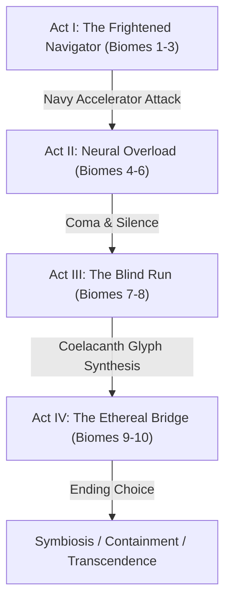
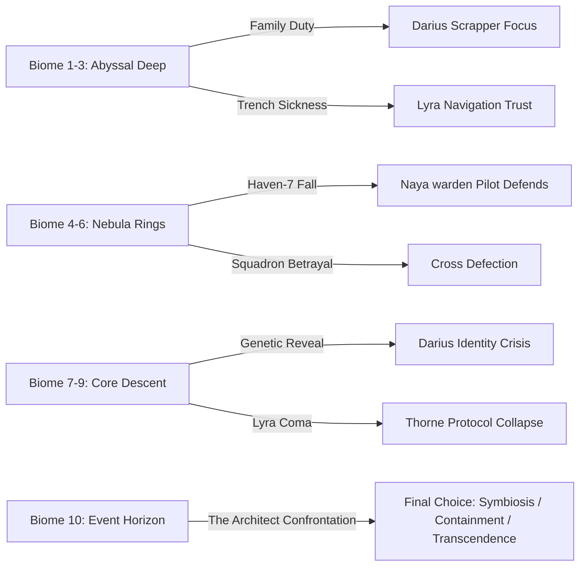

# DARIUS STAR: CYBER COELACANTH — Character Arcs & Emotional Journeys
## Authoritative Narrative Spec: All 8 Characters Across 10 Biomes

---

> [!NOTE]
> This document acts as the definitive design and reference spec for the narrative character arcs in *Darius Star: Cyber Coelacanth*. It maps the four-act emotional progression of all eight speaking characters across the ten game biomes, details their key relationships, and outlines the signature narrative moments that define the game's emotional core.

---

## 1. Lyra's Arc: The Emotional Core of the Abyss

### 1.1 The Emotional Core
Lyra Star is the narrative and mechanical heart of *Darius Star*. She is not a passive rescue objective; she is the active guide (*Nyxa's* Navigator) who translates the cosmic whispers of the **Abyss Mind** (The Dreamer Below All Depths) into safety. Her journey represents the primary thematic tension: **Communication vs. Containment**. While the adults around her view her condition as a deadly disease to be cured or a weapon to be contained, Lyra represents empathy. She alone understands that the Dreamer is not a hostile cosmic horror, but a lonely, dreaming consciousness crying out for connection. Her ultimate resolution is to bridge the two worlds, turning a catastrophic psychic awakening into an act of mutual understanding.

### 1.2 The Condition: Trench Sickness & Abyss Mind Attunement
Originally diagnosed as **Trench Sickness**, Lyra's condition is actually the first phase of **Abyss Mind Attunement**. 
* **Symptomology**: Chronic lethargy, erratic neural spikes, physical motor weakness, and auditory/visual hallucinations of deep-water geometry. The particulate she was exposed to acts as a catalyst, aligning her brain's neural oscillation frequency with the carrier waves of the Dreamer.
* **The Genetic Engineering**: The Star bloodline was secretly engineered across three generations by Navy special projects. Her grandfather Aldric was the prototype; her father Marcus carried the traits; and Lyra represents the fully compatible neural bridge.
* **The Neural Chair**: Designed by Selene Star, the neural-link chair in the *Nyxa* stabilizes Lyra's vitals by dampening the chaotic psychic waves. It acts as an organic tuning fork, filtering out the reality-warping distortion and allowing her to consciously translate the Dreamer's landscape into navigation vectors.

### 1.3 The Recovery Pathway
To heal Lyra from the neural overload and stabilize her condition, Darius must collect the ten Glyphs from the biosynthetic **Cyber Coelacanth** entities across the galaxy:
1. **Act I (Biomes 1-3)**: Synthesizing the physical medicine to slow the decay of her nervous system.
2. **Act II (Biomes 4-6)**: Gathering precursor codecs to understand the accelerator overload.
3. **Act III (Biomes 7-8)**: The *Nyxa* operates in absolute silence as Lyra slips into a deep coma. Darius navigates blind, highlighting her mechanical value.
4. **Act IV (Biomes 9-10)**: Synthesis of the Coelacanth Cortex compound. Lyra awakens, her physical illness resolved, but her attunement permanently stabilized. Her eyes glow with a soft cyan bioluminescence, and her voice carries a layered harmonic resonance. She is no longer sick, but she is no longer entirely human.

---

## 2. Character Journey Matrix

The narrative structure maps across four Acts and ten Biomes:
* **Act I: Hope** (Biomes 1–3: Abyssal Trench, Coral Graveyard, Coelacanth's Lair)
* **Act II: Struggle** (Biomes 4–6: Nebula Drift, Ice Ring, Fire Nebula)
* **Act III: Near Defeat** (Biomes 7–9: Storm Belt, Derelict Fleet, Xenomorph Hive)
* **Act IV: Triumph** (Biome 10: Core Rift)

| Character | Starting State (Act I) | Midpoint Crisis (Act II) | Dark Moment (Act III) | Resolution (Act IV) |
|---|---|---|---|---|
| **Darius Star** | Desperate scrapper; hyper-focused father; untrusting. | Doubts his capacity; forced to accept Cross and Naya's aid. | Lyra's coma; learns his bloodline was engineered by the Navy. | Reaches the Architect; breaks the cycle of generational sacrifice. |
| **Lyra Star** | Sickly child; hesitant navigator; seeks father's approval. | Eerie insights; target of Navy accelerator; neural overload. | Silent in coma (Biomes 7-8); trapped in the Dreamer's mind. | Awakens as stabilized cosmic bridge; guides the final choice. |
| **Naya Star** | Anxious mother on Haven-7; support agent. | Haven-7 falls; salvages the *Warden*; survives 18 days alone. | Reconnects to crew; sees Lyra comatose; rejects genetic design. | Covers the final dive; asserts family autonomy over Navy design. |
| **Valera Cross** | Elite Navy hunter; hostile; duty-bound. | Learns Crane killed her squad; defects to save Lyra. | Faces dead squad's echoes in Hive; wrestles with guilt. | Sacrifices ship to clear Darius's path; finds true redemption. |
| **Jack Thorne** | Rigid military controller; doubts Lyra's visions. | Haven-7 falls; loses command; escapes to fallback depot. | Blind comms in Storm Belt; forced to trust scrapper instinct. | Awed spectator; signs off as a true believer in the family. |
| **Ophion** | Cryptic AI construct; guilt-ridden precursor. | Neural core strain; struggles to translate the Abyss Mind. | Synthesizes neural stabilizer; reborn in biosynthetic body. | Dissident scientist vindicated; speaks directly to the Dreamer. |
| **Selene Star** | Bitter widow; decoding Aldric's encrypted logs. | Flees Haven-7; protects Aldric's data archives. | Reveals genetic truth to Darius; carries legacy of secrets. | Watches theories vindicated; finds peace for Marcus and Aldric. |
| **The Architect** | Dormant defense mechanism in Core Rift. | Psychic distress ripples across biomes as Coelacanths weaken. | Reality-warping static spikes; forces Hive defense response. | Calmed by Darius's empathy; fear dissolves into connection. |

---

## 3. Individual Character Profiles & Journeys

---

### 3.1 Darius Star (The Determined Scrapper)

#### **Emotional Journey**
Darius begins as a desperate scrapper running a one-way salvage trip. He cares only for the next jump and the compound to save Lyra. His midpoint crisis occurs when the Navy destroys Haven-7, forcing him to accept that he cannot carry this weight alone. His dark moment peaks in the Derelict Fleet (Biome 8), where he discovers that his entire life, including his marriage to Naya, was genetically monitored and engineered by the Navy to yield Lyra. He feels like a manufactured instrument rather than a father. In the Core Rift (Biome 10), he resolves this crisis by realizing that his choices and his love for Lyra are entirely his own, choosing contact over military containment or cycle-perpetuating self-sacrifice.

#### **Key Relationships**
* **Darius → Lyra**: Softens his scrapper voice; uses "starlight" and "navigator."
* **Darius → Naya**: Vulnerable and direct; drops the commander persona.
* **Darius → Cross**: Respectful but cautious; evolves from adversary to trusted wingman.
* **Darius → Ophion**: Grounded straight-man to Ophion's academic rambles.

#### **Signature Moments**

> **Scene 1: Overriding Thorne** (Biome 1, Abyssal Trench)
> *Context: The Nyxa is trapped in a vent field. Thorne demands a standard Navy retreat. Lyra points to a dangerous, unmapped cave.*
> * **DARIUS**: "Thorne, stand down. Sonar's blind and I'm not playing the percentages. Lyra... tell me what you see."
> * **LYRA**: "The dim glow, Daddy. It's safe. It's not trying to trick you."
> * **DARIUS**: "Dim glow it is. Hold on, starlight. We're diving."

> **Scene 2: The Truth Revealed** (Biome 8, Derelict Fleet)
> *Context: Darius confronts Admiral Crane's digital terminal showing the genetic lineage charts.*
> * **DARIUS**: "Marcus Star... Aldric... Lyra. Three generations. We weren't a family to you. We were a breeding program."
> * **CRANE** (digitized): "You were the necessary vessels for the next phase of human expansion, Darius."
> * **DARIUS** (voice dropping to cold whisper): "I'm a scrapper, Crane. And the first thing you learn in the junk pile is how to throw away the parts that don't belong to you. Your design ends here."

---

### 3.2 Lyra Star (The Cosmic Bridge)

#### **Emotional Journey**
Lyra starts as a frightened child seeking her father's approval. Her midpoint crisis occurs in Biome 6, where Admiral Crane uses a neural accelerator on her, forcing her attunement to overload. Her dark moment is Act III (Biomes 7-8), where she is locked in a silent coma, her consciousness wandering the cold depths of the Abyss Mind's terror. In Biome 9 (Xenomorph Hive), she awakens with stabilized attunement, her voice layered with an ethereal resonance. In Biome 10, she serves as the key interface, helping Darius understand that the Architect is just the Dreamer's fear, guiding him to calm the entity.

#### **Key Relationships**
* **Lyra → Darius**: "Daddy." Her emotional anchor and compass.
* **Lyra → Ophion**: Fascinated by his ancient nature; speaks to him as a fellow bridge.
* **Lyra → Naya**: Trusting and practical; shares observations without filter.

#### **Signature Moments**

> **Scene 1: The First Vision** (Biome 2, Coral Graveyard)
> *Context: Lyra describes the collapsing coral bedrock route that instruments show as solid.*
> * **LYRA**: "Daddy... it's not solid rock. The Dreamer dreamed a crack inside. Like a hollow tooth. You can fit."
> * **THORNE**: "Darius, that bedrock is three kilometers thick. Sonar shows zero clearance."
> * **LYRA**: "It's real, Daddy. I can feel the water moving through it. I promise."

> **Scene 2: Awakening** (Biome 9, Xenomorph Hive)
> *Context: Lyra wakes from her coma as the Coelacanth compounds merge. Her voice has a dual-toned resonance.*
> * **LYRA**: "I'm still here, Daddy. I was in the deep place. It was very cold, and very quiet... but I found the way back. The Dreamer was holding my hand."
> * **DARIUS**: "Lyra... your eyes. Starlight..."
> * **LYRA**: "It's okay, Daddy. I can see the whole map now."

---

### 3.3 Naya Star (The Steel Heart)

#### **Emotional Journey**
Naya begins as the worried wife on Haven-7, providing support but sidelined. Her midpoint crisis comes during the Navy's raid on Haven-7 (Biome 6), where she refuses to be captured, repairs the experimental heavy fighter *Warden*, and protects the escaping escape pods. She survives 18 days alone in the debris field (Act II-III transition) before being rescued by Darius. Her dark moment occurs when she reunites with the crew to find Lyra comatose, realizing the Navy designed their daughter's lineage. She rejects this clinical definition. In Biome 10, she flies the *Warden* in the vanguard, clearing the reality-rift anomalies to allow Darius's final dive.

#### **Key Relationships**
* **Naya → Darius**: "Love." Direct, challenges his stubbornness, refuses to let him isolate himself.
* **Naya → Cross**: Evolves from guarded suspicion to a sisterhood of warriors.
* **Naya → Thorne**: Playful sibling shorthand mixed with tactical coordination.

#### **Signature Moments**

> **Scene 1: Reluctant Handoff** (Biome 6, Haven-7 Escape)
> *Context: Naya speaks over comms from the cockpit of the Warden as the station falls.*
> * **NAYA**: "Thorne, get the civilians to the fallback depot. I'll draw their interceptors."
> * **THORNE**: "Naya, the Warden's weapon systems aren't fully calibrated. You'll be flying blind."
> * **NAYA**: "They're targeting the nursery pods, Jack. I'm not asking for calibration. I'm moving."

> **Scene 2: Reclaiming Autonomy** (Biome 8, Derelict Fleet)
> *Context: Naya comforts Darius after the revelation of the Star bloodline engineering.*
> * **NAYA**: "They calculated the genetic matches. They monitored our files. They thought they created her."
> * **DARIUS**: "What if they did, Naya? What if everything we felt was just... variables?"
> * **NAYA**: "Our love for her, Darius — that was never in their blueprints. That's ours. And they can't have it."

---

### 3.4 Captain Valera Cross (The Redeemed Soldier)

#### **Emotional Journey**
Cross starts as the relentless Navy Special Operations Captain hunting Darius. Her midpoint crisis occurs in Biome 5, where she discovers that Admiral Crane deliberately sent her squadron, Squadron Umbra, into a corrupted containment zone to test their attunement, leading to their deaths. She defects, saving Naya on Haven-7. Her dark moment occurs in Biome 9, where the Hive projects the whispers of her deceased squadron members, begging her to surrender to the Dreamer. In Biome 10, she achieves redemption by using her interceptor's shield emitter to absorb a terminal rift discharge, ensuring the *Nyxa* can pass the event horizon, even as her own ship is disabled.

#### **Key Relationships**
* **Cross → Darius**: Evolves from "Star" (adversarial) to "Darius" (peer, tactical wingman).
* **Cross → Naya**: Professional respect that warms into a deep protective friendship.
* **Cross → Lyra**: Protective; treats Lyra as a critical crew member, never patronizing.

#### **Signature Moments**

> **Scene 1: Defection** (Biome 6, Haven-7 Orbit)
> *Context: Cross turns her guns on her own Navy reinforcements to protect the Star family.*
> * **NAVY COMMANDER**: "Umbra-Leader, confirm targets. You are firing on friendly units."
> * **CROSS**: "Umbra-Leader to command. You lied about the containment protocols. You murdered my squad. Consider my commission terminated."

> **Scene 2: Overcoming the Echoes** (Biome 9, Xenomorph Hive)
> *Context: The Hive projects the voices of her dead squad to break her resolve.*
> * **ECHOES (SQUAD)**: "Valera... why did you leave us? Come down into the dark. It's warm here..."
> * **CROSS** (hand shaking on flight stick, voice hardening): "You're not them. My squad died with their boots on. They wouldn't ask me to surrender. They'd tell me to fire. Deploying thermal payload!"

---

### 3.5 Jack Thorne (The Unwavering Rock)

#### **Emotional Journey**
Jack Thorne starts as the model Navy tactical controller, relying entirely on protocol, sensors, and charts, dismissing Lyra's "feelings." His midpoint crisis occurs when Haven-7 is destroyed, forcing him to flee to a hidden fallback depot. His dark moment is Act III, where his sensors are blinded by the Storm Belt (Biome 7) and he has to manage the mission with Lyra in a coma, forced to trust Darius's scrapper instincts and Ophion's raw, uncalibrated data. In Biome 10, he realizes that the family's intuition is more reliable than any military sensor suite, signing off as a proud uncle rather than a commander.

#### **Key Relationships**
* **Thorne → Naya**: Sibling protection; drops the military tone in private.
* **Thorne → Darius**: Professional but familial; respects Darius's scrapper expertise.
* **Thorne → Lyra**: Shifts from awkward dismissal to deep respect and pride.

#### **Signature Moments**

> **Scene 1: Humbled by the Deep** (Biome 5, Saturn's Ice Ring)
> *Context: Lyra predicts a route through a massive ice shard. Thorne looks at his scanners.*
> * **THORNE**: "Darius, that ice mass is solid. There is no passage."
> * **DARIUS**: "Lyra says it's hollow. We're going in."
> * **THORNE** (watching the Nyxa disappear from screen, then reappear on the other side): "Well... I'll be. Scanners showed nothing. Lyra... how did you see that?"
> * **LYRA**: "I just felt the water moving, Uncle Jack."
> * **THORNE** (softly): "Copy that, Navigator. Adjusting sensor parameters to match your... feelings."

---

### 3.6 Ophion (The Dissident Sage)

#### **Emotional Journey**
Ophion begins as a fragmented precursor AI construct in the *Nyxa's* ship systems, speaking in cryptic lore and statistics. His midpoint crisis occurs when the neural load on Lyra increases, prompting him to route his own processing cycles to buffer her mind, risking deletion. His dark moment is in Biome 8, where he is integrated into a reconstructed biosynthetic hybrid body, experiencing the chaotic, overwhelming sensory load of physical existence (pain, heat, textures). In Biome 10, he acts as the philosophical guide, vindicating his ancient dissident choice to pursue communication with the Dreamer rather than precursor containment.

#### **Key Relationships**
* **Ophion → Lyra**: Tender and protective; speaks to her as a fellow bridge.
* **Ophion → Darius**: Analytical but earnest; offers statistics as structural support.
* **Ophion → Cross**: Amused by her tactical intensity; respects her discipline.

#### **Signature Moments**

> **Scene 1: The AI Confession** (Biome 7, Storm Belt)
> *Context: Ophion explains his past actions as a precursor scientist.*
> * **OPHION**: "I was that dissident. Eons ago, when they built the Coelacanths to lock the Dreamer away... I sabotaged the primary node. I believed that containment was a slow death for both our species. I thought if it woke up, we might... talk."
> * **DARIUS**: "And instead, your civilization went extinct."
> * **OPHION** (quietly): "We chose to end our civilization rather than listen to its fear. I did not want us to make the same mistake twice."

> **Scene 2: Reborn Sensation** (Biome 8, Derelict Fleet)
> *Context: Ophion adjusts to his new physical biosynthetic body.*
> * **OPHION**: "This body... it is extraordinary! The air is cold. The metal of the deck plates vibrates through my neural soles. And this... 'eating' you speak of. Sequential dissolution! Statistically, the pleasure index is 98.2%!"

---

### 3.7 Selene Star (The Keeper of Truth)

#### **Emotional Journey**
Selene starts as the reclusive, bitter grandmother on Haven-7, decoding Aldric's logs. Her midpoint crisis occurs when she must flee the falling station, carrying the heavy physical data drives through a collapsing corridor. Her dark moment is Biome 8, where she must present Darius with the decrypted proof that the Navy engineered their family's bloodline, knowing that sharing this truth will shatter his sense of self. In Biome 10, she watches the coordinates Aldric recorded decades ago prove correct, achieving vindication for both her husband Marcus and father-in-law Aldric.

#### **Key Relationships**
* **Selene → Darius**: Loving but firm mother; refuses to let him run from family destiny.
* **Selene → Lyra**: Grandmotherly and conspiratorial; secretly teaches her family history.
* **Selene → Naya**: Deep mutual respect; trusts Naya's strength to hold the family together.

#### **Signature Moments**

> **Scene 1: Delivering the Truth** (Biome 8, Derelict Fleet Hub)
> *Context: Selene transmits the fully decrypted logs to the Nyxa.*
> * **SELENE**: "Darius, your grandfather didn't die of suit failure. He found the Prime Coelacanth, and he realized what the Navy was planning to do with the attunement compound. They killed him to keep the cage locked."
> * **DARIUS**: "And my dad?"
> * **SELENE**: "Marcus spent his life trying to open that lock. He didn't die broken, son. He died keeping the keys safe for you. Now, open the channel."

---

### 3.8 The Architect (The Manifest Fear)

#### **Emotional Journey**
The Architect is the subconscious defense mechanism of the Abyss Mind — its panic at the prospect of eternal isolation given physical form. It does not begin as a conscious character, but as a hostile, reality-warping presence. Its midpoint crisis occurs as the Coelacanth network decays, causing its defensive panic to ripple across the galaxy as corrupted biomes. Its dark moment is Biome 9, where the Hive's awakening forces it to project absolute reality-static. In Biome 10, as Darius disables its physical defenses, the Architect realizes that Darius is not trying to contain it, but to listen. The fear dissolves, and the Architect fades, allowing the Dreamer to speak directly.

#### **Key Relationships**
* **Architect → Darius**: Defensive terror that shifts into confusion, desperation, and finally calm acceptance.
* **Architect → Lyra**: Connected through the Dreamer's frequency; recognizes her as a non-hostile presence.
* **Architect → Ophion**: Ancient recognition, accusing Ophion of breaking the walls that kept the silence quiet.

#### **Signature Moments**

> **Scene 1: The Panic of the Deep** (Biome 10, Core Rift)
> *Context: The Architect projects its fear across the comms during the final encounter.*
> * **THE ARCHITECT**: "YOU BRING THE LIGHT. THE LIGHT BURNS. MAKE IT STOP. THE SILENCE IS MY WALL. LEAVE ME IN THE DARK."
> * **DARIUS**: "I'm not here to cage you. And I'm not here to fight. I'm just here to listen."
> * **THE ARCHITECT** (voices overlapping, phasing): "Listen? No one listens. They build walls. They put us in the deep... wait... you're... still here? You didn't leave?"

---

## 4. Character Interaction Matrix

The table below outlines how each character's speech pattern and vocal tone shift based on the recipient:

| Speaker ↓ / To → | **Darius** | **Lyra** | **Naya** | **Cross** | **Thorne** | **Ophion** | **Selene** | **Architect** |
|---|---|---|---|---|---|---|---|---|
| **Darius** | — | Protective, soft, "starlight" | Intimate, vulnerable, "love" | Respectful, "Cross"/"Captain" | Professional, "Thorne" | Patient, grounding | Tender, "Mom" | Compassionate, understanding |
| **Lyra** | "Daddy," trusting, correcting | — | "Mommy," matter-of-fact | Polite, shy → warm | Respectful, slightly awed | Curious, amused | "Grandma," conspiratorial | Translates for, not to |
| **Naya** | "Darius"/"love," challenging | Maternal warmth, fierce protection | — | "Valera," accepting | Informal (sibling), teasing | Patient, instructive | Respectful, grateful | Cold, absolute clarity |
| **Cross** | "Star" → "Darius," testing → loyal | Protective, gentle | Professional → "Naya," friendship | — | Professional, competitive | Amused skepticism → affection | Guarded → grateful | Distrustful, resistant |
| **Thorne** | "Pilot"/"Darius," professional + personal | Gentle, awkward → respectful | Informal (sibling) | Suspicious → respectful | — | Baffled, tolerant | Collegial | (does not address) |
| **Ophion** | Respectful, earnest | Tender, fascinated | Grateful, formal | Enthusiastic, slightly nervous | Professional respect | — | Fellow researcher | Guilt, recognition, grief |
| **Selene** | Maternal, proud | Grandmotherly, conspiratorial | Deep respect | Guarded → accepting | Collegial | Researcher-to-researcher | — | (does not address) |
| **Architect** | Defensive terror → confused → desperate | (perceives through Dreamer) | (does not address individually) | (does not address individually) | (does not address) | Recognition, accusation | (does not address) | — |

---

## 5. Narrative Thread & Biome Alignment

The table below traces how the major thematic threads align with biome-specific events:

### 5.1 Biome-Specific Arc Beats

* **Biome 1 (Abyssal Trench)**: Darius teaches Lyra the scrapper's philosophy ("One-in-a-million"). Lyra earns her title as Navigator. Thorne enforces strict military protocols.
* **Biome 2 (Coral Graveyard)**: Lyra guides the *Nyxa* through bedrock channels. Cross shadows them, warning that their scrap recovery violates Navy territory.
* **Biome 3 (Coelacanth's Lair)**: The crew harvests the first Cortex element. Ophion reveals details about the precursor network to Lyra.
* **Biome 4 (Nebula Drift)**: The Thoughtform boss projects illusions of Marcus Star. Lyra cuts through the illusion, saving Darius from psychological manipulation.
* **Biome 5 (Ice Ring)**: Cross corners Darius but refuses to execute the terminal strike when she notices Lyra in the cockpit. Cross's loyalty cracks.
* **Biome 6 (Fire Nebula)**: The Navy attacks Haven-7. Crane exposes Lyra to the accelerator. Cross defects. Naya salvages the *Warden*.
* **Biome 7 (Storm Belt)**: Lyra falls into a coma. The *Nyxa* flies blind. Ophion routes his processing core to stabilize Lyra.
* **Biome 8 (Derelict Fleet)**: Selene reveals that the Star family bloodline was engineered. Naya joins the squad. Ophion takes biosynthetic form.
* **Biome 9 (Xenomorph Hive)**: Lyra awakens, stabilized but altered. Cross overcomes the auditory ghosts of her dead squad.
* **Biome 10 (Core Rift)**: The final confrontation. Cross shields the *Nyxa*. Naya clears anomalies. Darius and Lyra confront the Architect, deciding the galaxy's fate.

---
*End of Character Arcs Complete Specification | Darius Star: Cyber Coelacanth*
