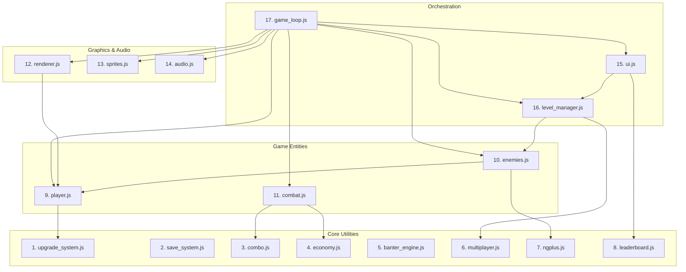

# Darius Star: Cyber Coelacanth — Code Quality Audit Report

This report presents a comprehensive code quality audit of the 17 JavaScript files located in [js/](file:///home/ubuntu/work/darius-star/js/) that compose the modularized engine of **Darius Star: Cyber Coelacanth**. The codebase is a canvas-based browser game loaded sequentially via script tags in [index.html](file:///home/ubuntu/work/darius-star/index.html).

---

## Executive Summary

While the pre-compilation syntax validation of all modules passes, a runtime audit of their interactions reveals several **critical integration gaps, missing properties, and namespace-scoping issues** that block gameplay progression, disable core features, or leak state across game loops.

### Key Audit Findings

1. **Banter Engine Silent Failure (Critical):** [banter_engine.js](file:///home/ubuntu/work/darius-star/js/banter_engine.js) is not attached to the `window` object. Because the rest of the engine does strict checks like `if (window.BanterEngine)`, all dialogue, story-beat triggers, and crew banter are silently disabled.
2. **Multiplayer Spawning Scale Bug (High):** [level_manager.js](file:///home/ubuntu/work/darius-star/js/level_manager.js) references `Multiplayer.activePlayers` to scale enemy count and health. However, `Multiplayer` has no such property (the correct property is `Multiplayer.count`). Consequently, the game scales difficulty for 1 player regardless of how many pilots join.
3. **Background & Particle Spawning Lock (Critical):** `LevelManager.currentLevelConfig` is missing `background` and `particleSettings` properties. 
   - `ui.js` calls `bgLayers[0].setKey(currentLevelConfig.background)` which evaluates to `undefined`, fallback-routing the background image to Biome 1 (`abyssal_trench`) forever.
   - `renderer.js` reads `currentLevelConfig.particleSettings` and immediately exits if it is missing, preventing all environmental particles (bubbles, embers, ice shards) from spawning.
4. **UI Level & Save System Reference Gaps (High):** [ui.js](file:///home/ubuntu/work/darius-star/js/ui.js) accesses `LevelManager.currentBiome` and `LevelManager.currentLevel`. However, `LevelManager` stores these as `LevelManager.biome` and `LevelManager.level`. This causes `biomeLevel` to become `undefined`, trapping the active biome name in Biome 1, displaying `undefined` in the HUD, and writing `undefined` to save slots.
5. **Namespace Pollution:** Only 2 out of 17 modules run inside Immediately Invoked Function Expressions (IIFEs). The remaining modules place all their configurations, classes, and helper functions in the global scope, presenting high namespace collision risks.
6. **Class-hoisting and Global Binding Omissions:** ES6 `class` definitions (e.g. `Enemy`, `Boss`, `Bullet`) declared globally in scripts do not attach properties to the browser's global `window` object. Gaps exist where automated tests expect window attachments that are missing on disk.

---

## Module-by-Module Health Report & Quality Scores

| Module | Exposes | Scope | Strict Mode? | Quality Score | Findings & Major Issues |
|:---|:---|:---:|:---:|:---:|:---|
| **[upgrade_system.js](file:///home/ubuntu/work/darius-star/js/upgrade_system.js)** | `window.DS_UpgradeSystem` | Local (IIFE) | No | **9.5 / 10** | Well-structured IIFE wrapper. Local helpers are safely hidden. Modifiers are correctly calculated and cached. |
| **[save_system.js](file:///home/ubuntu/work/darius-star/js/save_system.js)** | `window.CampaignSave` | Local (IIFE) | **Yes** | **10.0 / 10** | Gold standard. Uses strict mode, deep copies state migration safely, implements slot checks, and manages checkpoints correctly. |
| **[combo.js](file:///home/ubuntu/work/darius-star/js/combo.js)** | `Combo` | Global | No | **8.5 / 10** | Declared as a plain `const` object in global scope. Safe, but pollutes the namespace and lacks window binding. |
| **[economy.js](file:///home/ubuntu/work/darius-star/js/economy.js)** | `window.Economy` | Global | No | **9.0 / 10** | Exposes `Economy` to `window`. Has implicit references to global `biomeLevel` in fallback branches. Defines constants globally. |
| **[banter_engine.js](file:///home/ubuntu/work/darius-star/js/banter_engine.js)** | `BanterEngine` | Global | No | **4.0 / 10** | **CRITICAL BUG:** Omitted `window.BanterEngine` attachment. Since `game_loop.js` checks `if (window.BanterEngine)`, dialogue is completely disabled. |
| **[multiplayer.js](file:///home/ubuntu/work/darius-star/js/multiplayer.js)** | `window.Multiplayer` | Global | No | **9.5 / 10** | Exposes `Multiplayer` to `window`. Safely manages connection slots P1–P4 and maps them to input configurations. |
| **[ngplus.js](file:///home/ubuntu/work/darius-star/js/ngplus.js)** | `window.NGPlus` | Global | No | **10.0 / 10** | Clean integration. Handles paradox multipliers and enemy tint scaling. |
| **[leaderboard.js](file:///home/ubuntu/work/darius-star/js/leaderboard.js)** | `window.Leaderboard` | Global | No | **10.0 / 10** | Robust registry. Correctly sorts speedrun (ascending), scrap (descending), and deaths (ascending). |
| **[player.js](file:///home/ubuntu/work/darius-star/js/player.js)** | `window.Player` | Global | No | **8.0 / 10** | **Tight Coupling:** Deeply coupled to global state (`keys`, `enemyBullets`, `enemies`, `floatingTexts`, `particles`, `playSound`, `createExplosion`). Dodge reset uses a `setTimeout` that is never cleared, creating state desync hazards. |
| **[enemies.js](file:///home/ubuntu/work/darius-star/js/enemies.js)** | `EnemyBullet`, `Enemy`, `Boss` | Global | No | **8.5 / 10** | Contains classes for enemies and boss. Relies heavily on hoisted global states. Timeouts for cinematic transitions and next-biome advancements are fire-and-forget (never cleared on exit/reset). |
| **[combat.js](file:///home/ubuntu/work/darius-star/js/combat.js)** | `Bullet`, `PowerUp`, `SpriteExplosion` | Global | No | **7.5 / 10** | **Structural Inconsistency:** `ScrapDrop` placeholder comment block exists at the end of the file, but its actual class definition was moved to `renderer.js`. |
| **[renderer.js](file:///home/ubuntu/work/darius-star/js/renderer.js)** | `Particle`, `ScrapDrop`, `FloatingText` | Global | No | **8.0 / 10** | **Bloated Module:** Houses unrelated `ScrapDrop` class. Fails to spawn environmental particles due to missing `LevelManager` properties. Global arrays like `biomeBgCanvases` leak into global scope. |
| **[sprites.js](file:///home/ubuntu/work/darius-star/js/sprites.js)** | Loaders & collections | Global | No | **9.0 / 10** | Handles image loading and contains additive compositing filter. No local scoping. |
| **[audio.js](file:///home/ubuntu/work/darius-star/js/audio.js)** | context & synths | Global | No | **8.5 / 10** | **Copy-Paste Artifact:** The entire file is indented by 8 spaces. Web Audio synthesis works, but helper arrays leak globally. |
| **[ui.js](file:///home/ubuntu/work/darius-star/js/ui.js)** | `activeDialogue` etc. | Global | No | **6.5 / 10** | **CRITICAL INTEGRATION GAPS:** Accesses nonexistent `LevelManager` fields. Indented by 8 spaces. Registers window listeners that are never removed. |
| **[level_manager.js](file:///home/ubuntu/work/darius-star/js/level_manager.js)** | `window.LevelManager` | Global | No | **6.0 / 10** | **CRITICAL FUNCTIONAL GAPS:** Mismatches player count attributes, and fails to configure background or particle assets, breaking rendering visual shifts. |
| **[game_loop.js](file:///home/ubuntu/work/darius-star/js/game_loop.js)** | Game state variables | Global | No | **8.5 / 10** | Holds the central state pool and keyboard mappings. Heavily dependent on exact sequential loading of all other modules. Syntax lines fixed. |

---

## Implicit Dependency Graph & Load Order

All modules are loaded as standard scripts in the global scope of `index.html`. This sequential load order is critical: scripts loaded later read functions and classes defined in scripts loaded earlier.



### Exposes / Consumes Registry

| # | File | Exposes to Global Scope | Consumes from Global Scope |
|---|------|-------------------------|----------------------------|
| 1 | `upgrade_system.js` | `window.DS_UpgradeSystem` | `localStorage` |
| 2 | `save_system.js` | `window.CampaignSave` | `localStorage` |
| 3 | `combo.js` | `Combo` | Context `ctx` |
| 4 | `economy.js` | `window.Economy` | `biomeLevel` |
| 5 | `banter_engine.js` | `BanterEngine` | `Multiplayer` |
| 6 | `multiplayer.js` | `window.Multiplayer` | `Player` |
| 7 | `ngplus.js` | `window.NGPlus` | `window.CampaignSave` |
| 8 | `leaderboard.js` | `window.Leaderboard` | `localStorage` |
| 9 | `player.js` | `window.Player`, `DIFFICULTY_CONFIG` | `window.DS_UpgradeSystem`, `keys`, `enemyBullets`, `enemies`, `floatingTexts`, `particles`, `playSound`, `createExplosion` |
| 10 | `enemies.js` | `EnemyBullet`, `Enemy`, `Boss` | `canvas`, `currentNGLevel`, `window.NGPlus`, `mulberry32`, `getCurrentDifficultyConfig`, `player`, `enemySprites`, `determineEnding`, `playVictoryCinematic`, `advanceToNextBiome` |
| 11 | `combat.js` | `Bullet`, `PowerUp`, `SpriteExplosion` | `ctx`, `vfxSprites`, `enemies`, `Combo`, `Economy`, `biomeLevel`, `scrapDrops`, `ScrapDrop` |
| 12 | `renderer.js` | `Particle`, `ScrapDrop`, `FloatingText`, `ParallaxLayer` | `ctx`, `canvas`, `player`, `bgImages`, `window.LevelManager`, `biomeLevel`, `envParticles` |
| 13 | `sprites.js` | `playerSprites`, `enemySprites`, `vfxSprites` | `Image`, `preCompositeAdditive` |
| 14 | `audio.js` | `audioCtx`, `playSound`, `triggerBiomeAmbient` | `masterVolume`, `sfxVolume`, `musicVolume`, `biomeLevel` |
| 15 | `ui.js` | `activeDialogue`, `updateUI`, `drawUI` | `window.LevelManager`, `bgLayers`, `activeBiomeName`, `biomeLevel`, `score`, `floatingTexts` |
| 16 | `level_manager.js` | `window.LevelManager` | `Multiplayer`, `Enemy`, `enemies`, `canvas`, `runSeed` |
| 17 | `game_loop.js` | `canvas`, `ctx`, `keys`, `enemies`, `gameOver` | **All preceding modules** |

---

## List of all `window.XXX` Properties Needed by `game_loop.js`

To successfully orchestrate the campaign lifecycle and hook into modularized state machines, [game_loop.js](file:///home/ubuntu/work/darius-star/js/game_loop.js) relies on the following global property configurations:

- `window.DS_UpgradeSystem`: Metaprogression ship modifier multipliers (e.g. `weaponFireRateMultiplier`, `cosmetics.shipColor`).
- `window.CampaignSave`: Used for saving checkpoints, loading campaigns, and processing game-over continues.
- `window.Multiplayer`: Updates connection queues, tracks active players, and handles drop-out events.
- `window.Economy`: Decides scrap drop eligibility to prevent anti-farming hacks.
- `window.BanterEngine`: Silences or triggers voice profiles based on events.
- `window.NGPlus`: Seed loops, difficulty adjustments, and paradox scaling formulas.
- `window.Leaderboard`: Submits records for speedruns, survival runs, and scrap collections.
- `window.LevelManager`: Singleton managing wave count, formations, and bosses.

---

## Integration Gaps & Discovered Bugs

The following functional discrepancies were discovered during analysis of the module files:

### 1. `BanterEngine` Global Attachment Bug (BUG-03)
In [banter_engine.js](file:///home/ubuntu/work/darius-star/js/banter_engine.js), the engine is declared using a local constant:
```javascript
// banter_engine.js — Line 9
const BanterEngine = { ... };
```
Because `const` declarations at the top-level of script modules bind to the script's global execution block but do not attach properties to the browser's global `window` object, `window.BanterEngine` returns `undefined`. 
In [game_loop.js](file:///home/ubuntu/work/darius-star/js/game_loop.js), initialization fails:
```javascript
// game_loop.js — Line 69
if (window.BanterEngine) {
    BanterEngine.init(window.Multiplayer ? Multiplayer.count : 1);
}
```
This halts all dialogue box triggers, disabling character dialogue in the game.
- **Fix:** Add `window.BanterEngine = BanterEngine;` at the bottom of [banter_engine.js](file:///home/ubuntu/work/darius-star/js/banter_engine.js).

### 2. `LevelManager` Multiplayer Scaling Bug
In [level_manager.js](file:///home/ubuntu/work/darius-star/js/level_manager.js), the scaling code references `Multiplayer.activePlayers`:
```javascript
// level_manager.js — Line 124
const playerCount = (typeof Multiplayer !== 'undefined' && Multiplayer.activePlayers)
    ? Multiplayer.activePlayers : 1;
```
However, the `Multiplayer` object in [multiplayer.js](file:///home/ubuntu/work/darius-star/js/multiplayer.js) does not have an `activePlayers` property. The correct count is stored in `Multiplayer.count` or computed via `Multiplayer.getActivePlayers().length`. Consequently, `playerCount` always defaults to `1` in multiplayer, failing to scale wave size or boss HP for cooperative play.
- **Fix:** Modify references to `Multiplayer.activePlayers` in [level_manager.js](file:///home/ubuntu/work/darius-star/js/level_manager.js) to `Multiplayer.count`.

### 3. Missing Background & Particle Config in `level_manager.js`
In [ui.js](file:///home/ubuntu/work/darius-star/js/ui.js), the background is updated via the active config:
```javascript
// ui.js — Line 2275
bgLayers[0].setKey(LevelManager.currentLevelConfig.background);
```
And in [renderer.js](file:///home/ubuntu/work/darius-star/js/renderer.js), environmental particles are read from:
```javascript
// renderer.js — Line 887
const settings = LevelManager.currentLevelConfig.particleSettings;
```
However, [level_manager.js](file:///home/ubuntu/work/darius-star/js/level_manager.js) does not define `background` or `particleSettings` inside `this.currentLevelConfig` (lines 82–91 and 373–382).
- **Impact:** `background` returns `undefined`, resetting the background to Biome 1 (`abyssal_trench`) forever. `particleSettings` returns `undefined`, which trips the `if (!settings) return;` safety check in [renderer.js](file:///home/ubuntu/work/darius-star/js/renderer.js), disabling environmental particle spawns.
- **Fix:** Add `background` and `particleSettings` properties mapping to the active biome configuration inside `LevelManager` configurations.

### 4. UI Level & Save System Reference Gaps
In [ui.js](file:///home/ubuntu/work/darius-star/js/ui.js), LevelManager properties are mismatched:
```javascript
// ui.js — Line 2225
biomeLevel = LevelManager.currentBiome;
// ui.js — Line 2265
uiBiome.innerText = `BIOME: ${activeBiomeName} — LEVEL: ${LevelManager.currentLevel}`;
// ui.js — Line 2304
wave: window.LevelManager ? LevelManager.currentLevel : 1,
```
However, `LevelManager` defines these properties as `LevelManager.biome` and `LevelManager.level`.
- **Impact:** `LevelManager.currentBiome` evaluates to `undefined`, making `biomeLevel` `undefined` (which defaults activeBiomeName to `'1: Abyssal Trench'`). `LevelManager.currentLevel` evaluates to `undefined`, displaying `undefined` in the HUD and saving the level index as `undefined` in campaign save slots.
- **Fix:** Update `ui.js` references to `LevelManager.biome` and `LevelManager.level`.

### 5. `combat.js` Missing Class Structure
At the end of [combat.js](file:///home/ubuntu/work/darius-star/js/combat.js), there is a dangling comment header:
```javascript
// combat.js — Line 199
// --- ScrapDrop Class ---
```
The implementation is missing because the `ScrapDrop` class was placed inside [renderer.js](file:///home/ubuntu/work/darius-star/js/renderer.js) instead. This creates a confusing architecture where gameplay-related collection items are coupled directly into the background rendering layer.
- **Fix:** Relocate `class ScrapDrop` from [renderer.js](file:///home/ubuntu/work/darius-star/js/renderer.js) into [combat.js](file:///home/ubuntu/work/darius-star/js/combat.js) or a standalone module.

---

## Code Quality Recommendations

1. **Explicit Window Attachment:** For all modules that expose objects or classes globally (such as `Combo`, `Enemy`, `Boss`, `Bullet`, etc.), explicitly attach them to the global context (e.g. `window.Combo = Combo;`) to prevent issues with strict scoping engines and test runners.
2. **IIFE Scoping:** Wrap modules in Immediately Invoked Function Expressions (IIFEs) with `"use strict";` to eliminate global namespace pollution.
3. **Timer Lifecycle Management:** Ensure all `setTimeout` calls returned IDs are stored and cleared using `clearTimeout()` if a level restarts or exits to prevent late-running state corruption.
