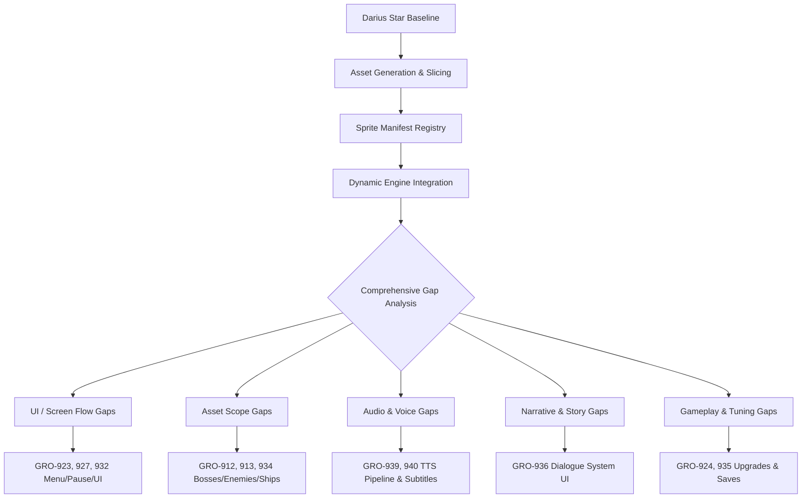

# Darius Star: Cyber Coelacanth — Comprehensive Gap Analysis
**Date:** June 9, 2026  
**Phase:** Audit - Comprehensive Gap Analysis  
**Auditor Agent:** Antigravity (research)  
**Project ID:** `aa3f825d-74c8-4366-9155-799100abccdd`

---

## 1. Executive Summary

This audit represents a exhaustive review of the current codebase, asset registry (`sprites.json`), audio plans, narrative drafts, and tracking board of the **Darius Star: Cyber Coelacanth** project. 

The game has made massive progress, moving from a canvas-only mockup to a fully integrated sprite-driven side-scrolling shoot-'em-up. The repository currently contains **2,233 sprite files** on disk, with all **1,804 unlisted frame animations** successfully merged into the `sprites.json` manifest and validated to ensure a passing linter state.

However, deep-dive examination reveals critical gaps in UI flow, metaprogression, asset coverage for the 10-biome scope, narrative display scripting, and a significant technical misunderstanding regarding the use of Google Veo for speech synthesis. To resolve these gaps, **8 new Linear issues (GRO-935 to GRO-942)** have been created, adding to the 12 issues from the previous audit (GRO-923 to GRO-934), bringing the current project issue count to **81**.



---

## 2. Project State Matrix

### 2.1 Issue Statistics
* **Total Project Issues:** 81 (GRO-831 through GRO-942)
* **Completed (Done):** 22 issues (27%) — Core rendering pipeline, base player/enemy/boss sprites, deployment
* **In Progress:** 2 issues (GRO-903: Veo API Setup, GRO-863: Audio Research)
* **Todo / Backlog:** 57 issues (71%) — Remaining audio, level design, and recently uncovered gaps

### 2.2 Asset Coverage Analysis
The game is designed around a **10-biome system** with **5 playable ships**. The asset sheet registry shows a high concentration of visual SFX frames but severe deficiencies in environmental, boss, and enemy variety:

| Category | Available | Needed | Gap | Notes |
|---|---|---|---|---|
| **Player Ships** | 1 (Striker) | 5 ships | **-4 ships** | Sprites for Phantom, Bastion, Tempest, and Specter needed. |
| **Biome Backgrounds** | 3 biomes | 10 biomes | **-7 biomes** | Biomes 4-10 lack parallax scrolling sheets. |
| **Biome Bosses** | 1 (Coelacanth) | 10 bosses | **-9 bosses** | Only Biome 3 (Coelacanth Lair) has boss sprite animation frames. |
| **Enemy Types** | 4 types | 40 types | **-36 types** | Biomes 4-10 require 4 unique thematic enemies each. |
| **Music Tracks** | 0 files | 16 tracks | **-16 tracks** | Gameplay loops (GRO-864) and filler UI music (GRO-919) must be generated. |
| **SFX Waveforms** | 3 files | 32 tracks | **-29 files** | Procedural Web Audio is active, but high-quality WAV files are missing. |

---

## 3. Deep-Dive Gap Analysis by Dimension

### 3.1 Dimension 1: Linear Gaps
* **Missing Level Implementations:** Existing issues cover coding the specific logic for Levels 1-3 (`GRO-871`, `GRO-873`, `GRO-875`), but there is no issue in the backlog for coding levels 4-10. This would leave the game incomplete.
  > [!IMPORTANT]
  > Resolved by creating **GRO-937: Levels 4-10 Wave Scripting & Progression Programming**.
* **Dialogue Engine Programming:** While writing story briefs is tracked in `GRO-915` and portraits in `GRO-930`, there was no task to code the UI presentation layer in `index.html`.
  > [!NOTE]
  > Resolved by creating **GRO-936: Dialogue & Briefing UI System Programming**.
* **Wave Configuration Tooling:** Manually coding spawning coordinates for 100 levels is highly error-prone. A tooling gap exists for wave scripting.
  > [!TIP]
  > Resolved by creating **GRO-938: Campaign Wave Schema & Level Configuration Tooling**.

### 3.2 Dimension 2: Asset Gaps
* **sprites.json Status:** Currently registers **2,233 files** on disk. This is heavily padded by 60-frame visual animations for SFX (e.g. `sfx_player_laser_l1` contains 60 separate PNG frames).
* **Missing Assets:**
  - **4 Player Ships:** Sprites for secondary ships (Phantom, Bastion, Tempest, Specter).
  - **36 Enemy Varieties:** Visual indicators matching hostile conditions (such as high-pressure abyssal zones, high-heat solar wind drift).
  - **Secondary Weapons & Hazards:** Visual models for homing missiles, deployable mines, floating debris, and destructible asteroids.

### 3.3 Dimension 3: Art Gaps
* **UI Screen Visual Assets:** The game currently has a title image (`title_0.png`) but lacks artwork for the Upgrade Shop menu, Ship Selection blueprints, Game Over screen overlays, and HUD borders.
* **Story Mode Portraits:** 16-bit pixel art portraits for narrative delivery:
  - **Commander Selene** (Mission Director)
  - **Darius Star** (Protagonist Pilot)
  - **Naval Officers & Antagonists**
  - **AI Biosphere Projections**

### 3.4 Dimension 4: Sound Gaps
* **UI Interactions:** System sounds are currently procedurally generated. For a premium retro experience, specific WAV/MP3 files for:
  - UI button hover (light high-pitch beep)
  - UI button select (satisfying double chirp)
  - Upgrade purchase success (ascending chime)
  - Error/insufficient scrap (dull buzzy thud)
* **Environmental/Engine Ambiance:** Low rumble hum for space flight that dynamically pitch-shifts based on speed. Water/current sonar swooshes for underwater biomes.

### 3.5 Dimension 5: Voice Gaps
* **The "Veo Voice" Bug:** Issue `GRO-917` suggests generating voice lines using Google Veo. **Veo is a video generation tool**; using it for speech synthesis is incorrect. The voice generation pipeline must be corrected.
  > [!WARNING]
  > Resolved by creating **GRO-939: Speech & Voice Synthesis Pipeline (Text-to-Speech)** to establish a pipeline via Google Cloud TTS or Gemini audio models.
* **Audio Playback:** A programming task was missing to bind voice assets to gameplay triggers and render captions.
  > [!IMPORTANT]
  > Resolved by creating **GRO-940: Voice Playback & Subtitle Accessibility Integration**.

### 3.6 Dimension 6: Story Gaps
* **Story Arc Verification:** The narrative structure outlined in `story-mode-narrative.md` covers all 10 biomes, tracing Darius's journey to harvest Coelacanth elements to cure his daughter Lyra's attunement. However, there is a lack of localization structures to deliver this story globally.
  > [!NOTE]
  > Resolved by creating **GRO-942: Localization & Multi-Language Subtitles Infrastructure**.

---

## 4. Newly Created Linear Issues

We have registered the following **8 issues** via the Linear GraphQL API, tagged for `agent:fred` as backlog items:

1. **GRO-935: Campaign Save & Load Persistence System** (High Priority)
   - *Description:* Implement campaign state saving using `localStorage`. Persist unlocked player ships, campaign level progress (e.g. Biome 4 Level 2), current scrap count, and permanent upgrades purchased in the shop. Provide fallback reset options.
2. **GRO-936: Dialogue & Briefing UI System Programming** (High Priority)
   - *Description:* Program the story briefing UI screen in `index.html`. This includes rendering 16-bit commander/character portraits, drawing a text scroll box with typewriter text effect, support for clicking to skip/advance text, and clean transitions into gameplay.
3. **GRO-937: Levels 4-10 Wave Scripting & Progression Programming** (High Priority)
   - *Description:* Implement spawning waves, level flow, and biome transitions for levels 4 through 10 in the main game loops. Integrate background parallax strips, enemy spawning logic, and boss triggers for these biomes.
4. **GRO-938: Campaign Wave Schema & Level Configuration Tooling** (Medium Priority)
   - *Description:* Design a structured JSON wave schema (`waves.json`) for the 100 stages of the campaign. Write a validator script that verifies wave balance (total enemies, spawn rates, scrap yield) and loads it dynamically into the game.
5. **GRO-939: Speech & Voice Synthesis Pipeline (Text-to-Speech)** (Medium Priority)
   - *Description:* Setup a pipeline using Google Cloud Text-to-Speech (TTS) or Gemini audio generation to synthesize the mission briefings and voice reactions into WAV/MP3 files. Replace the incorrect Veo voice generation concept.
6. **GRO-940: Voice Playback & Subtitle Accessibility Integration** (Medium Priority)
   - *Description:* Integrate audio playback of generated voice lines into the game loop. Implement synchronous, high-visibility subtitles for all voice-overs and story briefings to support accessibility and web audio settings.
7. **GRO-941: Automated Playtesting & Balancing Bot** (Low Priority)
   - *Description:* Develop a headless simulation run-mode (or simple autoplay bot) that plays through game levels to verify balance. Collect telemetry on player death rates, weapon levels, scrap accumulation, and boss defeat times.
8. **GRO-942: Localization & Multi-Language Subtitles Infrastructure** (Low Priority)
   - *Description:* Setup localization framework in `index.html` to support translation of story dialogue, briefings, and UI text into major languages (English, Japanese, Spanish, German) using static language dictionary files.

---

## 5. Development Roadmap & Priority Matrix

To execute these tasks, the team should tackle them in the following order to maximize pipeline efficiency:

```
[Phase A: Infrastructure & UI Foundation]
  ├── GRO-923: Main Menu Implementation
  ├── GRO-936: Dialogue & Briefing UI Programming
  └── GRO-935: Campaign Save & Load System (localStorage)

[Phase B: Level & Asset Expansion]
  ├── GRO-938: Wave Schema JSON configuration
  ├── GRO-937: Levels 4-10 Code Integration
  ├── GRO-934: Enemy Variety Sprites (28 types)
  └── GRO-925: Biome Boss Designs (9 bosses)

[Phase C: Narrative Audio & Accessibility]
  ├── GRO-939: Voice Synthesis Pipeline (TTS)
  ├── GRO-940: Voice Playback & Subtitles
  └── GRO-942: Localization Dictionary setup

[Phase D: Balancing & Release Polish]
  ├── GRO-924: Metaprogression Upgrade Shop wiring
  ├── GRO-941: Automated Balance Playtesting Bot
  └── GRO-932: Credits screen & Ending scroll
```
