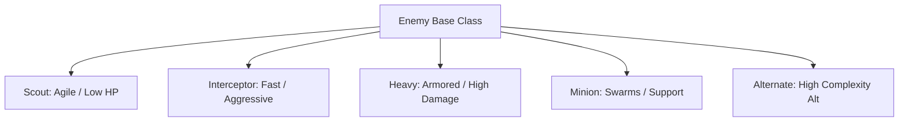

# Enemy Variety Design — Darius Star: Cyber Coelacanth

This document defines the complete expanded enemy roster for **Darius Star: Cyber Coelacanth**. It specifies 28 new enemy types across Biomes 4–10, plus 3 alternate enemy types for Biomes 1–3, providing a total of 31 unique specifications.

> [!NOTE]
> All specifications are designed to align with the core architectures described in [level-system-design.md](file:///home/ubuntu/work/darius-star/docs/level-system-design.md) and [LEVEL-THEME-SPEC.md](file:///home/ubuntu/work/darius-star/docs/LEVEL-THEME-SPEC.md).

---

## 🗺️ Enemy Variety Overview & Classification

The expanded enemy roster divides enemies into five key roles per biome:
*   **Scouts**: Highly agile, low-HP units that focus on screen positioning and scouting sweeps.
*   **Interceptors**: Speed-oriented combatants with aimed, high-frequency, or crowd-control attacks.
*   **Heavies**: High-HP armored targets with complex, dense bullet patterns and zone-denial capabilities.
*   **Minions**: Small, fast swarmers or utility units spawned in waves or by bosses.
*   **Alternates**: Specialized variants introduced in sub-levels to surprise players and alter local gameplay dynamics.

---

## 🛡️ Biomes 1–3: Alternate Enemy Specifications

These alternates add variety and strategic depth to the initial three ocean biomes.

### E03b: Hydrothermal Crawler (Heavy Alt)
*   **ID**: E03b
*   **Biome**: 1b (Abyssal Trench - Alternate Heavy)
*   **Gameplay Stats**:
    *   **HP**: 5
    *   **Point Value**: 350
    *   **Base Speed**: 1.2 units/sec (walking)
    *   **Fire Rate**: 0.25 shots/sec (once every 4 seconds)
*   **Movement Pattern**:
    *   **Ground Crawler**: Spawns at the bottom screen boundary. Walks left and right along the bottom edge. When it aligns with a hydrothermal vent background asset, it performs a mechanical vertical jump (up to 30% screen height) and drifts slowly down, releasing volcanic debris.
*   **Attack Type**:
    *   **Vertical Flared Plumes**: Shoots a burst of 3 upward-moving magma sparks that spread slightly as they rise, forcing the player to dodge horizontally.
*   **Visual Design Brief**:
    *   A heavy crustacean tank chassis constructed of jagged black basalt armor plating (#1E1E1E). Bright orange-glowing hydraulic limbs (#FF6600) propel it forward, and warning steam vents pulse along its upper shell.
*   **Spawn Conditions**:
    *   Spawns in Biome 1, sub-levels 1-5, 1-8. Appears once the player's score exceeds 600.
*   **Difficulty Scaling**:
    *   **HP Multiplier**: +30% per sub-level.
    *   **Speed Multiplier**: +10% per sub-level.
    *   **Attack Speed**: Plume bullet velocity increases by +15% per sub-level.

### E05b: Coral Wraith (Interceptor Alt)
*   **ID**: E05b
*   **Biome**: 2b (Coral Graveyard - Alternate Interceptor)
*   **Gameplay Stats**:
    *   **HP**: 3
    *   **Point Value**: 200
    *   **Base Speed**: 2.5 units/sec
    *   **Fire Rate**: 0.4 shots/sec (once every 2.5 seconds)
*   **Movement Pattern**:
    *   **Loop-the-Loop**: Flies in circular loop trajectories (radius: 120 pixels) while drifting horizontally from right to left. Upon completing a loop, it performs a sudden, rapid lunge towards the player's last Y-coordinate.
*   **Attack Type**:
    *   **Calcium Spike Spread**: Fires a 3-way fan pattern of sharp, neon-pink spikes (#FF4488) at the peak of each loop.
*   **Visual Design Brief**:
    *   Skeletal structure mimicking bleached white coral (#EEEEEE) interwoven with chrome servo joints. Trailing neon-pink fiber-optic wisps emerge from its spinal ports, flickering as it maneuvers.
*   **Spawn Conditions**:
    *   Spawns in Biome 2, sub-levels 2-2, 2-5, 2-8. Appears once score exceeds 1,200.
*   **Difficulty Scaling**:
    *   **HP Multiplier**: +25% per sub-level.
    *   **Spread Angle**: Spike spread angle increases by +5 degrees per sub-level.
    *   **Lunge Speed**: Lunge dash velocity increases by +20% per sub-level.

### E10b: Mech-Spider (Minion Alt)
*   **ID**: E10b
*   **Biome**: 3b (Coelacanth's Lair - Alternate Minion)
*   **Gameplay Stats**:
    *   **HP**: 2
    *   **Point Value**: 75
    *   **Base Speed**: 3.2 units/sec (rapid crawl)
    *   **Fire Rate**: None (Kamikaze contact damage)
*   **Movement Pattern**:
    *   **Laser Thread Drop**: Spawns at the top screen border. Drops vertically down on a glowing cyan laser thread until it reaches the player's Y-coordinate, then detaches and runs horizontally towards the player ship at high speed.
*   **Attack Type**:
    *   **Proximity Spark Blast**: On contact or when within 60 pixels of the player ship, it detonates, firing 4 electrical sparks in a cross pattern (up, down, left, right).
*   **Visual Design Brief**:
    *   A compact hexagonal chrome chassis (#CCCCCC) with 8 needle-like mechanical limbs. A single, blinking red optical sensor (#FF0000) dominates the front face, throwing off electric sparks.
*   **Spawn Conditions**:
    *   Spawned in waves of 3 during Biome 3 sub-levels (3-4 to 3-9) or released by the Warden Mech mid-boss.
*   **Difficulty Scaling**:
    *   **Crawl Speed**: +20% per sub-level.
    *   **Spark Velocity**: Blast spark speed increases by +15% per sub-level.

---

## 🌌 Biome 4: Nebula Drift

Atmospheric edge where solar plasma clashes with low-orbit vacuum.

### E11: Plasma Wisp (Scout)
*   **ID**: E11
*   **Biome**: 4 (Nebula Drift)
*   **Gameplay Stats**:
    *   **HP**: 1
    *   **Point Value**: 125
    *   **Base Speed**: 2.0 units/sec (drifting)
    *   **Fire Rate**: 0.5 shots/sec (once every 2 seconds)
*   **Movement Pattern**:
    *   **Erratic Quantum Phase**: Drifts leftward. Every 1.5 seconds, it blinks out of existence, flashing a warning cyan halo, and teleports 100 pixels forward-left and ±50 pixels vertically.
*   **Attack Type**:
    *   **Aimed Plasma Spark**: Fires a single high-velocity plasma spark (#00FFFF) directly at the player ship immediately after completing a teleportation step.
*   **Visual Design Brief**:
    *   A swirling orb of concentrated purple and cyan plasma (#00BFFF) with trailing gaseous filaments. The white-hot central core (#FFFFFF) is surrounded by a soft magenta aura.
*   **Spawn Conditions**:
    *   Biome 4, sub-levels 4-1 onwards. Score threshold: >3,000.
*   **Difficulty Scaling**:
    *   **Teleport Rate**: Teleport cooldown decreases by 10% per sub-level (minimum 0.8s).
    *   **Spark Speed**: Bullet speed increases by +12% per sub-level.

### E12: Storm Rider (Interceptor)
*   **ID**: E12
*   **Biome**: 4 (Nebula Drift)
*   **Gameplay Stats**:
    *   **HP**: 2
    *   **Point Value**: 200
    *   **Base Speed**: 3.8 units/sec
    *   **Fire Rate**: 0.6 shots/sec (once every 1.67 seconds)
*   **Movement Pattern**:
    *   **Diagonal Swoop**: Enters from the right, charging diagonally across the screen towards the player's Y-coordinate. It then curves sharply backwards and exits the top or bottom screen boundary.
*   **Attack Type**:
    *   **Dual Volt Burst**: Fires a quick 2-shot burst of electric blue bolts (#4466FF) during its swoop alignment phase.
*   **Visual Design Brief**:
    *   Sleek, forward-swept wing jet with a chrome-magenta finish (#FF00FF). Displays crackling blue electrical arcs across its wings and leaves a persistent neon jet trail.
*   **Spawn Conditions**:
    *   Biome 4, sub-levels 4-2 onwards. Score threshold: >3,500.
*   **Difficulty Scaling**:
    *   **HP Multiplier**: +20% per sub-level.
    *   **Swoop Velocity**: Dashing speed increases by +15% per sub-level.

### E13: Nebula Serpent (Heavy)
*   **ID**: E13
*   **Biome**: 4 (Nebula Drift)
*   **Gameplay Stats**:
    *   **HP**: 6
    *   **Point Value**: 400
    *   **Base Speed**: 1.5 units/sec
    *   **Fire Rate**: 0.2 shots/sec (once every 5 seconds)
*   **Movement Pattern**:
    *   **Sine-Wave Slither**: Moves horizontally across the screen in a deep, slow sine-wave pattern ($y = A \sin(\omega t)$ where $A = 150\text{px}$). Its segmented body trails behind the head unit.
*   **Attack Type**:
    *   **Supernova Nova Ring**: Halts for 1 second, then releases a circular ring of 8 expanding fireballs in 45-degree increments.
*   **Visual Design Brief**:
    *   A massive segmented dragon-like mech. Heavy dark-purple hull plates (#330066) with glowing pink joints (#FF00AA) and dual head-mounted optical sensors.
*   **Spawn Conditions**:
    *   Biome 4, sub-levels 4-4 onwards. Score threshold: >4,500.
*   **Difficulty Scaling**:
    *   **HP Multiplier**: +40% per sub-level.
    *   **Ring Bullet Density**: Expands to a 12-bullet ring in sub-levels 4-8 and 4-9.

### E14: Charged Cloud (Minion)
*   **ID**: E14
*   **Biome**: 4 (Nebula Drift)
*   **Gameplay Stats**:
    *   **HP**: 1
    *   **Point Value**: 50
    *   **Base Speed**: 2.2 units/sec
    *   **Fire Rate**: None (Contact & Static Trail)
*   **Movement Pattern**:
    *   **V-Formation Swarm**: Spawns in groups of 4 in a V-formation. Drifts linearly from right to left while gently oscillating vertically.
*   **Attack Type**:
    *   **Static Field Trail**: Leaves a faint, glowing yellow particle trail behind it for 1.5 seconds. If the player collides with this trail, they take damage.
*   **Visual Design Brief**:
    *   Fluffy, dark-gray electrostatic cloud clusters (#444444) sparking internally with yellow electricity (#FFAA00).
*   **Spawn Conditions**:
    *   Biome 4, all sub-levels. Spawned in clusters.
*   **Difficulty Scaling**:
    *   **Trail Duration**: Particle trail lasts +20% longer per sub-level.
    *   **Velocity**: Swarm drift speed increases by +15% per sub-level.

---

## ❄️ Biome 5: Ice Ring

Frozen debris field reflecting cold blue light of a distant sun.

### E15: Ice Shard (Scout)
*   **ID**: E15
*   **Biome**: 5 (Ice Ring)
*   **Gameplay Stats**:
    *   **HP**: 1
    *   **Point Value**: 125
    *   **Base Speed**: 3.0 units/sec
    *   **Fire Rate**: 0.3 shots/sec (once every 3.33 seconds)
*   **Movement Pattern**:
    *   **Kinetic Ricochet**: Travels in a straight diagonal path. Bounces off the top and bottom screen boundaries, maintaining velocity but changing angle. Exits via the left screen edge.
*   **Attack Type**:
    *   **Rear Shard Needle**: Shoots a single sharp ice needle (#88CCFF) directly backwards from its travel vector when bouncing.
*   **Visual Design Brief**:
    *   A crystalline, needle-sharp shard of compressed glacial ice. Spin-stabilized around its central axis, reflecting cyan and white starlight.
*   **Spawn Conditions**:
    *   Biome 5, sub-levels 5-1 onwards. Score threshold: >6,000.
*   **Difficulty Scaling**:
    *   **Ricochet Speed**: Gains a +5% speed boost upon each wall bounce.
    *   **Bullet Speed**: Shard needle velocity increases by +15% per sub-level.

### E16: Frost Ray (Interceptor)
*   **ID**: E16
*   **Biome**: 5 (Ice Ring)
*   **Gameplay Stats**:
    *   **HP**: 3
    *   **Point Value**: 220
    *   **Base Speed**: 2.2 units/sec
    *   **Fire Rate**: 0.2 shots/sec (once every 5 seconds)
*   **Movement Pattern**:
    *   **Sweeping Hover**: Enters the screen to a fixed X-coordinate (e.g., 75% width), then moves up and down along the Y-axis, tracking the player's vertical alignment.
*   **Attack Type**:
    *   **Thermal Freeze Beam**: Project a thin blue warning laser for 1 second, then fire a continuous freeze beam for 2 seconds. Colliding with the beam slows player ship movement by 40% for 2 seconds.
*   **Visual Design Brief**:
    *   Manta-ray shaped cyber-glider with a frosted ice-blue plating (#88CCFF) and white thermal radiator grills along its flanks.
*   **Spawn Conditions**:
    *   Biome 5, sub-levels 5-2 onwards. Score threshold: >6,500.
*   **Difficulty Scaling**:
    *   **HP Multiplier**: +20% per sub-level.
    *   **Beam Width**: Beam hit-box width increases by +12% per sub-level.

### E17: Crystal Golem (Heavy)
*   **ID**: E17
*   **Biome**: 5 (Ice Ring)
*   **Gameplay Stats**:
    *   **HP**: 8
    *   **Point Value**: 450
    *   **Base Speed**: 1.0 units/sec
    *   **Fire Rate**: 0.15 shots/sec (once every 6.67 seconds)
*   **Movement Pattern**:
    *   **Glacial Advance**: Marches forward horizontally. Immune to knockback and temporary stun effects. Heavy mass makes it move slowly.
*   **Attack Type**:
    *   **Glacial Shrapnel Mortar**: Launches a massive ice shell that targets the player's position. On contact or after 3 seconds, it detonates into a circular spread of 6 ice shards.
*   **Visual Design Brief**:
    *   A massive, monolithic humanoid golem composed of angular ice blocks (#EEEEFF) held together by a glowing white core framework (#FFFFFF). Heavy hydraulic leg pistons drive it forward.
*   **Spawn Conditions**:
    *   Biome 5, sub-levels 5-4 onwards. Score threshold: >7,500.
*   **Difficulty Scaling**:
    *   **HP Multiplier**: +50% per sub-level.
    *   **Mortar Split**: Mortar splits into 8 shards instead of 6 in sub-levels 5-8 and 5-9.

### E18: Snow Drone (Minion)
*   **ID**: E18
*   **Biome**: 5 (Ice Ring)
*   **Gameplay Stats**:
    *   **HP**: 1
    *   **Point Value**: 60
    *   **Base Speed**: 3.5 units/sec
    *   **Fire Rate**: None (Kamikaze Freeze Burst)
*   **Movement Pattern**:
    *   **Aggressive Charge**: Locks onto the player ship's coordinates and charges in a direct line at high velocity. Has low steering capabilities once the dash starts.
*   **Attack Type**:
    *   **Cryo Burst**: On collision with the player ship, it explodes, freezing player weapon inputs (unable to shoot) for 0.75 seconds.
*   **Visual Design Brief**:
    *   A small sphere coated in frost (#FFFFFF) with a single central red sensor eye (#FF0000) and two spinning gyro rings.
*   **Spawn Conditions**:
    *   Biome 5, all sub-levels. Spawned in groups of 3.
*   **Difficulty Scaling**:
    *   **Freeze Duration**: Freeze effect lasts +15% longer per sub-level (up to 1.5s at 5-9).
    *   **Dash Speed**: Dash velocity increases by +10% per sub-level.

---

## 🔥 Biome 6: Fire Nebula

Volcanic planetoid sector featuring rivers of molten lava and heavy ash clouds.

### E19: Ember Spark (Scout)
*   **ID**: E19
*   **Biome**: 6 (Fire Nebula)
*   **Gameplay Stats**:
    *   **HP**: 1
    *   **Point Value**: 150
    *   **Base Speed**: 3.2 units/sec
    *   **Fire Rate**: 0.4 shots/sec (once every 2.5 seconds)
*   **Movement Pattern**:
    *   **Diagonal Zigzag**: Moves leftward by executing rapid diagonal dashes (45 degrees down-left, pauses 0.5s, then 45 degrees up-left).
*   **Attack Type**:
    *   **Aimed Lava Glob**: Launches a slow-moving, high-damage glob of lava (#FF4400) directly at the player at the start of each pause.
*   **Visual Design Brief**:
    *   A small, brilliant yellow-orange core (#FFAA00) surrounded by a floating halo of burning obsidian embers that orbit the unit.
*   **Spawn Conditions**:
    *   Biome 6, sub-levels 6-1 onwards. Score threshold: >10,000.
*   **Difficulty Scaling**:
    *   **Dash Distance**: Diagonal dash distance increases by +15% per sub-level.
    *   **Glob Velocity**: Lava glob speed increases by +10% per sub-level.

### E20: Fire Serpent (Interceptor)
*   **ID**: E20
*   **Biome**: 6 (Fire Nebula)
*   **Gameplay Stats**:
    *   **HP**: 4
    *   **Point Value**: 250
    *   **Base Speed**: 2.8 units/sec
    *   **Fire Rate**: 0.25 shots/sec (once every 4 seconds)
*   **Movement Pattern**:
    *   **Tracking Spline**: Slithers horizontally across the screen while adjusting its Y-coordinate to match the player's vertical lane. Its movement matches a cubic spline curve.
*   **Attack Type**:
    *   **Molten Tail Swipe**: Sweeps its tail when aligned, firing a fan of 5 fireballs (#FFAA00) forward.
*   **Visual Design Brief**:
    *   A long, serpentine mechanical construct. Composed of dark molten rock plates (#443333) with bright lava-orange energy pathways (#FF5500) flowing between its segments.
*   **Spawn Conditions**:
    *   Biome 6, sub-levels 6-3 onwards. Score threshold: >11,000.
*   **Difficulty Scaling**:
    *   **Body Length**: Segment count increases by +2 per sub-level, extending tail swipe radius.
    *   **HP Multiplier**: +30% per sub-level.

### E21: Magma Core (Heavy)
*   **ID**: E21
*   **Biome**: 6 (Fire Nebula)
*   **Gameplay Stats**:
    *   **HP**: 9
    *   **Point Value**: 500
    *   **Base Speed**: 1.2 units/sec
    *   **Fire Rate**: 0.15 shots/sec (once every 6.67 seconds)
*   **Movement Pattern**:
    *   **Fortress Drift**: Enters the mid-right portion of the screen. Deploys an energy field, reducing its speed to 0.4 units/sec and increasing its frontal defense (blocks 50% of incoming damage).
*   **Attack Type**:
    *   **Radial Heat Wave**: Emits a expanding circle of 12 molten projectiles in a 360-degree pattern.
*   **Visual Design Brief**:
    *   A spherical obsidian shield shell (#222222) that splits into four quadrants to expose a pulsating, superheated white-hot plasma core (#FFFFFF).
*   **Spawn Conditions**:
    *   Biome 6, sub-levels 6-4 onwards. Score threshold: >12,000.
*   **Difficulty Scaling**:
    *   **HP Multiplier**: +40% per sub-level.
    *   **Radial Density**: Projectile count increases to 16 in sub-levels 6-8 and 6-9.

### E22: Ash Cloud (Minion)
*   **ID**: E22
*   **Biome**: 6 (Fire Nebula)
*   **Gameplay Stats**:
    *   **HP**: 2
    *   **Point Value**: 70
    *   **Base Speed**: 1.5 units/sec
    *   **Fire Rate**: None (Passive Screen Occlusion & Burn)
*   **Movement Pattern**:
    *   **Smog Drift**: Drifts slowly from right to left. Over a 5-second lifespan, it expands in scale from 40 pixels to 120 pixels in diameter, obscuring the screen.
*   **Attack Type**:
    *   **Soot Burn**: If the player ship enters the cloud, they suffer continuous damage-over-time (burn status, 1 damage tick per 0.5s spent inside).
*   **Visual Design Brief**:
    *   A thick, swirling cloud of dark ash gray (#333333) with deep red embers (#CC0000) glowing within.
*   **Spawn Conditions**:
    *   Biome 6, all sub-levels. Spawned in pairs to restrict player movement lanes.
*   **Difficulty Scaling**:
    *   **Expansion Rate**: Reaches maximum size 25% faster per sub-level.
    *   **Burn Damage**: Burn duration ticks last +15% longer after exiting the cloud.

---

## ⚡ Biome 7: Storm Belt

Perpetual electromagnetic tempest with high static interference.

### E23: Spark Drone (Scout)
*   **ID**: E23
*   **Biome**: 7 (Storm Belt)
*   **Gameplay Stats**:
    *   **HP**: 2
    *   **Point Value**: 160
    *   **Base Speed**: 3.5 units/sec
    *   **Fire Rate**: 0.5 shots/sec (once every 2 seconds)
*   **Movement Pattern**:
    *   **Lane Hopper**: Flies leftward along a horizontal lane. Every 2 seconds, it performs a quick vertical dash to an adjacent lane (120 pixels up or down) to dodge player attacks.
*   **Attack Type**:
    *   **Electrostatic Discharge**: Emits a horizontal electric arc (#00FFFF) spanning 250 pixels in front of it.
*   **Visual Design Brief**:
    *   Compact drone with dual metallic rotors and a center capsule holding two glowing blue glass Tesla spheres (#4466FF).
*   **Spawn Conditions**:
    *   Biome 7, sub-levels 7-1 onwards. Score threshold: >15,000.
*   **Difficulty Scaling**:
    *   **Hopping Frequency**: Lane-hopping cooldown decreases by 15% per sub-level.
    *   **Arc Length**: Arc extension distance increases by +20 pixels per sub-level.

### E24: Lightning Eel (Interceptor)
*   **ID**: E24
*   **Biome**: 7 (Storm Belt)
*   **Gameplay Stats**:
    *   **HP**: 4
    *   **Point Value**: 260
    *   **Base Speed**: 3.0 units/sec (cruising)
    *   **Fire Rate**: 0.3 shots/sec (once every 3.33 seconds)
*   **Movement Pattern**:
    *   **Coiling Spiral**: Swims in continuous tight spirals. Periodically activates an afterburner, charging directly forward in a straight horizontal line at 6.0 units/sec.
*   **Attack Type**:
    *   **Homing Lightning Bolt**: Releases a single bolt (#FFFFFF) that tracks the player ship's coordinates for 2.5 seconds before dissipating.
*   **Visual Design Brief**:
    *   A cybernetic chrome eel (#888888) with yellow circuit board traces (#FFFF00) running along its chassis that light up with electric discharge.
*   **Spawn Conditions**:
    *   Biome 7, sub-levels 7-2 onwards. Score threshold: >16,000.
*   **Difficulty Scaling**:
    *   **Homing Time**: Homing bolt tracks for +10% longer per sub-level.
    *   **HP Multiplier**: +25% per sub-level.

### E25: Thunderhead (Heavy)
*   **ID**: E25
*   **Biome**: 7 (Storm Belt)
*   **Gameplay Stats**:
    *   **HP**: 10
    *   **Point Value**: 550
    *   **Base Speed**: 1.2 units/sec
    *   **Fire Rate**: 0.1 shots/sec (once every 10 seconds)
*   **Movement Pattern**:
    *   **Atmospheric Drift**: Heavy, slow horizontal drift. Periodically locks its coordinates in place to charge its main generator.
*   **Attack Type**:
    *   **90-Degree Lightning Sweep**: Charges for 2 seconds (visualized by sparks converging on its core), then fires a massive electrical beam that sweeps in a 90-degree arc in front of it.
*   **Visual Design Brief**:
    *   A massive, cloud-shaped airborne command station with dark gray armored plating (#333344), warning lights, and two large spinning turbine fans.
*   **Spawn Conditions**:
    *   Biome 7, sub-levels 7-4 onwards. Score threshold: >17,500.
*   **Difficulty Scaling**:
    *   **HP Multiplier**: +30% per sub-level.
    *   **Sweep Velocity**: Sweep rotation speed increases by +15% per sub-level.

### E26: Static Mite (Minion)
*   **ID**: E26
*   **Biome**: 7 (Storm Belt)
*   **Gameplay Stats**:
    *   **HP**: 1
    *   **Point Value**: 75
    *   **Base Speed**: 2.5 units/sec
    *   **Fire Rate**: None (EMP Kamikaze)
*   **Movement Pattern**:
    *   **Ceiling/Floor Crawler**: Spawns on the top or bottom screen boundary and slides horizontally to match the player's X-position. It then drops vertically like a depth charge.
*   **Attack Type**:
    *   **EMP Blast**: On impact with the player or on reaching the player's Y-coordinate, it detonates. This creates an EMP shockwave that disables player shooting for 1.5 seconds.
*   **Visual Design Brief**:
    *   A tiny mechanical arachnid bug (#555566) with glowing yellow optic lenses (#FFAA00) and crackling metallic legs.
*   **Spawn Conditions**:
    *   Biome 7, all sub-levels. Spawned in drops of 3.
*   **Difficulty Scaling**:
    *   **EMP Lockout**: EMP disable duration increases by +10% per sub-level.
    *   **Drop Speed**: Vertical fall acceleration increases by +20% per sub-level.

---

## 🛳️ Biome 8: Derelict Fleet

Graveyard of massive, destroyed dreadnoughts and floating scrap metal.

### E27: Salvage Bot (Scout)
*   **ID**: E27
*   **Biome**: 8 (Derelict Fleet)
*   **Gameplay Stats**:
    *   **HP**: 2
    *   **Point Value**: 160
    *   **Base Speed**: 2.6 units/sec
    *   **Fire Rate**: 0.4 shots/sec (once every 2.5 seconds)
*   **Movement Pattern**:
    *   **Orbital Arc**: Sweeps onto the screen in a wide ellipse, curving close to the player ship before looping back to the right and retreating.
*   **Attack Type**:
    *   **Magnetic Graviton Pull**: Generates a gravity tractor beam (#33FF33) that pulls the player ship 150 pixels closer to it over 1.5 seconds, while launching aimed metal bolts (#886644).
*   **Visual Design Brief**:
    *   A rusted utility robot chassis (#886644) featuring a large, glowing green front electromagnet cone and dual solar array wings.
*   **Spawn Conditions**:
    *   Biome 8, sub-levels 8-1 onwards. Score threshold: >20,000.
*   **Difficulty Scaling**:
    *   **Pull Force**: Tractor beam pull velocity increases by +20% per sub-level.
    *   **HP Multiplier**: +15% per sub-level.

### E28: Auto-Turret (Interceptor)
*   **ID**: E28
*   **Biome**: 8 (Derelict Fleet)
*   **Gameplay Stats**:
    *   **HP**: 4
    *   **Point Value**: 250
    *   **Base Speed**: Stationary (drifts with debris)
    *   **Fire Rate**: 0.5 shots/sec (once every 2 seconds)
*   **Movement Pattern**:
    *   **Debris Anchor**: Spawns welded onto floating steel plates that drift slowly across the screen from right to left (0.5 units/sec).
*   **Attack Type**:
    *   **3-Shot Aimed Burst**: Tracks the player ship's angle and fires a fast 3-shot kinetic burst.
*   **Visual Design Brief**:
    *   A twin-barrel mechanical defense turret (#555566) with a glowing red laser sight scope (#FF0000), mounted on a jagged, rusted hull fragment.
*   **Spawn Conditions**:
    *   Biome 8, sub-levels 8-2 onwards. Score threshold: >21,000.
*   **Difficulty Scaling**:
    *   **Burst Delay**: Time between individual shots in a burst decreases by 15% per sub-level.
    *   **HP Multiplier**: +20% per sub-level.

### E29: Battle Cruiser (Heavy)
*   **ID**: E29
*   **Biome**: 8 (Derelict Fleet)
*   **Gameplay Stats**:
    *   **HP**: 12
    *   **Point Value**: 650
    *   **Base Speed**: 0.8 units/sec
    *   **Fire Rate**: 0.15 shots/sec (once every 6.67 seconds)
*   **Movement Pattern**:
    *   **Cruiser Advance**: Creeps forward horizontally. Its armored nose cone blocks all standard player lasers, requiring the player to maneuver and hit its exposed side engines.
*   **Attack Type**:
    *   **Dual Tracking Torpedoes**: Launches 2 heavy tracking torpedoes from its bay doors. Torpedoes have 3 HP each and can be shot down before impact.
*   **Visual Design Brief**:
    *   A massive, elongated military capital ship hull (#444455) covered in rust patches, with multiple deck turrets, flickering emergency lights (#FF2222), and glowing cyan exhaust ports.
*   **Spawn Conditions**:
    *   Biome 8, sub-levels 8-4 onwards. Score threshold: >23,000.
*   **Difficulty Scaling**:
    *   **Torpedo Health**: Torpedo HP increases by +1 per sub-level (up to 6 HP).
    *   **HP Multiplier**: +40% per sub-level.

### E30: Repair Drone (Minion)
*   **ID**: E30
*   **Biome**: 8 (Derelict Fleet)
*   **Gameplay Stats**:
    *   **HP**: 1
    *   **Point Value**: 80
    *   **Base Speed**: 3.0 units/sec
    *   **Fire Rate**: 0.5 heals/sec (once every 2 seconds)
*   **Movement Pattern**:
    *   **Support Hover**: hovers around the nearest Heavy (Battle Cruiser) or Interceptor (Auto-Turret) units, maintaining a distance of 80 pixels.
*   **Attack Type**:
    *   **Repair Nanite Beam**: Fires a glowing green beam (#00FF00) at damaged allies, restoring +2 HP per charge. Does not attack the player directly.
*   **Visual Design Brief**:
    *   A small cylindrical metallic drone with three rotating utility claw arms and a dome-shaped green sensor eye.
*   **Spawn Conditions**:
    *   Biome 8, all sub-levels. Spawns as escorts for heavier units.
*   **Difficulty Scaling**:
    *   **Heal Output**: Restoration amount increases by +1 HP per sub-level.
    *   **HP Multiplier**: +10% per sub-level.

---

## 🪱 Biome 9: Xenomorph Hive

Organic parasite infestation consuming the derelict fleet.

### E31: Larva Swarm (Scout)
*   **ID**: E31
*   **Biome**: 9 (Xenomorph Hive)
*   **Gameplay Stats**:
    *   **HP**: 2
    *   **Point Value**: 180
    *   **Base Speed**: 3.0 units/sec
    *   **Fire Rate**: None (Melee Lunge)
*   **Movement Pattern**:
    *   **Erratic Swarm Wave**: Spawns in tightly packed groups of 6. They follow a synchronized, jagged zigzag path, breaking formation to lunge when the player is close.
*   **Attack Type**:
    *   **Mandible Bite**: Performs a short 100-pixel forward dash to bite the player ship.
*   **Visual Design Brief**:
    *   Small writhing purple worms (#6633AA) with segmented chitinous shells and glowing neon-green mandibles (#33FF33).
*   **Spawn Conditions**:
    *   Biome 9, sub-levels 9-1 onwards. Score threshold: >26,000.
*   **Difficulty Scaling**:
    *   **Swarm Size**: Group size increases by +1 per sub-level (up to 10 larvae).
    *   **Speed Multiplier**: +15% per sub-level.

### E32: Spine Caster (Interceptor)
*   **ID**: E32
*   **Biome**: 9 (Xenomorph Hive)
*   **Gameplay Stats**:
    *   **HP**: 5
    *   **Point Value**: 280
    *   **Base Speed**: 2.4 units/sec
    *   **Fire Rate**: 0.4 shots/sec (once every 2.5 seconds)
*   **Movement Pattern**:
    *   **Vertical Sentinel**: Floats near the right screen edge, adjusting its Y-position to remain aligned with the player's ship.
*   **Attack Type**:
    *   **Piercing Organic Spine**: Fires a high-speed calcified spine needle (#CC6677) that pierces standard shields, inflicting direct hull damage unless dodged.
*   **Visual Design Brief**:
    *   A bulbous organic pod covered in pulsing violet veins (#6633AA) and a long, needle-like frontal bone snout.
*   **Spawn Conditions**:
    *   Biome 9, sub-levels 9-2 onwards. Score threshold: >27,000.
*   **Difficulty Scaling**:
    *   **Spine Speed**: Spine velocity increases by +15% per sub-level.
    *   **HP Multiplier**: +30% per sub-level.

### E33: Brood Guard (Heavy)
*   **ID**: E33
*   **Biome**: 9 (Xenomorph Hive)
*   **Gameplay Stats**:
    *   **HP**: 12
    *   **Point Value**: 700
    *   **Base Speed**: 1.0 units/sec
    *   **Fire Rate**: 0.2 shots/sec (once every 5 seconds)
*   **Movement Pattern**:
    *   **Juggernaut March**: Moves slowly from right to left. Periodically stops to shield itself with its armored head plate (invulnerable for 2 seconds).
*   **Attack Type**:
    *   **5-Way Acid Spray**: Fires a 5-way fan of green acid droplets (#33FF33). Upon hitting the screen boundaries, the droplets leave sticky acid pools for 3 seconds that damage the player on contact.
*   **Visual Design Brief**:
    *   A massive, hunched organic beast with heavy bone plating on its forehead, dripping acid glands along its jaws, and six armored legs.
*   **Spawn Conditions**:
    *   Biome 9, sub-levels 9-4 onwards. Score threshold: >29,000.
*   **Difficulty Scaling**:
    *   **Acid Pool Duration**: Pools persist for +20% longer per sub-level.
    *   **HP Multiplier**: +40% per sub-level.

### E34: Face Hugger (Minion)
*   **ID**: E34
*   **Biome**: 9 (Xenomorph Hive)
*   **Gameplay Stats**:
    *   **HP**: 1
    *   **Point Value**: 85
    *   **Base Speed**: 4.0 units/sec
    *   **Fire Rate**: None (Kamikaze Latch)
*   **Movement Pattern**:
    *   **Diagonal Wall Jump**: Spawns on the screen edge and springs diagonally towards the player in high-velocity jumps (1.5-second cooldown between jumps).
*   **Attack Type**:
    *   **Parasitic Latch**: Latches onto the player ship upon collision, slowing movement speed by 50% and dealing 1 damage per second for 3 seconds.
*   **Visual Design Brief**:
    *   A pale, fleshy arachnid (#CC9999) with eight fingers, a long muscular tail, and a translucent central sac.
*   **Spawn Conditions**:
    *   Biome 9, all sub-levels. Released from Hive Node structures or spawned in waves of 4.
*   **Difficulty Scaling**:
    *   **Slow Intensity**: Reduces player speed by an additional 5% per sub-level.
    *   **Latch Duration**: Latch lasts +10% longer per sub-level.

---

## 🌀 Biome 10: Core Rift

Reality-bending zone at the center of the singularity where physics collapses.

### E35: Void Shade (Scout)
*   **ID**: E35
*   **Biome**: 10 (Core Rift)
*   **Gameplay Stats**:
    *   **HP**: 3
    *   **Point Value**: 220
    *   **Base Speed**: 2.8 units/sec
    *   **Fire Rate**: 0.5 shots/sec (once every 2 seconds, corporeal only)
*   **Movement Pattern**:
    *   **Dimensional Shift**: Alternate states every 2 seconds. In its **Ethereal state**, it is semi-transparent, invulnerable to damage, and moves through screen obstacles. In its **Corporeal state**, it is solid, vulnerable, and fires.
*   **Attack Type**:
    *   **Void Blast**: Fires a dark magenta energy orb (#FF0088) that distorts the player's weapon fire trajectory in its vicinity.
*   **Visual Design Brief**:
    *   A shifting shadow silhouette of a futuristic fighter jet, outlined in flickering neon-magenta (#FF0088) and green code rain particles.
*   **Spawn Conditions**:
    *   Biome 10, sub-levels 10-1 onwards. Score threshold: >32,000.
*   **Difficulty Scaling**:
    *   **Vulnerability Window**: Corporeal state duration decreases by 10% per sub-level (minimum 1.0 second).
    *   **Void Blast Speed**: Orb speed increases by +15% per sub-level.

### E36: Reality Fragment (Interceptor)
*   **ID**: E36
*   **Biome**: 10 (Core Rift)
*   **Gameplay Stats**:
    *   **HP**: 5
    *   **Point Value**: 320
    *   **Base Speed**: 2.5 units/sec
    *   **Fire Rate**: 0.4 shots/sec (once every 2.5 seconds)
*   **Movement Pattern**:
    *   **Chronal Glitch**: Moves in short, stuttering steps. Teleports forward in its path by 40 pixels every 0.5 seconds, leaving behind glitchy mirror fragments.
*   **Attack Type**:
    *   **Refraction Shield Burst**: Captures player bullets that strike its front and fires them back as corrupted hazard sparks (#00FF41).
*   **Visual Design Brief**:
    *   A floating, irregular shard of shattered glass (#FFFFFF) reflecting static noise, television lines, and inverted color filters.
*   **Spawn Conditions**:
    *   Biome 10, sub-levels 10-2 onwards. Score threshold: >33,000.
*   **Difficulty Scaling**:
    *   **Burst Damage**: Refracted sparks gain a +20% velocity boost per sub-level.
    *   **HP Multiplier**: +30% per sub-level.

### E37: Time Wraith (Heavy)
*   **ID**: E37
*   **Biome**: 10 (Core Rift)
*   **Gameplay Stats**:
    *   **HP**: 14
    *   **Point Value**: 800
    *   **Base Speed**: 1.2 units/sec
    *   **Fire Rate**: 0.3 shots/sec (once every 3.33 seconds)
*   **Movement Pattern**:
    *   **Temporal Loop**: Drifts forward for 3 seconds, then rewinds its position and health state to where it was 3 seconds prior. It repeats this temporal loop continuously.
*   **Attack Type**:
    *   **Chronal Distortion Wave**: Emits a pulsating purple aura (radius: 200 pixels). Inside this aura, player ship speed and player projectile velocity are slowed by 60%.
*   **Visual Design Brief**:
    *   A tall, hollow mechanical shroud made of dark metallic plates (#111111) encasing clockwork gears and a core of purple chronal mist (#9933FF).
*   **Spawn Conditions**:
    *   Biome 10, sub-levels 10-4 onwards. Score threshold: >35,000.
*   **Difficulty Scaling**:
    *   **Aura Radius**: Wave radius increases by +15 pixels per sub-level.
    *   **HP Multiplier**: +40% per sub-level.

### E38: Chaos Spawn (Minion)
*   **ID**: E38
*   **Biome**: 10 (Core Rift)
*   **Gameplay Stats**:
    *   **HP**: 2
    *   **Point Value**: 100
    *   **Base Speed**: 3.5 units/sec
    *   **Fire Rate**: None (Morph on Death)
*   **Movement Pattern**:
    *   **Orbital Shielding**: Spawns in groups of 3 and orbits a larger Heavy unit (like E37), absorbing incoming player shots.
*   **Attack Type**:
    *   **Chaotic Reincarnation**: Upon death, it morphs into a random minion type from biomes 1–9 at 50% health, launching an immediate counter-attack.
*   **Visual Design Brief**:
    *   A small, amorphous blob of white static noise (#FFFFFF) and purple geometric artifacts that constantly change shape.
*   **Spawn Conditions**:
    *   Biome 10, all sub-levels. Spawns as escorts.
*   **Difficulty Scaling**:
    *   **Orbit Velocity**: Speed increases by +20% per sub-level.
    *   **Morph Health**: Morphs spawn with +10% more health per sub-level (up to 100%).

---

## 📈 Summary Table of New & Alternate Enemies

| ID | Name | Role | Biome | HP | Points | Fire Rate | Movement Type |
|---|---|---|---|---|---|---|---|
| **E03b** | Hydrothermal Crawler | Alt Heavy | 1b | 5 | 350 | 0.25/s | Bottom Crawler |
| **E05b** | Coral Wraith | Alt Interceptor | 2b | 3 | 200 | 0.40/s | Loop-the-Loop |
| **E10b** | Mech-Spider | Alt Minion | 3b | 2 | 75 | None | Laser Drop |
| **E11** | Plasma Wisp | Scout | 4 | 1 | 125 | 0.50/s | Teleporting |
| **E12** | Storm Rider | Interceptor | 4 | 2 | 200 | 0.60/s | Diagonal Swoop |
| **E13** | Nebula Serpent | Heavy | 4 | 6 | 400 | 0.20/s | Sine-Wave Slither |
| **E14** | Charged Cloud | Minion | 4 | 1 | 50 | None | V-Formation |
| **E15** | Ice Shard | Scout | 5 | 1 | 125 | 0.30/s | Ricochet |
| **E16** | Frost Ray | Interceptor | 5 | 3 | 220 | 0.20/s | Sweeping Hover |
| **E17** | Crystal Golem | Heavy | 5 | 8 | 450 | 0.15/s | Glacial Advance |
| **E18** | Snow Drone | Minion | 5 | 1 | 60 | None | Homing Dash |
| **E19** | Ember Spark | Scout | 6 | 1 | 150 | 0.40/s | Zigzag |
| **E20** | Fire Serpent | Interceptor | 6 | 4 | 250 | 0.25/s | Tracking Spline |
| **E21** | Magma Core | Heavy | 6 | 9 | 500 | 0.15/s | Fortress Drift |
| **E22** | Ash Cloud | Minion | 6 | 2 | 70 | None | Smog Drift |
| **E23** | Spark Drone | Scout | 7 | 2 | 160 | 0.50/s | Lane Hopper |
| **E24** | Lightning Eel | Interceptor | 7 | 4 | 260 | 0.30/s | Coiling Spiral |
| **E25** | Thunderhead | Heavy | 7 | 10 | 550 | 0.10/s | Atmospheric Drift |
| **E26** | Static Mite | Minion | 7 | 1 | 75 | None | Ceiling Crawler |
| **E27** | Salvage Bot | Scout | 8 | 2 | 160 | 0.40/s | Orbital Arc |
| **E28** | Auto-Turret | Interceptor | 8 | 4 | 250 | 0.50/s | Debris Anchor |
| **E29** | Battle Cruiser | Heavy | 8 | 12 | 650 | 0.15/s | Cruiser Advance |
| **E30** | Repair Drone | Minion | 8 | 1 | 80 | 0.50/s | Support Hover |
| **E31** | Larva Swarm | Scout | 9 | 2 | 180 | None | Swarm Wave |
| **E32** | Spine Caster | Interceptor | 9 | 5 | 280 | 0.40/s | Vertical Sentinel |
| **E33** | Brood Guard | Heavy | 9 | 12 | 700 | 0.20/s | Juggernaut March |
| **E34** | Face Hugger | Minion | 9 | 1 | 85 | None | Wall Jumper |
| **E35** | Void Shade | Scout | 10 | 3 | 220 | 0.50/s | Dimensional Shift |
| **E36** | Reality Fragment | Interceptor | 10 | 5 | 320 | 0.40/s | Chronal Glitch |
| **E37** | Time Wraith | Heavy | 10 | 14 | 800 | 0.30/s | Temporal Loop |
| **E38** | Chaos Spawn | Minion | 10 | 2 | 100 | None | Orbital Shielding |

---

## 🎨 Asset Generation Specifications

For sprite generation via Imagen or Leonardo.ai, the following general parameters must be applied to maintain styling cohesion:
1.  **Rendering Style**: 2D pixel art, 16-bit arcade style, clean outlines, dark outlines.
2.  **Projection**: Side-scrolling profile view.
3.  **Color Space**: Neon emissions. Highly saturated accent glows (#00FFFF, #FF00FF, #33FF33, #FFAA00) paired with dark charcoal/gunmetal base plates.
4.  **Slicing Grid**: All standard sprites must fit a $32 \times 32$ or $64 \times 64$ grid. Heavy units (E13, E17, E21, E25, E29, E33, E37) are $128 \times 128$ pixel assets.
