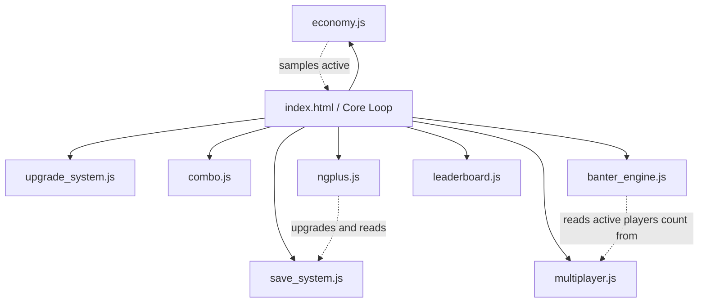

# Darius Star Foundational Structure Audit & Build Plan

This document maps the complete script dependency graph of **Darius Star: Cyber Coelacanth**, analyzes the state of all referenced external scripts, and outlines a prioritized implementation plan for the missing modular codebase components.

---

## Section 1: What Exists

### 1. File Inventory on Disk
Below is the status of the repository contents at the root and key subdirectories:

| File / Folder Path | Type | Size (Bytes) | Purpose / Description |
| :--- | :--- | :--- | :--- |
| `index.html` | File | 397,479 | Main canvas game file. Contains core rendering, gameplay loops, audio routing, menu layouts, and state management logic. |
| `upgrade_system.js` | File | 8,832 | Permanent meta-progression shop upgrade tracker. Modifies engines, shields, weapons, and cosmetics selections. |
| `combo.js` | File | 7,456 | Kill-streak score multiplier tracking and HUD overlay renderer. |
| `banter_engine.js` | File | 30,063 | Event-driven in-mission dialogue and banter player. Houses complete dialogue script for 10 biomes. |
| `pre_level.html` | File | 28,447 | Mission brief and pilot select pre-level screen. |
| `post_level.html` | File | 21,947 | Interactive level review and statistics board. |
| `ship_select.html` | File | 56,769 | Main menu screen comparing interceptor, dreadnought, and warden ships. |
| `upgrade_shop.html` | File | 33,687 | Interstitial shop layout interface that maps and buys permanent upgrades. |
| `AGENTS.md` | File | 2,456 | Refactoring documentation rules, extraction target list, and testing criteria. |
| `JULES-SESSIONS.md` | File | 1,840 | Status list and integration progress tracker for the 7 modules Jules is extracting. |
| `generate_audio.py` | File | 72,833 | Python synthesizer script for generating raw retro SFX audio files. |
| `veo_client.py` | File | 111,065 | Python CI/CD deploy client for Cloudflare Pages integration. |
| `assets/` | Folder | — | Directory containing graphical sprites (`sprites.json`, catalog lists, images) and audio folders. |
| `docs/` | Folder | — | Contains design maps, dialogue profiles, stakes curves, and synthesizer guidelines. |

---

### 2. External Scripts Status in `index.html`
Lines 278 to 285 in `index.html` list 8 external scripts. Their disk presence and status are analyzed below:

```html
<script src="upgrade_system.js"></script> <!-- EXISTS -->
<script src="save_system.js"></script>    <!-- MISSING -->
<script src="combo.js"></script>           <!-- EXISTS -->
<script src="economy.js"></script>         <!-- MISSING -->
<script src="banter_engine.js"></script>   <!-- EXISTS -->
<script src="multiplayer.js"></script>     <!-- MISSING -->
<script src="ngplus.js"></script>          <!-- MISSING -->
<script src="leaderboard.js"></script>     <!-- MISSING -->
```

| Script Tag Source | Disk Status | Impact on Game Load | Inline Fallback in `index.html` |
| :--- | :--- | :--- | :--- |
| `upgrade_system.js` | **EXISTS** | None. Loads successfully. | Yes (`window.DS_UpgradeSystem`) |
| `save_system.js` | **MISSING** | **CRITICAL crash hazard**. Game fails to render Load menu if slot is filled since it calls `CampaignSave.loadAll()` without check. | Partially (`window.CampaignSave` checks on save/checkpoint; missing on menu lists) |
| `combo.js` | **EXISTS** | None. Loads successfully. | No (called directly: `Combo.init()`, `Combo.update()`, `Combo.draw()`) |
| `economy.js` | **MISSING** | **Minor/Medium**. Defeating enemies will not drop scrap, preventing meta-progression shop purchases. | Yes (`window.Economy` checks wrap all drops) |
| `banter_engine.js` | **EXISTS** | None. Loads successfully. | Yes (`window.BanterEngine`) |
| `multiplayer.js` | **MISSING** | **Minor**. Coop drop-in controls (Enter/Numpad3) will do nothing; game defaults to single-player. | Yes (`window.Multiplayer` checks wrap all logic) |
| `ngplus.js` | **MISSING** | **Minor**. Defeating the game will fail to advance slots to NG+ loops, and Paradox mobs will not spawn. | Yes (`window.NGPlus` checks wrap all integrations) |
| `leaderboard.js` | **MISSING** | **Medium**. High-score table screens will remain empty or crash if users clear them. | Yes (`window.Leaderboard` checks wrap all references) |

---

## Section 2: Missing Module Specifications

### 1. `save_system.js` (Exposes `CampaignSave`)
* **Exposed Global**: `CampaignSave` (as a global object/constant attached to `window`).
* **Expected Signatures**:
  * `CampaignSave.createBlank()`: Returns a default save structure object.
  * `CampaignSave.save(slotIndex, saveObj)`: Saves `saveObj` under slot index `0-2` in the local storage array `'darius_star_saves'`.
  * `CampaignSave.load(slotIndex)`: Retrieves the save object from slot `slotIndex` (returns `null` if empty).
  * `CampaignSave.loadAll()`: Returns the complete array of 3 save slots (containing save objects or `null`).
  * `CampaignSave.delete(slotIndex)`: Deletes the save at slot index `slotIndex`.
  * `CampaignSave.summarize(slotIndex)`: Returns a display-ready summary object of the save containing biome level, wave, ship, scrap balance, accumulated score, elapsed playTime, death count, difficulty, and date/time details.
  * `CampaignSave.checkpoint(slotIndex, checkpointPayload)`: Integrates transient run state (score, scrap, ship type, shields, etc.) into the `lastCheckpoint` field of the active save object.
  * `CampaignSave.restoreCheckpoint(slotIndex)`: Checks out the checkpoint, decrements player lives count by `1`, updates the storage, and returns the restored state.
  * `CampaignSave.autosave(slotIndex, runPayload)`: Commits final run progress or general auto-save states to storage.
* **Globals Depended On**: Browser storage APIs (`localStorage`, `JSON`). Self-contained.
* **Priority**: **CRITICAL**. Required immediately to prevent Load/Save screen initialization crashes.

### 2. `economy.js` (Exposes `Economy`)
* **Exposed Global**: `Economy` (global object).
* **Expected Signatures**:
  * `Economy.init()`: Resets/wipes current session's loot tracking map.
  * `Economy.shouldDrop(enemyId)`: Evaluates if an enemy can drop scrap. Leverages `Economy._lootedSegments` tracker to prevent players from farming scrap drops via checkpoint reloading.
  * `Economy.rollDrop(enemyType, biomeLevel)`: References loot tables to return drop instructions: `{ type: 'scrap'|'shield'|'weapon', amount: Number }`.
  * `Economy.createDrop(x, y, type, amount)`: Prepares coordinates and properties return payload: `{ x: Number, y: Number, type: String }` which is pushed into the game's scrap entity pool.
  * `Economy.newSegment()`: Increments or moves segment tracking ID to allow fresh drops on new levels/waves.
* **Exposed Properties**:
  * `Economy._lootedSegments`: Key-value registry holding sets of defeated enemy IDs per segment. Reset or loaded during checkpoint transitions to maintain anti-farming integrity.
* **Globals Depended On**: `biomeLevel` (global current biome tracker).
* **Priority**: **HIGH**. Critical for game loop meta-progression upgrades and reward loops.

### 3. `multiplayer.js` (Exposes `Multiplayer`)
* **Exposed Global**: `Multiplayer` (global object).
* **Expected Signatures**:
  * `Multiplayer.init()`: Resets players listing. Configures Player 1 as the Host.
  * `Multiplayer.update(dt)`: Main simulation loop processing network updates, movement interpolations, and joins/leaves.
  * `Multiplayer.onPlayerPullOut(playerId)`: Executed when player `playerId` runs out of shields/fails to repair.
  * `Multiplayer.requestJoin(shipType)`: Pushes a join request for remote players (P2-P4).
  * `Multiplayer.processJoins(biomeLevel)`: Evaluates join queues and adds corresponding player statuses.
  * `Multiplayer.requestLeave(playerId)`: Flags player `playerId` to drop out.
  * `Multiplayer.processLeaves()`: Removes players from active pool and outputs dialogue line banter.
* **Exposed Properties**:
  * `Multiplayer.count`: Total active multiplayer players (1-4).
  * `Multiplayer.maxPlayers`: Maximum multiplayer slot capacity (4).
  * `Multiplayer.players`: Array of player metadata objects representing connection and ship parameters:
    * `{ id: Number, alive: Boolean, isHost: Boolean, ship: String, x: Number, y: Number, shield: Number, _wasPulledOut: Boolean }`
* **Globals Depended On**: `biomeLevel` (passed during process joins).
* **Priority**: **MEDIUM**. Safely disabled on load; required only for coop mechanics.

### 4. `ngplus.js` (Exposes `NGPlus`)
* **Exposed Global**: `NGPlus` (global object).
* **Expected Signatures**:
  * `NGPlus.start(prevRunDataOrSlot)`: Reads standard save details, wraps state, increments `ngLevel` by `1`, and builds/saves the New Game+ save object.
  * `NGPlus.summarize(saveObj)`: Parses save and returns `{ level: Number, scrapMult: Number }`.
  * `NGPlus.rollParadox(currentNGLevel, biomeLevel)`: Determines if an enemy upgrades to a Paradox state based on current loop count and level thresholds.
  * `NGPlus.applyParadox(enemyInstance, paradoxObj)`: Injector function that edits enemy attributes (e.g. scales health, changes bullet parameters/speed, and modifies color markers).
  * `NGPlus.getScrapMult({ ngLevel })`: Computes scaling multiplier (e.g. `1 + ngLevel * 0.5`) to reward high-difficulty completions.
* **Globals Depended On**: `currentNGLevel` (global), `biomeLevel` (global).
* **Priority**: **HIGH**. Completes the campaign progression loop and adds replayability.

### 5. `leaderboard.js` (Exposes `Leaderboard`)
* **Exposed Global**: `Leaderboard` (global object).
* **Expected Signatures**:
  * `Leaderboard.getTop(category, count)`: Queries local storage under key `'darius_star_leaderboards'` and returns sorted top arrays for `scrapLord`, `speedrun`, or `survivor`.
  * `Leaderboard.submit(category, entryPayload)`: Registers a new record. Calculates the player's performance tier and appends timestamped information before saving.
  * `Leaderboard.isPersonalBest(category, value, shipType)`: Evaluates if a score represents a personal record for the current ship.
  * `Leaderboard.categories[category].getValue(scoreObj)`: Parser callback returning sorting metrics (e.g. `s => s.timeSeconds` for speedrun).
* **Exposed Constants**:
  * `Leaderboard.KEY`: Storage string `'darius_star_leaderboards'`.
  * `Leaderboard.categories`: Object holding category metadata (name, sorting direction, value trackers) and tier thresholds:
    * *Scrap Lord*: Ranks from "Scrap Cadet" to "Scrap Lord" (color code tier indicators).
    * *Speedrun*: Time bands from "Abyssal Crawler" to "Sonic Phantom" (descending order).
    * *Survivor*: Death counters from "Fodder" to "Untouchable" (0 deaths).
* **Globals Depended On**: Browser storage APIs (`localStorage`, `JSON`). Self-contained.
* **Priority**: **HIGH**. Required to render the competitive stats overlay.

---

## Section 3: Dependency Graph

### Load Order (in `index.html`)
The scripts are loaded in sequential order from top to bottom. `index.html` orchestrates their calls through the main game loop, while some scripts share logical dependencies:



---

## Section 4: Build Plan

A phased construction strategy to address missing assets and integrate ongoing modularization scripts:

```
Phase 1: Directory Setup & Structural Organization
       |
Phase 2: save_system.js (Critical Load/Save stability)
       |
Phase 3: economy.js & ngplus.js (Progression & Endgame loop)
       |
Phase 4: leaderboard.js & multiplayer.js (Social / competitive features)
       |
Phase 5: Jules PR Integration (Fred's integration check)
```

| Order | Task / Target Component | Assigned Agent | Effort Est. | Description / Objective |
| :---: | :--- | :---: | :---: | :--- |
| **1** | Directory Scaffolding Setup | **AGY** (Antigravity) | 0.5 Hours | Create the standard subfolders `js/`, `tools/`, and `tests/`. |
| **2** | Create `save_system.js` | **Jules** (Code Build) | 3.0 Hours | Implement the `CampaignSave` storage mechanics. Resolves immediate menu crashes. |
| **3** | Create `economy.js` | **Jules** (Code Build) | 2.0 Hours | Implement segment loot tracking, anti-farming registries, and drop rolling. |
| **4** | Create `ngplus.js` | **Jules** (Code Build) | 2.5 Hours | Implement Paradox mob stats overrides, scaling multipliers, and NG+ loop triggers. |
| **5** | Create `leaderboard.js` | **Jules** (Code Build) | 2.0 Hours | Implement category database sorting, personal best assessments, and performance tier labeling. |
| **6** | Create `multiplayer.js` | **Jules** (Code Build) | 4.0 Hours | Implement coop drop-in controllers, remote status updates, and exit logs. |
| **7** | Integrate Jules Extractions | **Fred** (Integrator) | 5.0 Hours | Merge Player, Enemies, Combat, Renderer, Sprites, Audio, and UI scripts from Jules sessions into the `js/` directory. |

---

## Section 5: Directory Scaffolding Needed

To clean up the repository root and accommodate Jules' ongoing module extractions, we must build a unified structure.

### 1. Directory Creation Commands
Execute these commands to prepare directories:
```bash
mkdir -p js/
mkdir -p tools/
mkdir -p tests/
```

### 2. Target File Placement Map
Once completed, files will reside as follows. External modules should be moved/written into the `js/` folder for tidiness, updating the script tags in `index.html` accordingly:

```
darius-star/
├── index.html                      # Main game orchestrator
├── pre_level.html                  # Mission select screen
├── post_level.html                 # Post-level debrief screen
├── ship_select.html                # Ship option comparator
├── upgrade_shop.html               # Upgrade purchase store
├── AGENTS.md                       # Refactoring guidelines
├── JULES-SESSIONS.md               # Extraction session records
│
├── js/                             # Central JavaScript script directory
│   ├── upgrade_system.js           # Permanent metaprogression upgrades (moved)
│   ├── save_system.js              # Campaign checkpoint databases (new)
│   ├── combo.js                    # Score multipliers and HUD (moved)
│   ├── economy.js                  # Loot and anti-farming routines (new)
│   ├── banter_engine.js            # Dialogue systems (moved)
│   ├── multiplayer.js              # Drop-in multiplayer handler (new)
│   ├── ngplus.js                   # New Game+ scaling & hazards (new)
│   ├── leaderboard.js              # Speedrun/Scrap registers (new)
│   │
│   # --- Jules Extractions ---
│   ├── player.js                   # Player class and stats
│   ├── enemies.js                  # Enemy and Boss classes
│   ├── combat.js                   # Collisions and bullets
│   ├── renderer.js                 # Backgrounds & environmental particles
│   ├── sprites.js                  # Graphic sprite loaders
│   ├── audio.js                    # Music & synth routing
│   └── ui.js                       # In-game overlays, menus, HUD
│
├── assets/                         # Sprite catalogs and audio files
│   ├── ASSET_CATALOG.json
│   ├── VEO_ASSET_CATALOG.json
│   ├── sprites.json
│   ├── audio/                      # Audio loops and indicators
│   └── sprites/                    # Character and enemy ship graphics
│
├── tools/                          # Administrative build utility scripts
│   ├── generate_audio.py           # Synthetic audio builder (moved)
│   └── veo_client.py               # Deploy pipelines (moved)
│
└── tests/                          # Automated unit test suite
    └── js/                         # Tests for extracted files (e.g. player.test.js)
```
