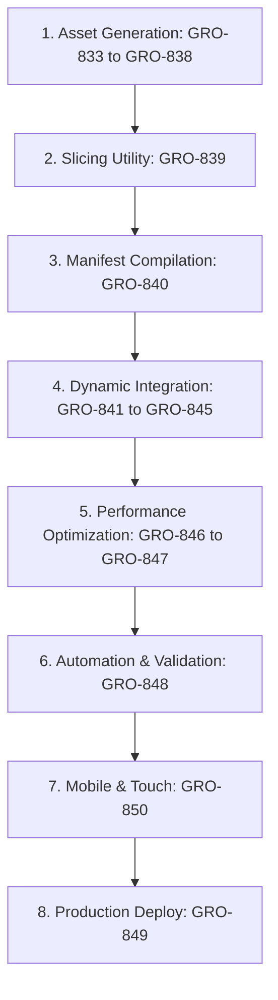

# Darius Star: Gemini Spark Asset & Antigravity TUI Integration Pack

**Source Document:** Gemini Spark — AI Asset & Antigravity TUI Integration Pack
**Authoritative Reference:** `docs/GAME-DESIGN-DOCUMENT.md` and `docs/linear-task-map.md`

This document contains the complete analyzed prompt catalog, asset-to-file mapping table, execution sequence, prerequisites, and Linear issue mappings for integrating AI-generated assets into **Darius Star: Cyber Coelacanth**.

---

## 1. Prerequisites

Before initiating the integration sequence, ensure the following prerequisites are met:
1. **Google AI Ultra Subscription:** Required to access **Google Flow Beta** for asset generation, utilizing its Subject/Scene/Style matching capabilities for design consistency.
2. **Local Python Environment:** Must have Python 3.x and the **Pillow (PIL)** library installed for sprite sheet slicing.
3. **Repository Access:** Access to the `github.com/mbgulden/darius-star` repository.
4. **Codebase Architecture Alignment:** The legacy document refers to a monolithic `darius_twin.html` file. Since the codebase has been modularized (see `AGENTS.md`), all integrations must target the shell `index.html` and the specific module files in `js/` (primarily `js/sprites.js` for loading, `js/renderer.js` for background rendering, and `js/player.js` / `js/enemies.js` / `js/combat.js` for entity rendering).

---

## 2. Complete Prompt Catalog

Below is the copy-paste ready prompt catalog for asset generation and agent instructions.

### A. Asset Generation Prompts (for Google Flow Beta / Imagen 3)

*   **Player Ship**
    ```text
    Retro-cyberpunk fighter jet, 2D side-view sprite, 16-bit pixel art style, sleek aerodynamic frame with neon blue and purple glow accents, visible exhaust ports, high contrast.
    ```
*   **Enemy Fleet**
    ```text
    Set of cybernetic aquatic biome ships, including robotic fish with metallic scales, mechanical jellyfish with glowing fiber-optic tentacles, and electric eels with translucent circuitry.
    ```
*   **Colossal Boss (Cyber Coelacanth)**
    ```text
    'Cyber Coelacanth' dreadnought ship, massive armored prehistoric fish silhouette, biomechanical plating, glowing red optic sensors, side-view boss sprite, intricate engine details.
    ```
*   **Sprites & VFX Sheets**
    ```text
    2D retro VFX sheet, plasma laser beams, pulsating thruster flames, translucent blue energy shields, circular shockwave explosions, pixel-perfect bloom.
    ```
*   **Parallax Backgrounds**
    ```text
    Layered backgrounds: Deep-space nebula with neon gas clouds and distant stars; sprawling cyberpunk biomechanical city with towering silhouettes and flickering lights.
    ```
*   **Title & UI Art**
    ```text
    16-bit arcade title card, 'Darius Star: Cyber Coelacanth' in stylized glowing futuristic font, dark space background, vibrant color palette, retro-gaming aesthetic.
    ```

### B. Antigravity TUI/CLI Action Prompts

*   **Sprite Sheet Slicer**
    ```text
    Using the local Python library Pillow, write and execute a script to programmatically slice generated sprite sheets into individual 64x64 pixel frames. Ensure the script handles alpha transparency and saves the output to the /assets/sprites/ directory.
    ```
*   **Dynamic Asset Integration**
    ```text
    Update index.html and js/sprites.js to dynamically inject the newly sliced assets. Write a JavaScript utility that reads the asset manifest (sprites.json) and populates the internal sprite object array, ensuring all paths are mapped correctly to the current directory structure.
    ```
*   **Performance Optimization Prompts**
    *   **Loop Refactoring:**
        ```text
        Refactor the index.html rendering loop to utilize requestAnimationFrame. Eliminate all setInterval calls to ensure synchronicity with the display refresh rate.
        ```
    *   **Offscreen Canvas Pre-rendering:**
        ```text
        Implement offscreen canvas pre-rendering for the 'Cyber Coelacanth' boss and complex fleet sprites. Render these to a hidden buffer once during load to reduce per-frame draw calls.
        ```
    *   **Lazy-loading:**
        ```text
        Optimize initial load times by implementing lazy-loading for the parallax background layers and the Colossal Boss assets, triggering the download only when the player nears the relevant stage trigger.
        ```
*   **Workflow Automation**
    ```text
    Generate a tasks.json configuration to automate development workflows. Include a 'lint' command to check for missing asset references in index.html/js/sprites.js and a 'build' command to verify that all image dimensions conform to the required power-of-two constraints for GPU optimization.
    ```

---

## 3. Asset-to-File Mapping Table

This table maps each generated asset category to its designated file path in the repository.

| Asset Category | Target File Path | Purpose / Description |
|---|---|---|
| **Player Ship** | `assets/sprites/player_ship.png` | 16-bit player ship sprite sheet containing thrust/tilting animation frames. |
| **Enemy Fleet (Robot Mob)** | `assets/sprites/generated/robot_mob.png` | 2x2 grid animation frames for the standard fish minion. |
| **Enemy Fleet (Mine Layer)** | `assets/sprites/generated/mine_layer.png` | Static/single sprite sheet for the mine-deploying enemy. |
| **Enemy Fleet (Sniper Drone)** | `assets/sprites/generated/sniper_drone.png` | Static/single sprite sheet for the long-range drone. |
| **Colossal Boss** | `assets/sprites/generated/boss_coelacanth.png` | Multi-frame sheet for the Cyber Coelacanth dreadnought. |
| **VFX Sheets** | `assets/sprites/vfx_sheet.png` | Consolidated sheet for lasers, shields, thruster flames, and explosions. |
| **Parallax Nebulae** | `assets/sprites/bg_nebula.png` | Starfield background layer (far distance). |
| **Parallax City** | `assets/sprites/bg_cyber_city.png` | Cyberpunk biomechanical city silhouette layer (mid distance). |
| **Title & UI Art** | `assets/sprites/title_ui.png` | Title screen logo, credits background, and HUD panels. |
| **Sprite Manifest** | `assets/sprites/sprites.json` | JSON mapping layout, listing slice coordinates for all sprite sheets. |

---

## 4. Linear Issue Mapping

Each prompt and task corresponds to a specific issue in the **Darius Star** Linear project:

| Prompt / Task | Linear Issue ID | Phase / Description |
|---|---|---|
| **Read & Analyze Integration Pack** | `GRO-832` | Phase 1: Foundation (Current Task) |
| **Generate Player Ship Sprite** | `GRO-833` | Phase 2: Asset Generation (Player Jet) |
| **Generate Enemy Fleet Sprites** | `GRO-834` / `GRO-1109` | Phase 2 / Sprint 1: Enemy Units (Fish, Jellyfish, Eels, Drones) |
| **Generate Cyber Coelacanth Boss Sprite** | `GRO-835` | Phase 2: Boss dreadnought |
| **Generate VFX Sprite Sheets** | `GRO-836` | Phase 2: Lasers, shields, explosions |
| **Generate Parallax Background Layers** | `GRO-837` | Phase 2: Deep space nebula + Alien city layers |
| **Generate Title Card and UI Art** | `GRO-838` | Phase 2: Main title screen + HUD styling |
| **Sprite Sheet Slicer (Pillow Script)** | `GRO-839` | Phase 3: Slicing script implementation |
| **Generate sprites.json Manifest** | `GRO-840` | Phase 3: Manifest compilation |
| **Integrate Player Ship Sprite** | `GRO-841` | Phase 4: Replace procedural code with player ship textures |
| **Integrate Enemy Fleet Sprites** | `GRO-842` | Phase 4: Replace procedural code with enemy fleet textures |
| **Integrate Cyber Coelacanth Boss Sprite** | `GRO-843` | Phase 4: Replace procedural code with boss dreadnought texture |
| **Integrate VFX Sprites (lasers/shields/explosions)**| `GRO-844` | Phase 4: Replace canvas drawings with VFX slices |
| **Integrate Parallax Background Layers** | `GRO-845` | Phase 4: Dynamic layered rendering |
| **Offscreen Canvas Pre-rendering** | `GRO-846` | Phase 5: Render static/complex entities to hidden buffers |
| **Lazy-loading for boss and backgrounds** | `GRO-847` | Phase 5: Trigger asset loading dynamically near target level coordinates |
| **tasks.json Automation (lint/build)** | `GRO-848` | Phase 5: Workspace build & check scripts |
| **Deploy to Cloudflare Pages** | `GRO-849` | Phase 6: Release deployment |
| **Mobile & Touch Controls + Responsive Scaling**| `GRO-850` / `GRO-1115` | Phase 6 / Sprint 3: Viewport adjustments & touch interfaces |

---

## 5. Integration Sequence

To ensure dependency integrity, execute the prompts and tasks in the following order:



### Step 1: Asset Generation (Phase 2)
*   **Task:** Run the generation prompts for Player Ship, Enemy Fleet, Colossal Boss, VFX, Backgrounds, and UI inside Google Flow Beta.
*   **Result:** High-resolution sprite sheets saved locally.

### Step 2: Sprite Sheet Slicing (Phase 3 — `GRO-839`)
*   **Task:** Run the Pillow script to slice the high-res sheets into individual `64x64` frames, handling transparency.
*   **Result:** Sliced frames stored under `assets/sprites/`.

### Step 3: Manifest Generation (Phase 3 — `GRO-840`)
*   **Task:** Compile the coordinates and metadata into `assets/sprites/sprites.json` mapping out each slice.

### Step 4: Code Integration (Phase 4 — `GRO-841` to `GRO-845`)
*   **Task:** Refactor `js/sprites.js` to load the manifest and sprite sheets, and update entity rendering in `js/player.js`, `js/enemies.js`, `js/combat.js`, and `js/renderer.js` to draw slices instead of vector paths.

### Step 5: Performance Optimization (Phase 5 — `GRO-846` to `GRO-847`)
*   **Task:** Implement offscreen pre-rendering to draw complex sprites (e.g., boss ship, explosions) once to a hidden canvas during load, and implement lazy-loading triggered by biome proximity to decrease initial package load size.

### Step 6: Automation & Verification (Phase 5 — `GRO-848`)
*   **Task:** Establish the `tasks.json` configuration and write check scripts to verify image power-of-two constraints and references.

### Step 7: Responsive and Input Calibrations (Phase 6 — `GRO-850`)
*   **Task:** Add touch input overlays, d-pad listeners, and aspect-ratio scaling triggers.

### Step 8: Deployment (Phase 6 — `GRO-849`)
*   **Task:** Deploy the fully-featured canvas game to Cloudflare Pages using wrangler/veo_client integration.
