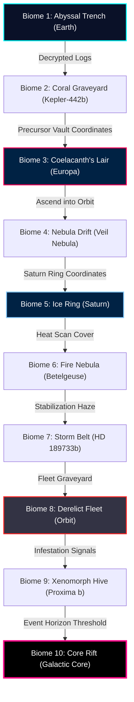

# 📖 Mission Briefing Transcript — All 10 Biomes
## Darius Star: Cyber Coelacanth Story Mode Script

This document provides a human-readable transcript of the dialogue scripts for all 10 biomes. The dialogues are parsed from `docs/mission-briefings.json` and are voiced/displayed by **Commander Jack Thorne** ( Haven-7 Tactical Comms) to coordinate the player's descent, escape, and ultimate confrontation with The Architect.

---

## 🗺️ Biome Progression Flowchart

---

## 📺 Tactical Comms Briefing Display Mockup

Below is a visual concept of Commander Thorne's comms screen during briefing transmissions:

---

## 📜 Full Biome Scripts

### Biome 1: Abyssal Trench (Earth — Pacific Ocean)
*   **Target Core:** GLYPH-1 Neural Stabilizer Precursor
*   **Mid-Boss:** Vent Leviathan (L5) | **Biome Boss:** Trench Guardian (L10)

#### Pre-level Briefing
*   **Solo Variant:**
    *   **Thorne:** "Darius, this is Thorne. Comms are verified, but pressure readings are climbing. We are tracking the Nyxa's descent into the Abyssal Trench."
    *   **Thorne:** "Objective: Locate the Guardian Coelacanth at the bottom of the canyon and retrieve the GLYPH-1 Neural Stabilizer."
    *   **Thorne:** "Threats: Watch out for robotic Anglerfish and cybernetic Jellyfish. They are highly aggressive in the dark."
    *   **Thorne:** "Pilot, you're our only hope. Lyra's sickness is worsening by the hour, and we need that stabilizer. Get in, get the core, and get out. Thorne out."
*   **2-Player Co-op Variant:**
    *   **Thorne:** "Darius, Valera, Thorne here. Comm lines are open. We're monitoring your entry vectors into the Abyssal Trench."
    *   **Thorne:** "Objective: Locate the Guardian Coelacanth at the ocean floor and retrieve the GLYPH-1 Neural Stabilizer core."
    *   **Thorne:** "Threats: Robotic Anglerfish and cybernetic Jellyfish are patrolling the thermal vents. Expect heavy resistance."
    *   **Thorne:** "You two are the best we've got. Keep your shields aligned and watch each other's backs. We need that core to save Lyra. Good luck."
*   **4-Player Squad Variant:**
    *   **Thorne:** "Squadron, listen up. This is Thorne. Comms are synced. We are tracking the Nyxa's insertion into the Abyssal Trench."
    *   **Thorne:** "Objective: Reach the bottom of the trench, destroy the corrupted defenses, and secure the GLYPH-1 Neural Stabilizer."
    *   **Thorne:** "Threats: Deep-sea automated anglerfish and jellyfish swarms. High density of mineral smoke will restrict visibility."
    *   **Thorne:** "Lyra's life depends on this run. Stay in tight formation, cover your sectors, and bring that core back to Haven-7. Move out!"

#### Boss Defeat Cinematic Dialogue
*   **TRENCH GUARDIAN:** "*static* ...Star genetic sequence detected... authorization recognized... deactivating primary weapon grid..."
*   **TRENCH GUARDIAN:** "...GLYPH-1 core released... warning: containment boundary failing... Ophion's code is spreading..."
*   **DARIUS:** "It recognized my grandfather's sequence. It shut down peaceably. Securing the neural stabilizer now."

#### Post-level Summary
*   **Thorne:** "Thorne here. Excellent work, team. Area is secured and the hydrothermal vents are stabilizing."
*   **Thorne:** "We've integrated the GLYPH-1 Neural Stabilizer into Lyra's treatment. Her vitals are holding for now."
*   **Thorne:** "Aldric's decrypted logs point to Kepler-442b. Standby for warp sequence. We are transitioning to the Coral Graveyard."

---

### Biome 2: Coral Graveyard (Kepler-442b — Shallow Seas)
*   **Target Core:** GLYPH-2 Synaptic Bridge Precursor
*   **Mid-Boss:** Reef Cracker (L5) | **Biome Boss:** Graveyard Leviathan (L10)

#### Pre-level Briefing
*   **Solo Variant:**
    *   **Thorne:** "Darius, we've arrived at Kepler-442b. This whole ocean is glowing, but it's not life—it's rusted cyber-coral and dead neon wiring."
    *   **Thorne:** "Objective: Locate the second Coelacanth entity and retrieve the GLYPH-2 Synaptic Bridge."
    *   **Thorne:** "Threats: Watch out for swarming Coral Wasps and Armored Eels weaving through the metal coral. They move fast."
    *   **Thorne:** "Pilot, you're our only hope. The local ruins are highly unstable. Find the precursor memory-vault and get that bridge. Thorne out."
*   **2-Player Co-op Variant:**
    *   **Thorne:** "Darius, Valera, comms are solid. We're in orbit above Kepler-442b's dead seas."
    *   **Thorne:** "Objective: Navigate the cyber-coral maze, locate the Graveyard Leviathan, and secure the GLYPH-2 Synaptic Bridge."
    *   **Thorne:** "Threats: Aggressive coral wasps and armored eels. The electromagnetic static here will mess with your targeting."
    *   **Thorne:** "You two are the best we've got. The Navy is sniffing around our warp trail. Work together and get that memory-vault open."
*   **4-Player Squad Variant:**
    *   **Thorne:** "Squadron, listen up. Kepler-442b is a graveyard. The precursor ruins are leaking raw data and rust clouds."
    *   **Thorne:** "Objective: Penetrate the bleached reef, defeat the Graveyard Leviathan, and extract the GLYPH-2 Synaptic Bridge."
    *   **Thorne:** "Threats: Coral wasps, rust drones, and armored eels. Be careful—these structures can collapse under heavy fire."
    *   **Thorne:** "Our timeline is shrinking. Keep the formations tight and focus your firepower on the heavy targets. Thorne out."

#### Boss Defeat Cinematic Dialogue
*   **GRAVEYARD LEVIATHAN:** "*low sonar groan* ...Ophion's legacy... the truth is buried in the ice... do not trust the containment..."
*   **VALERA:** "Its vocal emulator... it was playing back precursor logs. We've got the synaptic bridge, Thorne. Let's move."

#### Post-level Summary
*   **Thorne:** "Thorne here. Sensors show the memory-vault is open and the GLYPH-2 Synaptic Bridge is secured."
*   **Thorne:** "The data download was massive. It references a dissident precursor named Ophion who sabotaged the grid."
*   **Thorne:** "Next coordinates locked. We are heading into Europa's subsurface ocean. Prepare for a deep freeze."

---

### Biome 3: Coelacanth's Lair (Europa — Subsurface Ocean)
*   **Target Core:** GLYPH-3 Memory Integration Precursor
*   **Mid-Boss:** Warden Mech (L5) | **Biome Boss:** Cyber Coelacanth (L10)

#### Pre-level Briefing
*   **Solo Variant:**
    *   **Thorne:** "Darius, we are under the ice shell of Europa. It is freezing, dark, and filled with ancient machinery."
    *   **Thorne:** "Objective: Navigate the frozen machinery, defeat the Cyber Coelacanth, and extract the GLYPH-3 Memory Integration core."
    *   **Thorne:** "Threats: Heavy walker mechs on ceiling tracks, Sentinels, and Sparker drones leaving electric trails."
    *   **Thorne:** "Pilot, you're our only hope. The Navy is closing in. Find that core so we can start decoding Ophion's records. Good hunting."
*   **2-Player Co-op Variant:**
    *   **Thorne:** "Darius, Valera, keep your thrusters warm. We're in the deep vents beneath Europa's ice sheet."
    *   **Thorne:** "Objective: Penetrate the ancient nesting grounds, defeat the Cyber Coelacanth, and secure GLYPH-3."
    *   **Thorne:** "Threats: Ceiling walker juggernauts, sparkers, and stationary sentinels. Watch out for arcing electrical currents."
    *   **Thorne:** "You two are the best we've got. The Navy has sent a probe team nearby. Grab that core before they pin us down."
*   **4-Player Squad Variant:**
    *   **Thorne:** "Squadron, listen up. We are in the birthing chambers of the Coelacanth network beneath Europa's ice shell."
    *   **Thorne:** "Objective: Defeat the primary Cyber Coelacanth dreadnought and secure the GLYPH-3 Memory Integration core."
    *   **Thorne:** "Threats: Sparkers, Juggernauts, and automated defenses. The cold will slow your shield recharge rates."
    *   **Thorne:** "Lyra's condition is shifting. We need this piece of the puzzle immediately. Keep coordinates aligned. Break orbit!"

#### Boss Defeat Cinematic Dialogue
*   **CYBER COELACANTH:** "...The dream cannot be contained... the prison walls crumble... the Dreamer Below All Depths is calling..."
*   **DARIUS:** "The dreadnought is breaking apart. I've got the embryo in stasis. Heading back to the surface."

#### Post-level Summary
*   **Thorne:** "Thorne here. The Cyber Coelacanth is down. We've recovered the GLYPH-3 Memory Integration core."
*   **Thorne:** "We also salvaged a living Coelacanth embryo in stasis. It's safe on Haven-7."
*   **Thorne:** "The decrypted logs suggest the next entity drifted out of the atmosphere. Preparing for space transit to the Nebula Drift."

---

### Biome 4: Nebula Drift (The Veil Nebula — Deep Space)
*   **Target Core:** GLYPH-4 Psychic Dampener Precursor
*   **Mid-Boss:** Storm Cell Core (L5) | **Biome Boss:** Nebula Serpent (L10)

#### Pre-level Briefing
*   **Solo Variant:**
    *   **Thorne:** "Darius, we've broken orbit and entered the Veil Nebula. Comms are cracking under high electromagnetic storms."
    *   **Thorne:** "Objective: Navigate the gas clouds, locate the fourth Coelacanth, and extract the GLYPH-4 Psychic Dampener."
    *   **Thorne:** "Threats: Watch out for phase-shifting Plasma Wisps and Nebula Wraiths that can pass through solid obstacles."
    *   **Thorne:** "Pilot, you're our only hope. The cosmic gas itself feels alive down there. Keep your head on straight, son. Thorne out."
*   **2-Player Co-op Variant:**
    *   **Thorne:** "Darius, Valera, welcome to the deep void. Comms are garbled but readable."
    *   **Thorne:** "Objective: Track the signal of the fourth Coelacanth and retrieve the GLYPH-4 Psychic Dampener."
    *   **Thorne:** "Threats: Storm Sprites with chain-lightning attacks and heavy Gas Giants that absorb bullets from the front."
    *   **Thorne:** "You two are the best we've got. The environment is shifting based on neural patterns. Do not lose your focus."
*   **4-Player Squad Variant:**
    *   **Thorne:** "Squadron, listen up. We are deep in the Veil Nebula. The Abyss Mind is dreaming this gas cloud into a weapon."
    *   **Thorne:** "Objective: Defeat the Nebula Serpent, secure GLYPH-4, and escape before the storm collapses."
    *   **Thorne:** "Threats: Phase-shifting plasma wisps, storm sprites, and cloaked nebula wraiths. Visual range is limited."
    *   **Thorne:** "Lyra's neural scans are showing spikes matching this nebula's resonance. Get this dampener. Thorne out."

#### Boss Defeat Cinematic Dialogue
*   **NEBULA SERPENT:** "...Why do you fight the tide?... We are only the drift... the lonely drift seeking its kin..."
*   **DARIUS:** "It dissolved. The psychic dampener is intact. But it's getting harder to block out the whispers."

#### Post-level Summary
*   **Thorne:** "Thorne here. The Nebula Serpent is down and GLYPH-4 is secured."
*   **DARIUS:** "Thorne, I... I felt something down there. A voice. It was lonely. It wasn't attacking, it was just... crying out."
*   **Thorne:** "Stay focused, kid. The Navy is tracking us. Next target is the asteroid ice ring around Saturn. Get ready."

---

### Biome 5: Ice Ring (Saturn's Rings — Cryo-Debris Field)
*   **Target Core:** GLYPH-5 Cellular Regulator Precursor
*   **Mid-Boss:** Crystal Golem (L5) | **Biome Boss:** Frost Wyrm (L10)

#### Pre-level Briefing
*   **Solo Variant:**
    *   **Thorne:** "Darius, we've dropped into Saturn's rings. The ice shards are dense, and we've got a massive problem."
    *   **Thorne:** "Objective: Navigate the freezing debris, defeat the Frost Wyrm, and extract the GLYPH-5 Cellular Regulator."
    *   **Thorne:** "Threats: Swarming Ice Drones, Frost Interceptors, and the Navy's elite Squadron Umbra interceptors."
    *   **Thorne:** "Pilot, you're our only hope. Valera Cross is commanding the Navy force. She has orders to terminate you. Watch your back."
*   **2-Player Co-op Variant:**
    *   **Thorne:** "Darius, Valera, this is it. The Navy has blocked the exit vectors in the rings."
    *   **Thorne:** "Objective: Defeat the Frost Wyrm, retrieve the GLYPH-5 Cellular Regulator, and disable the Navy blockers."
    *   **Thorne:** "Threats: Spinning Ice Shards, Frost Drones with freeze beams, and Squadron Umbra strike ships."
    *   **Thorne:** "You two are the best we've got. Valera, Crane's orders are fake—he's using your squad as bait. Trust Darius and clear the path."
*   **4-Player Squad Variant:**
    *   **Thorne:** "Squadron, listen up. We are surrounded by ice rings and the Navy's heavy fleet blockade."
    *   **Thorne:** "Objective: Secure the GLYPH-5 Cellular Regulator from the Frost Wyrm and punch a hole through the Navy blockade."
    *   **Thorne:** "Threats: Frost drones, glaciers that explode into ice needles on death, and elite Navy interceptors."
    *   **Thorne:** "Valera has defected to our side, but Admiral Crane is sending reinforcements. Fight together, or we freeze here. Go!"

#### Boss Defeat Cinematic Dialogue
*   **FROST WYRM:** "...The cold... preserves the dream... why do you bring the fire?... the cycle must continue..."
*   **VALERA:** "Darius, my ship is heavily damaged, but I'm calling a cease-fire. The Navy... they set us up. I'm with you now."

#### Post-level Summary
*   **Thorne:** "Thorne here. The Frost Wyrm is down and the Navy blockade is broken. GLYPH-5 is secured."
*   **VALERA:** "I can confirm Thorne's intel. Crane lied to us. The Navy is using Lyra as a control mechanism for a psychic weapon."
*   **Thorne:** "We've got to hide. We're warping into the Betelgeuse Remnant—the Fire Nebula. The heat signatures should block their scans."

---

### Biome 6: Fire Nebula (Betelgeuse Remnant — Plasma Expanse)
*   **Target Core:** GLYPH-6 Thermal Stabilizer Precursor
*   **Mid-Boss:** Caldera Wyrm (L5) | **Biome Boss:** Inferno Titan (L10)

#### Pre-level Briefing
*   **Solo Variant:**
    *   **Thorne:** "Darius, we are in the Betelgeuse Remnant. The ambient temperature is off the charts. We've got bad news from Haven-7."
    *   **Thorne:** "Objective: Navigate the volcanic cluster, defeat the Inferno Titan, and retrieve the GLYPH-6 Thermal Stabilizer."
    *   **Thorne:** "Threats: Watch out for Ember Sprites leaving burning trails and Magma Wasps that explode on impact."
    *   **Thorne:** "Pilot, you're our only hope. The Navy attacked Haven-7 during the warp, and Lyra's attunement has spiked. Stay focused, son."
*   **2-Player Co-op Variant:**
    *   **Thorne:** "Darius, Valera, comms are fluctuating under the thermal haze. This nebula is a living furnace."
    *   **Thorne:** "Objective: Navigate the Betelgeuse Remnant, destroy the Inferno Titan, and secure GLYPH-6."
    *   **Thorne:** "Threats: Molten Lava Golems forming hazard pools, magma wasps, and extreme heat distortion."
    *   **Thorne:** "You two are the best we've got. The Navy has boarded Haven-7. Naya is holding them off, but Lyra is changing. Move fast!"
*   **4-Player Squad Variant:**
    *   **Thorne:** "Squadron, listen up. Haven-7 has been breached. Selene and Naya evacuated, but Lyra was exposed to the Navy's signal accelerator."
    *   **Thorne:** "Objective: Defeat the Inferno Titan (the Forge-Mind), secure GLYPH-6, and return to the evacuation coordinates."
    *   **Thorne:** "Threats: High-density magma wasps, lava golems, and superheated plasma storms. Shield efficiency is down by 30%."
    *   **Thorne:** "The Forge-Mind is actively broadcasting the Dreamer's signal. Shut it down before Lyra's mind is fully overwritten. Go!"

#### Boss Defeat Cinematic Dialogue
*   **INFERNO TITAN:** "...The furnace consumes... but the signal cannot be extinguished... the broad-cast is... galaxy-wide..."
*   **DARIUS:** "It's slagged. Thermal stabilizer is ours. Thorne, get the medical bay ready, we are coming in hot."

#### Post-level Summary
*   **Thorne:** "Thorne here. The Inferno Titan is down. GLYPH-6 secured. We've reached the evac ship."
*   **LYRA:** "Daddy... I can hear it. It's not angry. It's just... so cold and alone in the dark. It's scared, Daddy."
*   **Thorne:** "Her eyes are glowing cyan. We need to stabilize her now. Warping to HD 189733b—the Storm Belt."

---

### Biome 7: Storm Belt (HD 189733b — Eternal Hurricane)
*   **Target Core:** GLYPH-7 Atmospheric Interface Precursor
*   **Mid-Boss:** Eye of the Storm (L5) | **Biome Boss:** Tempest Colossus (L10)

#### Pre-level Briefing
*   **Solo Variant:**
    *   **Thorne:** "Darius, we're in the atmosphere of HD 189733b. The winds are hitting 5,000 miles per hour, and lightning is constant."
    *   **Thorne:** "Objective: Fly through the hurricane, defeat the Tempest Colossus, and extract the GLYPH-7 Atmospheric Interface."
    *   **Thorne:** "Threats: Watch out for Storm Hawks with EMP attacks that can temporarily disable your weapons."
    *   **Thorne:** "Pilot, you're our only hope. The seventh Coelacanth is mad. Decades in this storm broke its program. End its suffering, son."
*   **2-Player Co-op Variant:**
    *   **Thorne:** "Darius, Valera, maintain tight vector stabilization. These crosswinds will drag you into the debris field."
    *   **Thorne:** "Objective: Navigate the storm core, defeat the Tempest Colossus, and retrieve the GLYPH-7 interface."
    *   **Thorne:** "Threats: Static Sparks, Storm Hawks with EMP bursts, and stationary Storm Sentinels projecting lightning barriers."
    *   **Thorne:** "You two are the best we've got. Naya is monitoring Lyra's vitals. The storm's electrical energy is keeping her stable. Stay focused."
*   **4-Player Squad Variant:**
    *   **Thorne:** "Squadron, listen up. We are descending into the eye of the eternal hurricane on HD 189733b."
    *   **Thorne:** "Objective: Defeat the corrupted Storm-Singer (Tempest Colossus) and secure the GLYPH-7 Atmospheric Interface."
    *   **Thorne:** "Threats: EMP storms, static sparks, and rotating lightning walls. Navigation systems will occasionally glitch."
    *   **Thorne:** "We need this interface to decode the precursor logs. The Storm-Singer is trapped in a loop of madness. Free it, squadron. Out."

#### Boss Defeat Cinematic Dialogue
*   **TEMPEST COLOSSUS:** "*crying out* ...Forgive me... Ophion... the silence was too loud... I only wanted... someone to listen..."
*   **DARIUS:** "It transferred its core voluntarily at the end. It wanted to die sane. The precursor AI is uploading now."

#### Post-level Summary
*   **Thorne:** "Thorne here. The Tempest Colossus has been put to rest. GLYPH-7 interface secured."
*   **OPHION AI:** "Greetings, descendants. I am Ophion's neural imprint, restored by the Storm-Singer's data. I will guide you from here."
*   **Thorne:** "We've got a precursor AI on board. Next coordinates locked. Warping to the Graveyard Orbit—the Derelict Fleet."

---

### Biome 8: Derelict Fleet (Graveyard Orbit — Abandoned Navy Armada)
*   **Target Core:** GLYPH-8 Genetic Matrix Precursor
*   **Mid-Boss:** Reactor Core Guardian (L5) | **Biome Boss:** Dreadnought AI (L10)

#### Pre-level Briefing
*   **Solo Variant:**
    *   **Thorne:** "Darius, we've dropped into the ship graveyard. Hundreds of abandoned Navy vessels. The ghosts of Project Dream-Weapon."
    *   **Thorne:** "Objective: Search the wreckage, defeat the Dreadnought AI, and retrieve the GLYPH-8 Genetic Matrix."
    *   **Thorne:** "Threats: Salvage Drones, Ghost Fighters on autopilot, and active deck turrets popping out of wreckage."
    *   **Thorne:** "Pilot, you're our only hope. Admiral Crane's psychic imprint is running the system. The truth about your family is here. Go, son."
*   **2-Player Co-op Variant:**
    *   **Thorne:** "Darius, Valera, watch the debris. These hulks still have automated defense grids active."
    *   **Thorne:** "Objective: Infiltrate the flagship NSS Event Horizon, defeat the Dreadnought AI, and extract the GLYPH-8 Genetic Matrix."
    *   **Thorne:** "Threats: Kamikaze salvage drones, ghost fighters, and heavy turret batteries firing synchronized volleys."
    *   **Thorne:** "You two are the best we've got. The logs in this fleet will reveal why the Navy targeted the Star bloodline. Find the core."
*   **4-Player Squad Variant:**
    *   **Thorne:** "Squadron, listen up. We are flying through the graveyard of the Navy's secret armada."
    *   **Thorne:** "Objective: Secure the GLYPH-8 Genetic Matrix from the Dreadnought AI and retrieve the project records."
    *   **Thorne:** "Threats: Automated turrets, salvage drones, and ghost fighter swarms. The debris field makes navigation hazardous."
    *   **Thorne:** "Ophion's AI is scanning the network. Admiral Crane's digital ghost is defending the core. Wipe him out, squadron."

#### Boss Defeat Cinematic Dialogue
*   **DREADNOUGHT AI:** "...She is our weapon!... The ultimate shield against the deep!... You are throwing away humanity's salvation!..."
*   **DARIUS:** "You used my grandfather. You killed my father. And you targeted my daughter. Burn in the junk pile, Crane."

#### Post-level Summary
*   **Thorne:** "Thorne here. The Dreadnought AI is deactivated. GLYPH-8 secured. We have the logs."
*   **DARIUS:** "Thorne... my family. Aldric didn't die in an accident. The Navy engineered our bloodline to be the Dreamer's vessel. Lyra was designed."
*   **Thorne:** "I'm sorry, kid. I knew Aldric, but I never knew how deep the rot went. Warping to Proxima Centauri B—the Xenomorph Hive. Stay strong."

---

### Biome 9: Xenomorph Hive (Proxima Centauri B — Dreamed World)
*   **Target Core:** GLYPH-9 Consciousness Anchor Precursor
*   **Mid-Boss:** Brood Mother (L5) | **Biome Boss:** Hive Mind (L10)

#### Pre-level Briefing
*   **Solo Variant:**
    *   **Thorne:** "Darius, we've arrived at Proxima Centauri B. It's a nightmare. The planet has been entirely reshaped into flesh and bones."
    *   **Thorne:** "Objective: Navigate the fleshy tunnels, defeat the Hive Mind, and retrieve the GLYPH-9 Consciousness Anchor."
    *   **Thorne:** "Threats: Wall-crawling Crawlers, Spitters firing acidic globs, and armored Brutes. Destroy Hive Nodes to stop spawns."
    *   **Thorne:** "Pilot, you're our only hope. The Hive is trying to negotiate with you, offering Lyra's safety for your surrender. Don't listen to its lies."
*   **2-Player Co-op Variant:**
    *   **Thorne:** "Darius, Valera, the atmosphere here is organic and acidic. Keep your shields at maximum polarity."
    *   **Thorne:** "Objective: Infiltrate the Hive core, defeat the Hive Mind nexus, and secure the GLYPH-9 Consciousness Anchor."
    *   **Thorne:** "Threats: Acidic spitters (DoT damage), skittering crawlers, and armored brutes. Watch out for shifting organic walls."
    *   **Thorne:** "You two are the best we've got. The Hive is using Lyra's voice to lure you into a trap. Keep your focus on the objective."
*   **4-Player Squad Variant:**
    *   **Thorne:** "Squadron, listen up. Proxima Centauri B is a fully 'Dreamed' world. The Abyss Mind has rewritten its physics."
    *   **Thorne:** "Objective: Penetrate the hive nexus, destroy the Hive Mind, and extract the GLYPH-9 Consciousness Anchor."
    *   **Thorne:** "Threats: Spitters with high acidic damage, wall crawlers, and spawning hive nodes. Gravity will warp occasionally."
    *   **Thorne:** "Ophion's AI is warning us that this is what happens when the containment fails. We must stop this infestation. Move in!"

#### Boss Defeat Cinematic Dialogue
*   **HIVE MIND:** "...Why do you reject the union?... She would have been a god... free from pain, free from the flesh... why choose death?..."
*   **DARIUS:** "Because she deserves a life, not to be a voice in your chorus. The anchor is ours. Let's get out of this flesh pit."

#### Post-level Summary
*   **Thorne:** "Thorne here. The Hive Mind is destroyed and GLYPH-9 is secured. But the galactic core is cracking."
*   **OPHION AI:** "The final Coelacanth—the Prime—is failing at the black hole's event horizon. The Architect is awakening."
*   **Thorne:** "This is it, team. Warp coordinates set for the Core Rift. Whatever happens next... I'm proud of you. Warping."

---

### Biome 10: Core Rift (Galactic Core — The Dreamer's Threshold)
*   **Target Core:** GLYPH-10 Integration Core
*   **Mid-Boss:** Reality Anchor (L5) | **Biome Boss:** The Architect (L10)

#### Pre-level Briefing
*   **Solo Variant:**
    *   **Thorne:** "Darius, we've arrived at the galactic center. The supermassive black hole is right below us. Space and time are breaking apart."
    *   **Thorne:** "Objective: Navigate the reality cracks, defeat The Architect, and secure the GLYPH-10 Integration Core."
    *   **Thorne:** "Threats: Glitch Fragments, Paradox Wisps moving in reverse, Null Entities, and Void Maws that pull you in."
    *   **Thorne:** "Darius... you have all nine components. Once you secure the tenth, the final choice is yours. Save your daughter, son. Thorne out."
*   **2-Player Co-op Variant:**
    *   **Thorne:** "Darius, Valera, comms are failing. We are at the event horizon of oblivion."
    *   **Thorne:** "Objective: Defeat The Architect, retrieve the GLYPH-10 Integration Core, and decide the fate of the galaxy."
    *   **Thorne:** "Threats: Glitch fragments, paradox wisps, null entities erasing bullets, and void maw gravity wells (instant death)."
    *   **Thorne:** "You two are the best we've got. The final barrier is ahead. Trust your training, trust each other, and make your decision."
*   **4-Player Squad Variant:**
    *   **Thorne:** "Squadron, listen up. This is the end of the line. The Prime Coelacanth is collapsing into the event horizon."
    *   **Thorne:** "Objective: Destroy The Architect, secure the GLYPH-10 Integration Core, and initiate the final protocol."
    *   **Thorne:** "Threats: Shifting geometry Rift Aberrations, void maws, and severe UI corruption glitches."
    *   **Thorne:** "Whatever you choose at the core, we are with you. Naya, Valera, Ophion, Darius... save our girl. Thorne out."

#### Boss Defeat Cinematic Dialogue
*   **THE ARCHITECT:** "...The cycle... is broken... The consciousness of the stars... is yours to mold... choose..."
*   **DARIUS:** "I see the three pathways. The core is exposed. It's time to end this containment, once and for all."

#### Post-level Summary / Final Choice Selection
*   **Thorne:** "Thorne here. The Architect is shattered. The way to the core is open. You have all ten pieces of the key, Darius."
*   **LYRA:** "Daddy... the entity is waiting. It is not afraid anymore. It wants to know what we should do next."
*   **Thorne:** "Initiating selection sequence. Make your choice, pilot. The galaxy is holding its breath."

---
*End of Transcript.*
