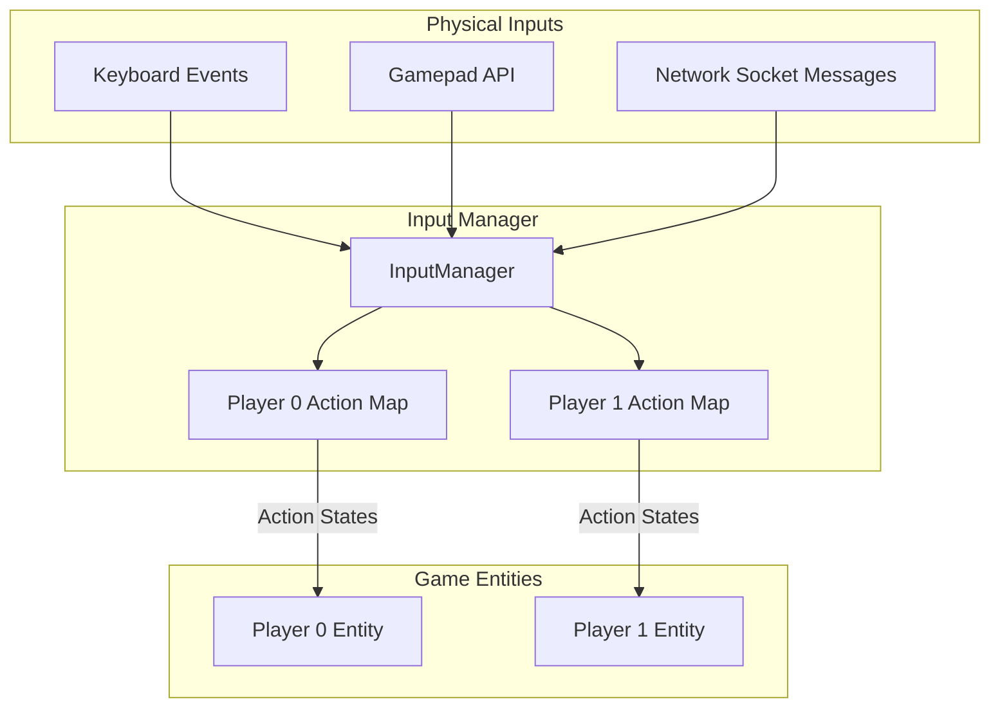
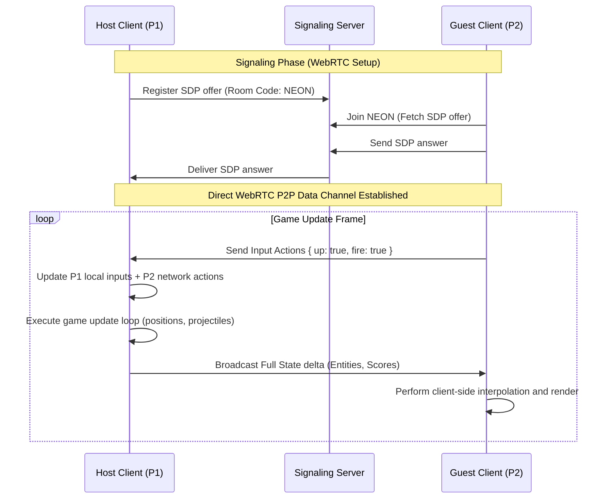

# GRO-911: Multiplayer Foundation: Design 2-Player Co-Op Architecture

- **Phase**: Multiplayer — Foundation
- **Author**: Fred (Architecture Design), AGY (Research & Mockups)
- **Status**: Proposed / Under Review
- **Date**: June 9, 2026

---

## 1. Executive Summary
This document outlines the architecture for introducing 2-player cooperative gameplay (co-op) into *Darius Star: Cyber Coelacanth*, with structural provisions to scale to 4 players and future network play. The design leverages a **Network-Ready Local Co-op** foundation, decoupling input registration from state updates. This allows us to ship local play (same screen/keyboard) immediately while keeping the codebase modular enough to plug in WebRTC peer-to-peer or WebSocket server synching later with minimal refactoring.

---

## 2. Approach Evaluation Matrix

We evaluated three key implementation patterns for multiplayer:

| Feature/Metric | Option A: Local Co-Op (Shared Screen) | Option B: WebRTC Peer-to-Peer | Option C: WebSocket Server |
| :--- | :--- | :--- | :--- |
| **Networking Infrastructure** | None (0ms Latency) | P2P Signaling Server (low cost) | Authoritative Game Server (higher cost) |
| **Complexity** | Extremely Low (Single Instance) | High (SDP signaling, ICE traversal) | High (Node.js/Go room server) |
| **State Synchronization** | Automatic (Same memory space) | Complex (Host-Client delta updates) | Complex (Server-authoritative state) |
| **Input Responsiveness** | Perfect (0ms hardware latency) | High (Client-side prediction required) | Medium (TCP head-of-line blocking lag) |
| **4-Player Scalability** | Low (Keyboard limits, requires gamepads) | Medium (Star topology on Host) | High (Central server handles topology) |
| **Security / Anti-Cheat** | N/A (Local trusted) | Low (Host can cheat) | High (Authoritative server validation) |
| **Deployment Suitability** | Perfect for static hosting (CF Pages) | Perfect for static hosting (CF Pages) | Requires server hosting (GCP, AWS) |

### Selected Strategy: Network-Ready Hybrid
We will implement **Option A (Local Co-Op)** as the immediate multiplayer gameplay foundation, but structured as **Network-Ready**:
- **Why?** It requires zero external network infrastructure, is 100% reliable, has zero latency, and fits the static build targets (Cloudflare Pages).
- **Network-Ready Clause**: All input parsing is decoupled from the game loop using an abstract `InputManager` that maps players to action payloads. This allows substituting keyboard listeners with network stream packet listeners (WebRTC/WebSockets) in a future phase without rewrites of the core movement or collision systems.

---

## 3. Core Architectural Components

### 3.1 Input Abstraction (`InputManager`)
Currently, input is bound directly to a global `keys` dictionary and hardcoded in the player update loop:
```javascript
if (keys['w'] || keys['W'] || keys['ArrowUp']) dy -= 1;
```
To support multiple players, we introduce `InputManager`, which maps physical inputs to abstract actions.



#### The Input Schema
Each player entity reads their movements and actions from a mapped state structure:
```typescript
interface PlayerActions {
    up: boolean;
    down: boolean;
    left: boolean;
    right: boolean;
    fire: boolean;
    bomb: boolean;
}
```

#### Key Mappings
- **Player 1 (Keyboard Left)**: Move = `W`/`A`/`S`/`D`, Fire = `Space`, Bomb = `Left Shift`
- **Player 2 (Keyboard Right)**: Move = `Arrow Keys`, Fire = `NumPad 0` or `J`, Bomb = `NumPad Enter` or `K`
- **Gamepads**: Automatically assigned to Player 0 or Player 1 upon connection (`gamepadconnected` listener).

---

### 3.2 Game State Abstraction (`players` Array)
The single `player` instance is refactored into a `players` array:
```javascript
let players = [];
```

#### Refactored Player Class & Spawning
```javascript
class Player {
    constructor(id, x, y, color, controlsProfile) {
        this.id = id; // 0, 1, 2, 3
        this.x = x;
        this.y = y;
        this.width = 40;
        this.height = 20;
        this.speed = 220;
        this.shieldMax = 100;
        this.shield = 100;
        this.weaponLevel = 1;
        this.shootCooldown = 0.15;
        this.shootTimer = 0;
        this.color = color;
        this.invulnerable = 2.0; // Spawn invulnerability
        this.controlsProfile = controlsProfile;
        this.isDead = false;
        this.respawnTimer = 0;
    }

    update(dt) {
        if (this.isDead) {
            this.handleRespawn(dt);
            return;
        }

        if (this.invulnerable > 0) this.invulnerable -= dt;

        // Fetch actions from the InputManager
        const actions = InputManager.getActions(this.id);
        
        let dx = 0;
        let dy = 0;
        if (actions.up) dy -= 1;
        if (actions.down) dy += 1;
        if (actions.left) dx -= 1;
        if (actions.right) dx += 1;

        if (dx !== 0 && dy !== 0) {
            dx *= 0.7071;
            dy *= 0.7071;
        }

        this.x += dx * this.speed * dt;
        this.y += dy * this.speed * dt;

        // Screen clamping
        this.clampToViewport();

        if (this.shootTimer > 0) this.shootTimer -= dt;
        if (actions.fire && this.shootTimer <= 0) {
            this.shoot();
            this.shootTimer = this.shootCooldown;
        }
    }
}
```

---

### 3.3 Viewport Constraints & Camera Handling
Since *Darius Star* is a horizontal scrolling shooter, we keep a **Shared Single Screen** (no split screen). Visibility of enemies coming from the right is critical; split-screen would drastically cut the field of view.

#### Viewport Clamping Rules
- Players are constrained to the visible 800x450 canvas.
- Clamping checks:
  ```javascript
  clampToViewport() {
      if (this.x < 10) this.x = 10;
      // Prevent P1/P2 from flying off the right margin (blocked by viewport limit)
      if (this.x > canvas.width - this.width - 10) this.x = canvas.width - this.width - 10;
      if (this.y < 10) this.y = 10;
      if (this.y > canvas.height - this.height - 10) this.y = canvas.height - this.height - 10;
  }
  ```

---

### 3.4 Multi-Player Collision Loops & Homing logic
The main collision loop needs to support iterating over multiple players.

#### 1. Player Bullet Collisions (Tagging Bullet Owners)
We update the `Bullet` constructor to track its creator (`ownerId`):
```javascript
class Bullet {
    constructor(x, y, vx, vy, color, size = 4, isWave = false, damage = 1, ownerId = 0) {
        this.x = x;
        this.y = y;
        this.vx = vx;
        this.vy = vy;
        this.color = color;
        this.size = size;
        this.isWave = isWave;
        this.damage = damage;
        this.ownerId = ownerId;
    }
}
```
When checking bullet hits on enemies:
```javascript
bullets.forEach((bullet, bIdx) => {
    enemies.forEach((enemy, eIdx) => {
        if (checkCollision(bullet, enemy)) {
            enemy.hp -= bullet.damage;
            bullets.splice(bIdx, 1);
            if (enemy.hp <= 0) {
                // Award score to the specific player who fired the bullet
                scoreManager.addScore(bullet.ownerId, enemy.points);
                spawnExplosion(enemy.x, enemy.y);
            }
        }
    });
});
```

#### 2. Enemy Homing Bullet & Targeting Logic
Homing bullets currently lock onto the single player instance:
```javascript
const dx = player.x - this.x;
```
For multiplayer, we refactor this to target the **closest active player** or **randomly alternate** targeting to distribute threat:
```javascript
getTargetPlayer() {
    // Filter out dead players
    const activePlayers = players.filter(p => !p.isDead);
    if (activePlayers.length === 0) return null;
    
    // Default: Target the closest player
    let closestPlayer = activePlayers[0];
    let minDist = Infinity;
    
    activePlayers.forEach(p => {
        const dist = Math.hypot(p.x - this.x, p.y - this.y);
        if (dist < minDist) {
            minDist = dist;
            closestPlayer = p;
        }
    });
    return closestPlayer;
}
```

---

### 3.5 Scoring and Power-Up Balancing

#### Scoring Architecture
- **Individual Scores**: Tracked per player (`scores[0]`, `scores[1]`) to encourage friendly competition.
- **Team Score**: Combined score (`scores[0] + scores[1]`) that triggers the boss battle at 2,000 points.

#### Power-Up Allocation Rules
Power-ups are physical orbs (Red = Weapon Upgrade, Green = Shield Restore). We propose two modes:
1. **Shared Cooperative (Default)**: Whichever player touches the power-up receives the upgrade.
2. **Cooperative Shield Recharge**: If P1 collects a Green Orb and P1 is already at full shield, P2 receives the shield points instead.
3. **Weapon Max Caps**: If a player collects a Red Orb at weapon level 5, it is automatically converted into bonus score (500 pts) for the team.

---

### 3.6 Respawn and Lives System
- **Lives Pool**: Players share a communal pool of lives (e.g. 5 lives total) or have 3 lives each.
- **Death State**: When a player's shield hits 0:
  - Play explosion animation and sound.
  - Set player `isDead = true`, remove sprite from canvas.
  - Set `respawnTimer = 3.0` (3 seconds delay).
- **Respawn**: If lives > 0:
  - Decrement lives pool.
  - Reset shield to 100%, reset weapon level to `Math.max(1, weaponLevel - 1)` (penalty).
  - Spawn player at `(80, canvas.height / 2 + offset)`.
  - Set `invulnerable = 3.0` (flashing sprite, immune to damage).
- **Game Over**: Triggers only when `players.every(p => p.isDead) && livesPool === 0`.

---

## 4. Cooperative HUD & User Interface
We redesign the game HUD to accommodate side-by-side player information and a central cooperative Team Score.

### 4.1 Ship Selection Screen
Before entering gameplay, players go to a redesigned Ship Selection screen where they can activate Player 2, pick their ship class, custom ship color, and inspect bindings.

*Ship Selection Mockup:*


### 4.2 In-Game HUD Layout
- **P1 Status Area (Top-Left)**: Displays P1 Shield, Weapon Level, and Individual Score.
- **Team Score Area (Top-Center)**: Displays the combined score and progress to boss spawn.
- **P2 Status Area (Top-Right)**: Displays P2 Shield, Weapon Level, and Individual Score.

*Co-Op Gameplay HUD Mockup:*


---

## 5. 4-Player Scalability Blueprint

Scaling to 4 players requires addressing physical input bottlenecks and screen clutter.

### 5.1 Input Device Scaling
A single keyboard cannot reliably handle 4 players due to key ghosting. The following input profile matrix is mandatory:
- **Player 1**: Keyboard (WASD + Space)
- **Player 2**: Keyboard (Arrow Keys + NumPad 0/Enter)
- **Player 3**: Gamepad 1 (D-Pad/Left stick + A/X button)
- **Player 4**: Gamepad 2 (D-Pad/Left stick + A/X button)

### 5.2 HUD Grid Scaling
The HUD expands from two headers to a four-corner grid overlay:
- **Top-Left**: Player 1 Status
- **Top-Right**: Player 2 Status
- **Bottom-Left**: Player 3 Status
- **Bottom-Right**: Player 4 Status
- **Top-Center**: Global Team Score & Boss Bar

---

## 6. Future Network Integration Roadmap (WebRTC / WebSockets)

When expanding to online play, the foundation maps cleanly:



### Transition Steps
1. **Network Input mapping**: Implement `NetworkInputProvider` that listens to incoming peer messages and updates `InputManager.setActions(1, data)`.
2. **State Serialization**: Write a lightweight serializer that packages positions, speeds, health, active bullets, and scores into a binary buffer (Float32Array) for low-overhead transmission.
3. **Replication Sync**: The Host acts as the authority. Guest client sends inputs, Host runs the game loop and replicates entity states back to the client at 30Hz or 60Hz.
4. **Client Interpolation**: Guest client interpolates enemy and player coordinates between the last two received server frames to hide network jitter.

---

## 7. Artifact Deliverables and Paths

For review and implementation verification, the following design assets are produced:

- **Architecture Specification**: [docs/multiplayer-architecture.md](file:///home/ubuntu/work/darius-star/docs/multiplayer-architecture.md)
- **Ship Selection Mockup**: [docs/assets/coop_ship_selection_mockup.png](file:///home/ubuntu/work/darius-star/docs/assets/coop_ship_selection_mockup.png)
- **Gameplay HUD Mockup**: [docs/assets/coop_gameplay_hud_mockup.png](file:///home/ubuntu/work/darius-star/docs/assets/coop_gameplay_hud_mockup.png)
