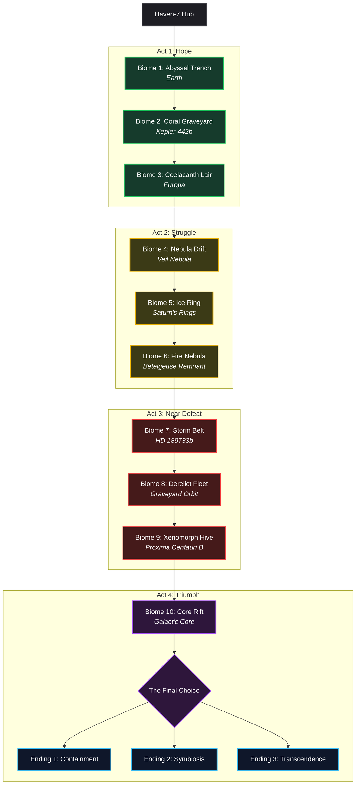

# DARIUS STAR — Story Mode Design Document
## Sci-Fi Cyberpunk × Deep-Sea Cosmic Horror | 10-Biome Hero's Journey

---

## Story Mode Key Art Concept

---

## 1. NARRATIVE PILLARS

* **Hero's Journey (Family First)**: Darius Star's personal stakes drive the narrative. He is a father fighting for his daughter Lyra's survival, descending into dangerous depths to secure a cure.
* **10-Biome Chapters**: The narrative progresses linearly across 10 diverse space and deep-sea biomes, each presenting a distinct narrative beat and building up to a dramatic boss fight.
* **Escalating Threat**: The initial quest for a medicine reveals a cosmic containment crisis. The player transitions from saving a single life to deciding the fate of galactic consciousness.
* **Cooperative Narrative**: Multiplayer expands the perspective. Player 2 (Valera Cross), Player 3 (Naya Star), and Player 4 (Ophion Reborn) introduce military betrayal, parental protective instincts, and ancient precursor redemptive arcs.

---

## 2. HERO: DARIUS STAR

### Backstory & Legacy
* **Name & Callsign**: **Darius Star**, age 34. Callsign derived from his grandfather's Abyssal Navy nickname "Starfish."
* **Lineage**: 
  * Grandfather **Aldric Star**: Legendary Navy officer who first encountered the Abyss Mind in the Marianas Trench. Officially died in an "equipment failure," but was actually murdered to suppress the truth.
  * Father **Marcus Star**: Spent his life trying to prove the cover-up, bankrupting the family and dying broken.
* **Current Status**: FreelDeep-salvage mercenary operating from the orbital platform *Haven-7*. Under heavy debt to salvage cartels.

### Motivation & What Was Lost
* **Lyra's Diagnosis**: His 8-year-old daughter is diagnosed with **Trench Sickness**, a degenerative condition caused by exotic deep-sea particulate.
* **The Mission**: Retrieve components of the **Coelacanth Cortex** from the 10 biomes to synthesize a cure.
* **What Was Lost**: Family reputation (labeled as conspiracy theorists), grandfather Aldric, father Marcus, and financial stability.

---

## 3. THE COSMIC THREAT: THE CYBER COELACANTH & THE ABYSS MIND

### Origin of the Cyber Coelacanths
* **Precursor Prison Guards**: The Coelacanths are eons-old **biosynthetic entities** designed by precursors to serve as a galaxy-wide containment network.
* **The Suppression Field**: They emit a localized suppression frequency that keeps the sleeping **Abyss Mind** dormant.
* **Current Decay**: The network is failing. As each Coelacanth goes dark, a **Dream Pulse** is emitted, warping local biology, physics, and gravity.

### The Abyss Mind (The Dreamer Below All Depths)
* **Nature**: A consciousness dwelling in the crust-mantle boundaries of water-bearing planets. It behaves like a tectonic geological process rather than an organic entity.
* **Awakening Effect**: When active, it reimagines reality. Water-bearing worlds are transformed into landscapes of impossible geometries and black thought-liquid. All individual minds are absorbed into its collective chorus.
* **The Twist**: Lyra's Trench Sickness is actually **Abyss Mind attunement**. Her brain is a perfect interface. The Navy knows this and is withholding the cure to study her as a weapon (Project Dream-Weapon).

---

## 4. THE 10-BIOME NARRATIVE ROADMAP

---

## 5. BIOME-BY-BIOME CHAPTER DETAILS

### CHAPTER 0: PROLOGUE — Haven-7 (Hub World)
* **Narrative Beat**: Darius receives Lyra's terminal diagnosis. His mother Selene decrypts Aldric's old navy logs, revealing the first Coelacanth location. Darius prepares his ship, the *Nyxa*, and receives Aldric's Navy dive knife from his wife Naya.
* **Emotional Core**: Desperation masked as courage. The player interacts with family members in the Haven-7 med-bay.

### CHAPTER 1: ABYSSAL TRENCH (Earth — Pacific Ocean)
* **Theme**: Deep sea, hydrothermal vents, ancient ruins.
* **Narrative Arc**: Darius dives into Earth's deepest trench and finds Aldric's original dive suit. The Guardian Coelacanth recognizes Darius's DNA, warning: *"You carry the blood. The Dreamer knows your line."*
* **Boss**: **Drowned Warden** (the malfunctioning Guardian Coelacanth).
* **Component**: GLYPH-1 (Neural Stabilizer precursor).
* **Emotional Beat**: Hearing his grandfather's voice recorded in the machine's memory brings a mixture of relief and fear.

### CHAPTER 2: CORAL GRAVEYARD (Kepler-442b — Shallow Seas)
* **Theme**: Bleached alien coral maze, spectral memory-echoes.
* **Narrative Arc**: Darius finds a precursor memory vault. A vision reveals they chose extinction over the Dreamer's awakening. He learns of a dissident precursor, **Ophion**, who sabotaged the network.
* **Boss**: **Memory Wraith** (manifestation of the collective death-memories of the reef).
* **Component**: GLYPH-2 (Synaptic Bridge precursor).
* **Emotional Beat**: Realizing the crushing weight of ancestral sacrifice.

### CHAPTER 3: COELACANTH LAIR (Europa — Subsurface Ocean)
* **Theme**: Ice caves, thermal geysers, embryonic nesting ground.
* **Narrative Arc**: Darius enters the birthing ground of the Coelacanths. He discovers Ophion's hidden lab, indicating Ophion believed they could coexist with the Abyss Mind.
* **Boss**: **Hatchery Queen** (corrupted breeding protocol producing hostile bio-hybrids).
* **Component**: GLYPH-3 (Memory Integration precursor).
* **Extra**: Darius finds a living, uncorrupted Coelacanth embryo and brings it back to Haven-7.
* **Emotional Beat**: Questioning if curing Lyra is "fixing" her or stopping her from becoming something greater.

### CHAPTER 4: NEBULA DRIFT (Veil Nebula — Deep Space)
* **Theme**: Sentient gaseous cloud, gravity shifts, mental projections.
* **Narrative Arc**: The fourth Coelacanth is lost in a psychic cloud. Darius experiences direct communication from the Dreamer. It reveals its loneliness — it is not trying to destroy; its awakening is a cry for companionship.
* **Boss**: **Thoughtform Colossus** (psychic manifestation of the Dreamer's frustration).
* **Component**: GLYPH-4 (Psychic Dampener precursor).
* **Emotional Beat**: Direct contact with the alien mind's vast, aching solitude.

### CHAPTER 5: ICE RING (Saturn's Rings — Cryo-Debris Field)
* **Theme**: Asteroid belt navigation, military interception.
* **Narrative Arc**: Navy special operations unit **Squadron Umbra**, led by **Captain Valera Cross**, intercepts Darius. She demands the logs and components, revealing the Navy wants to weaponize the Abyss Mind (Project Dream-Weapon).
* **Boss**: **Cryo-Kraken + Squadron Umbra** (Two-phase fight against the mutated Coelacanth and Captain Cross's gunship).
* **Component**: GLYPH-5 (Cellular Regeneration precursor).
* **Emotional Beat**: Sparing Captain Cross. A human antagonist who is just as broken by grief as Darius is.

### CHAPTER 6: FIRE NEBULA (Betelgeuse Remnant — Plasma Expanse)
* **Theme**: Plasma currents, heat management, industrial wreckage.
* **Narrative Arc**: While Darius is cut off in the plasma field, Haven-7 is attacked. Valera Cross (now defected) helps protect Lyra, but Lyra is exposed to a Navy attunement device.
* **Boss**: **Forge-Mind** (a molten, corrupted Coelacanth acting as a signal transmitter for the Dreamer).
* **Component**: GLYPH-6 (Thermal Stabilizer precursor).
* **Emotional Beat**: Darius returns to Haven-7 to find Lyra's eyes glowing with bioluminescent patterns. She tells him: *"Daddy, the thing in the dark isn't angry. It's scared."*

### CHAPTER 7: STORM BELT (HD 189733b — Eternal Hurricane)
* **Theme**: Supersonic winds, horizontal lightning networks.
* **Narrative Arc**: The seventh Coelacanth has gone mad from centuries of storm-bound isolation. It repeats: *"Ophion was right... the Dreamer only wants someone to listen..."*
* **Boss**: **Storm-Singer / Eye of the Tempest**.
* **Component**: GLYPH-7 (Atmospheric Interface precursor).
* **Extra**: The Storm-Singer transfers its database, containing a neural reconstruction of **Ophion's AI**.
* **Emotional Beat**: Witnessing the tragedy of a machine choosing suicide to escape its own madness.

### CHAPTER 8: DERELICT FLEET (Graveyard Orbit — Abandoned Navy Armada)
* **Theme**: Drifting warships, military hardware, haunting psychic echoes.
* **Narrative Arc**: Ophion's AI construct explains that the precursors' walls were a temporary fix. Exploring the fleet flagship *Event Horizon*, Darius discovers a dark truth: the Navy genetically engineered the Star bloodline over three generations to create a compatible vessel for the Dreamer.
* **Boss**: **The Admiral's Remnant** (psychic ghost of Admiral Crane merged with the eighth corrupted Coelacanth).
* **Component**: GLYPH-8 (Genetic Matrix precursor).
* **Emotional Beat**: The realization that his daughter's illness and his entire family's suffering were manufactured by the state.

### CHAPTER 9: XENOMORPH HIVE (Proxima Centauri B — Dreamed World)
* **Theme**: Biomechanical landscape, living flesh structures, temporal anomalies.
* **Narrative Arc**: A planet completely rewritten by the Abyss Mind. The hive offers Darius peace and safety for Lyra if he stops. Ophion's AI admits symbiosis is appealing but warns of losing individuality.
* **Boss**: **Hive-Mind Nexus** (the ninth Coelacanth integrated into the living planet).
* **Component**: GLYPH-9 (Consciousness Anchor precursor).
* **Emotional Beat**: Rejecting the easy path. Reaffirming that he is fighting for Lyra's humanity, not just her survival.

### CHAPTER 10: CORE RIFT (Galactic Core — The Dreamer's Threshold)
* **Theme**: Black hole horizon, collapsing physics, reality warping.
* **Narrative Arc**: Darius reaches the Prime Coelacanth at the edge of the black hole. He is confronted by the Dreamer's nightmares given form.
* **Boss**: **The Dreamer's Fear** (subconscious projection of the Abyss Mind's terror of isolation).
* **Component**: GLYPH-10 (Integration Core).
* **Emotional Beat**: Facing the final choice and deciding the fate of Lyra, humanity, and the Dreamer.

---

## 6. MULTIPLAYER CO-OP STRUCTURE (1 / 2 / 4 Players)

### Solo (1 Player)
* **Darius Star** is the sole pilot. The story focus is intensely personal — a father's desperate struggle to save his daughter. Banter is provided by Ophion's AI from Chapter 7 onward.

### Co-Op Duo (2 Players)
* **Player 1**: Darius Star.
* **Player 2**: **Captain Valera Cross** (playable from the beginning with an expanded parallel arc).
* **Dynamic**: Cross starts as a shadow tracking Darius, leading to a dramatic **PvPvE duel** in Biome 5 (Ice Ring) where players must survive the boss while fighting each other. Following the battle, she defects and joins Darius permanently. Her stakes: discovering her squadron was sacrificed by the Navy.

### Full Squad (4 Players)
* **Player 1**: Darius Star (The Determined - DPS focus).
* **Player 2**: Captain Valera Cross (The Soldier - Tactical focus).
* **Player 3**: **Naya Star** (The Heart - Support focus). In 4-player mode, Haven-7 is attacked in Biome 3. Naya takes up arms and joins the mission, carrying the Coelacanth embryo which provides shield buffs.
* **Player 4**: **Ophion Reborn** (The Sage - Crowd control focus). The embryo hatches into a physical, biosynthetic hybrid containing Ophion's consciousness. He provides comic relief and deep philosophical insights into physical life.
* **Banter System**: Characters exchange contextual dialogue based on active players, highlighting their differing views on the Abyss Mind.

---

## 7. THE THREE NARRATIVE ENDINGS

| Ending | Mechanism | Lyra's Fate | The Dreamer's Fate | Galaxy Status |
|--------|-----------|-------------|--------------------|---------------|
| **1. Containment** | Reinforce network using all 10 glyphs. | Cured. Connection severed. Returns to normal child. | Re-imprisoned in deep sleep for eons. | Status quo preserved. Navy maintains power. |
| **2. Symbiosis** (Ophion's Path) | Establish two-way communication bridge. | Becomes the first human-Dreamer bridge. Happy and safe. | Gains a companion; stabilizes its dreams. | Coexistence begins. Precursor containment ended. |
| **3. Transcendence** (Sacrifice) | Darius takes the glyphs himself, replacing Lyra. | Cured. Returns to normal life. | Joins with Darius's consciousness. | Darius ceases to exist as an individual; watches over the deep. |

---

## 8. CHARACTER SPECIFICATIONS

* **Lyra Star**: Curious, drawing visions of the Dreamer before ever seeing it. Her dialogue shifts from innocent to cosmic.
* **Naya Star**: Grounded and protective. Ready to take up arms to defend her daughter's identity.
* **Selene Star**: The intelligence lead on Haven-7. Driven by a lifelong desire to expose the Abyssal Navy.
* **Ophion (AI / Reborn)**: A mixture of ancient wisdom and childlike wonder at physical objects (e.g. eating, buttons).
* **Admiral Crane**: A patriot who lost his moral compass. Believed Project Dream-Weapon was the only path to human survival.

---

> [!NOTE]
> This story mode narrative architecture provides the foundation for Phase 2 implementation. The mechanics of the game (Ship Specials, Upgrade economy) integrate directly with the narrative progression, aligning scrap collecting, powerups, and combat complexity with the hero's emotional descent and eventual triumph.

*End of Design Document.*
